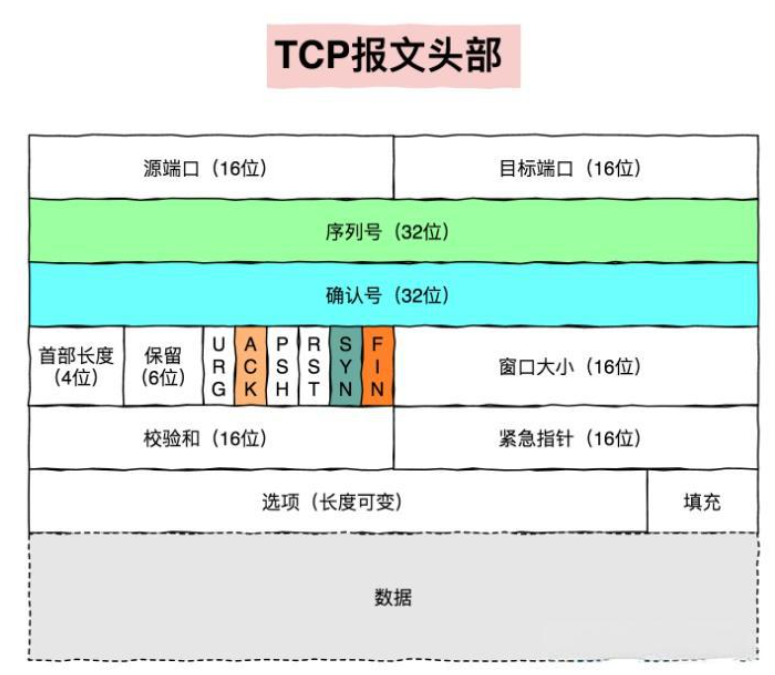
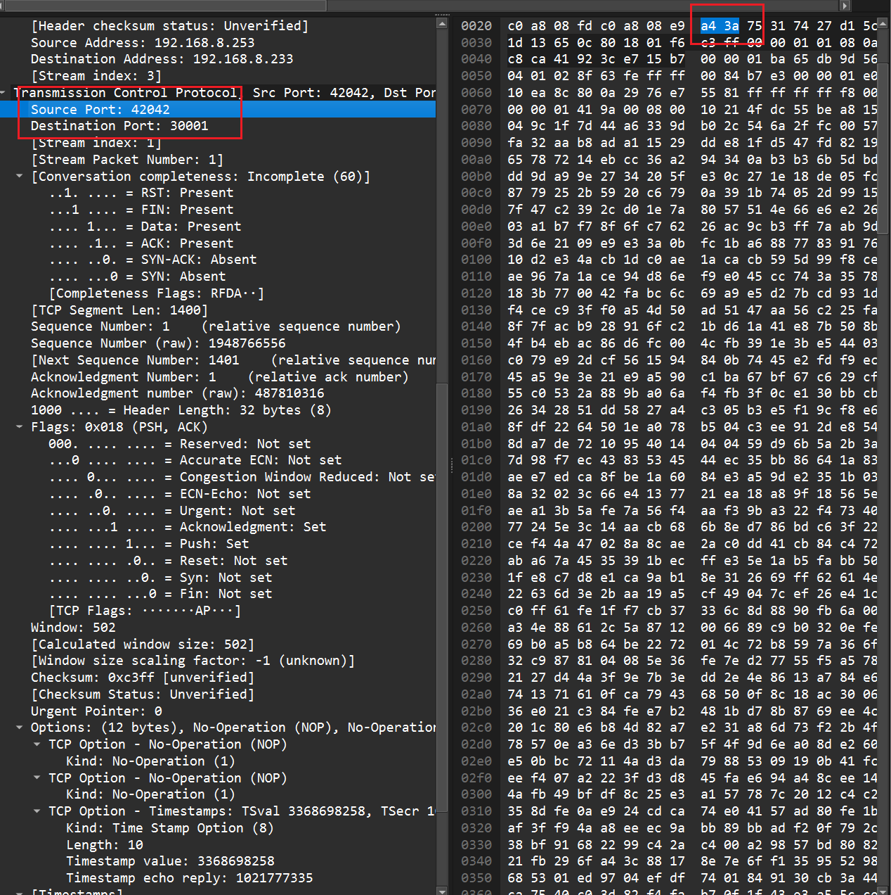
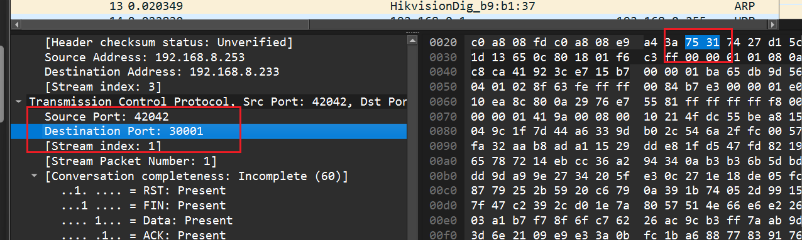
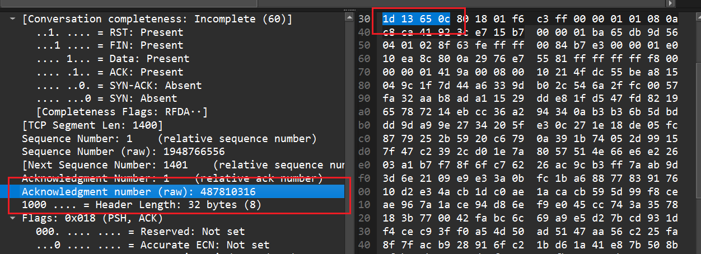
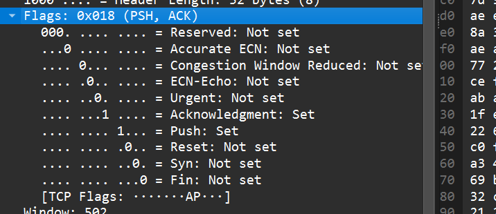
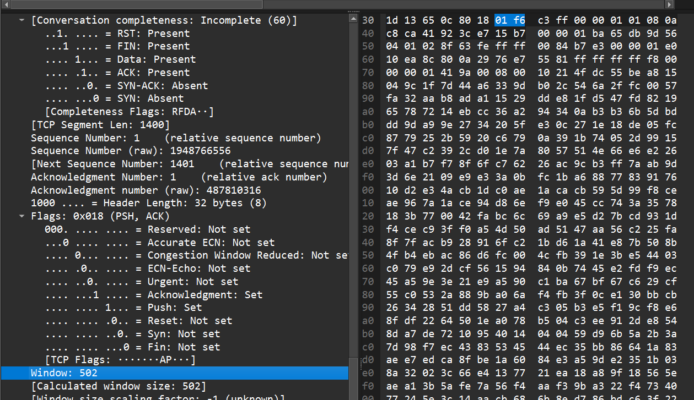
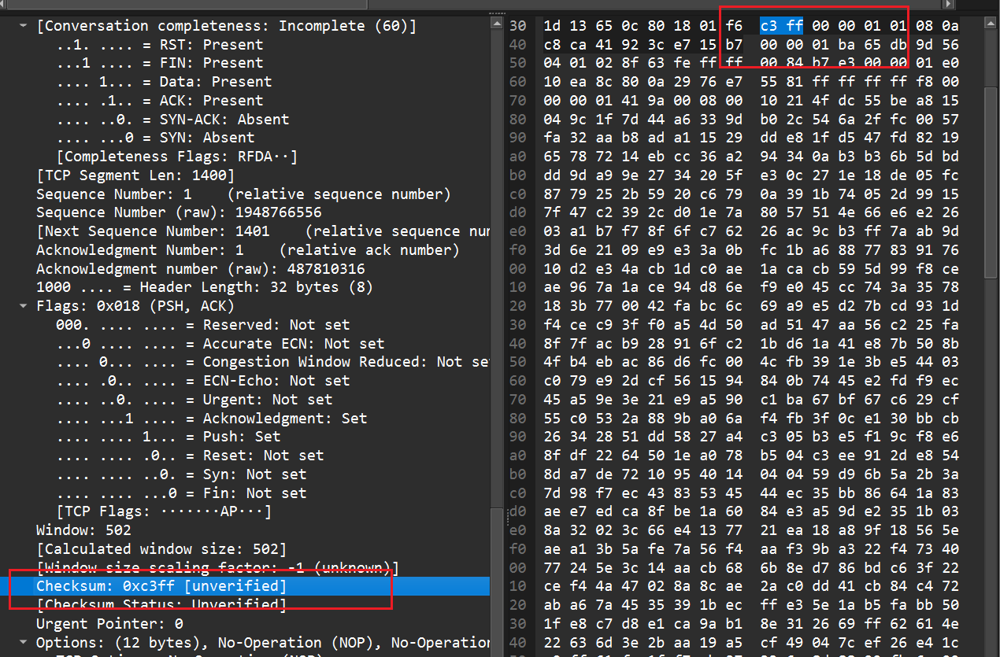

# 网路抓包
网络抓包`Packet Capture`是一种网络分析技术，通过截获、记录和分析在网络上传输的数据包，来帮助诊断网络问题、分析网络性能、排查安全事件或进行协议研究。
## 网络抓包的原理
网络抓包的核心是利用网卡的“混杂模式”（Promiscuous Mode）。在正常模式下，网卡只接收发给本机的数据包；而在混杂模式下，网卡会接收网络上所有经过它的数据包，无论目标地址是否是本机。抓包工具利用这一特性，捕获并解析这些数据包。
## 抓包工具 --- `tcpdump`
在Linux下使用抓包工具`tcpdump`抓取网络数据包，分析了解网络数据状况
### `tcpdump` 安装
- 如果设备能够连接网络，可以直接下载
    ```bash
    sudo apt update 
    sudo apt install tcpdump
    ```
- 如果设备不能连接网络，则需要通过官网下载源码，手动编译
    1. [`tcpdump`官网](https://www.tcpdump.org) 拉取源码，`ftp`传入设备，解压下载
    ```bash
    # 由于tcpdump依赖libpcap因此两个安装包都需要下载并传入解压
    tar -xvf tcpdump-4.9.2.tar.gz
    tar -xvf libpcap-1.10.1.tar.gz
    ```
    2. 先配置编译`libpcap`
    ```bash 
    cd libpcap-1.10.1
    ./configure 
    make 
    ```
    3. 配置编译`tcpdump`
    ```bash
    cd tcpdump-4.9.2 
    ./configure 
    make 
    ```
### 指令格式
`tcpdump`的基本指令格式
```bash 
tcpdump [options] [proto] [dir] [type]
```
- options 参数选项 
- proto 协议过滤器  
- dir 数据包流向过滤器
- type 类型过滤器
### 基本使用 
- 查看`tcpdump`帮助
    ```bash 
    tcpdump -h 
    tcpdump --help 
    #################################
    tcpdump version 4.99.5
    libpcap version 1.10.4 (with TPACKET_V3)
    OpenSSL 1.1.1f  31 Mar 2020
    64-bit build, 64-bit time_t
    Usage: tcpdump [-AbdDefhHIJKlLnNOpqStuUvxX#] [ -B size ] [ -c count ] [--count]
                    [ -C file_size ] [ -E algo:secret ] [ -F file ] [ -G seconds ]
                    [ -i interface ] [ --immediate-mode ] [ -j tstamptype ]
                    [ -M secret ] [ --number ] [ --print ] [ -Q in|out|inout ]
                    [ -r file ] [ -s snaplen ] [ -T type ] [ --version ]
                    [ -V file ] [ -w file ] [ -W filecount ] [ -y datalinktype ]
                    [ --time-stamp-precision precision ] [ --micro ] [ --nano ]
                    [ -z postrotate-command ] [ -Z user ] [ expression ]
    ```
#### 选项解析
- 基本选项
    ```
    -A - 以 ASCII 格式显示每个数据包（去除链路层头部）
    -b - 以 ASN.1/BER 格式显示数据包
    -B size - 设置操作系统捕获缓冲区大小（单位：KiB）
    -c count - 捕获指定数量的数据包后退出
    --count - 打印捕获的数据包计数
    -d - 将编译后的包匹配代码以可读形式转储
    -D - 列出所有可用的网络接口
    -e - 显示链路层头部信息
    -f - 以数字形式显示外部IPv4地址
    -F file - 从文件读取过滤表达式
    -G seconds - 每指定秒数轮转输出文件
    -h - 显示帮助信息
    -H - 检测802.11s网格头
    -i interface - 指定要监听的网络接口，网卡
    --immediate-mode - 立即模式（无缓冲）
    -I - 将接口置于监控模式（无线网络）
    -j tstamptype - 设置时间戳类型
    -K - 不验证IP、TCP、UDP校验和
    -l - 标准输出行缓冲
    -L - 列出接口支持的数据链路类型
    -n - 不将地址解析为主机名
    -N - 不显示主机名的域名限定
    -O - 不运行包匹配代码优化器
    ```
- 输出控制
    ```
    -p - 非混杂模式监听
    -q - 简洁输出（较少协议信息）
    -r file - 从文件读取数据包
    -s snaplen - 设置快照长度（捕获字节数）
    -S - 打印绝对的TCP序列号
    -t - 不显示时间戳
    -T type - 将数据包解释为指定类型
    -u - 打印未解码的NFS句柄
    -v - 详细输出
    -V file - 从文件读取文件名列表
    -w file - 将原始数据包写入文件
    -W filecount - 限制文件数量
    -x - 以十六进制显示数据包
    -X - 以十六进制和ASCII显示数据包
    -y datalinktype - 设置数据链路类型
    ```
- 高级功能
    ```
    -E algo:secret - 使用IPsec ESP解密
    -M secret - 使用TCP-MD5摘要验证
    -Q in|out|inout - 指定捕获方向
    -Z user - 以指定用户身份运行
    -z postrotate-command - 文件轮转后执行命令
    ```
- 时间戳选项
    ```
    --time-stamp-precision precision - 设置时间戳精度
    --micro - 微秒精度时间戳
    --nano - 纳秒精度时间戳
    ```
- 其他
    ```
    --number - 显示数据包编号
    --print - 即使写入文件也打印数据包
    --version - 显示版本信息
    ```
#### 常用规则
1. 基于IP地址过滤，使用`host ip`可以指定host ip进行过滤，
    ```bash
    tcpdump host ip 
    ```
    - 使用`src` 可以指定src host ip进行过滤，这里是源ip
        ```bash
        tcpdump src host ip
        ```
    - 使用`dst` 可以指定dst host ip进行过滤，这里是目标ip
        ```bash
        tcpdump dst host ip
        ```
- 基于IP地址过滤组合使用
    ```bash 
    # 捕获从 A 到 B 的特定流量
    tcpdump src host 192.168.1.100 and dst host 192.168.1.200
    # 捕获从 A 到 B 的 HTTP 流量
    tcpdump src host 192.168.1.100 and dst host 192.168.1.200 and dst port 80
    # 排除特定主机的流量
    tcpdump not host 192.168.1.100
    ```
2. 基于网段过滤，使用`net ip/mask`可以对指定网段进行过滤
    ```bash 
    tcpdump net ip/mask
    ```
    - 使用`src` 可以指定src net ip/mask进行过滤，这里是源网段
        ```bash
        tcpdump src net ip/mask
        ```
    - 使用`dst` 可以指定dst net ip/mask进行过滤，这里是目标网段
        ```bash 
        tcpdump dst net ip/mask        
        ```
- 基于网段过滤组合使用
    ```bash 
    # 捕获整个网段的流量
    tcpdump net 192.168.1.0/24
    # 捕获源IP在特定网段的流量
    tcpdump src net 192.168.1.0/24
    # 捕获目标IP在特定网段的流量  
    tcpdump dst net 10.0.0.0/8
    # 捕获两个网段间的通信
    tcpdump src net 192.168.1.0/24 and dst net 10.0.0.0/8
    # 排除特定网段的流量
    tcpdump not net 192.168.1.0/24
    ```
3. 基于端口过滤，使用`port port`对指定端口进行过滤
    ```bash 
    tcpdump port port
    ```
    - 使用`src` 可以指定src port进行过滤，这里是源端口
        ```bash
        tcpdump src port port
        ```
    - 使用`dst` 可以指定dst port进行过滤，这里是目标端口
        ```bash
        tcpdump dst port port
        ```
- 基于端口过滤组合使用
    ```bash 
    # 捕获端口范围
    tcpdump portrange 8000-8080
    # 捕获多个端口
    tcpdump port 80 or port 443 or port 8080
    # 排除特定端口
    tcpdump not port 22
    # 组合端口和IP过滤
    tcpdump host 192.168.1.100 and port 80
    ```
4. 基于协议进行过滤，使用`proto protocol`对指定协议进行过滤
    ```bash 
    tcpdump proto protocol
    ```
- 基于协议过滤组合使用
    ```bash 
    # 协议组合
    tcpdump tcp or udp
    # 协议+端口组合
    tcpdump tcp and port 80
    # 协议+IP组合
    tcpdump udp and host 192.168.1.100
    ```

### pcap 格式输出分析
|No.|Time|Source|Destination|Protocol|Length|Info|
|---|----|------|-----------|--------|-----|----|

1. No. 列：数据包编号
2. Time 列：数据包接收的时间
3. Source 列：数据包的源IP地址和端口号
4. Destination 列：数据包的目标IP地址和端口号
5. Protocol 列：数据包的协议类型
6. Length 列：数据包的长度
7. Info 列：数据包的信息
 
具体协议对应的数据报文不一样
#### TCP 网络数据包格式解析


1. 16位源端口号
    
    - 标识发送方的应用程序端口号
    - 用于接收方向将响应数据发送回正确的应用程序
2. 16位目的端口号
    
    - 标识接收方的应用程序端口号
    - 比如`http`使用的是80， `https`使用的是443
3. 32位序列号
    
    - 标识该段中第一个数据字节的序列号
    - 在连接建立`SYN`时，序列号时随机生成的初始序列号
    - 用于确保数据按序到达和重传机制
4. 32位确认号
    
    - 表示期望收到的下一个序列号
    - 在`ACK = 1`时候有效
    - 比如，收到序列号为100、长度为500字节的数据，确认号为600
5. 4位数据偏移
    
    - TCP头部长度
6. 6位保留位
    必须保留位
7. 6位TCP控制位
    
    - `URG`: 紧急数据`
    - `ACK`: 确认号有效
    - `PSH`: 立即传送
    - `RST`: 重置连接
    - `SYN`: 建立连接
    - `FIN`: 结束连接
8. 16位窗口大小
    
    - 表示接收方当前可用于接收数据的缓冲区大小
    - 防止发送方发送过快导致接收方溢出
9. 16位校验和
    
    - 用于校验TCP头部、数据以及伪头部的完整性
10. 16位紧急指针
    - 标识紧急数据的末尾位置
11. 选项
    - 选项
12. 数据
    - 数据


#### UDP 网络数据包
#### ARP 网络数据包
#### ICMP 网络数据包
#### RSTP 网路数据包
## 抓包工具 --- WireShark