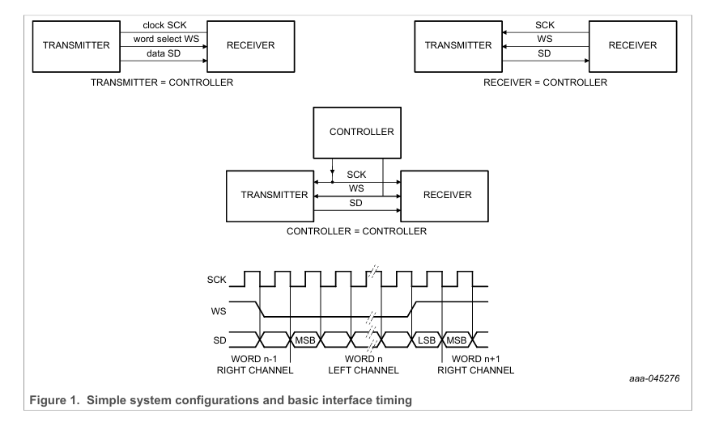
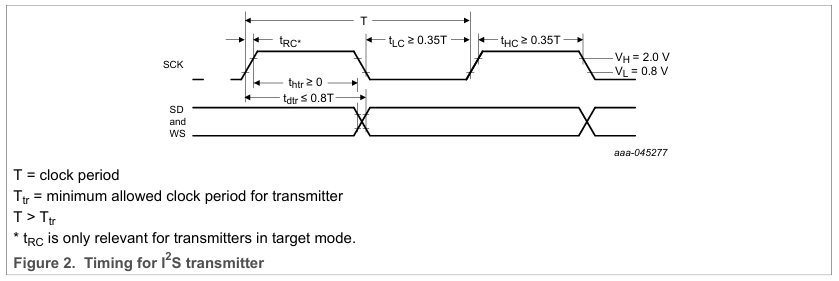
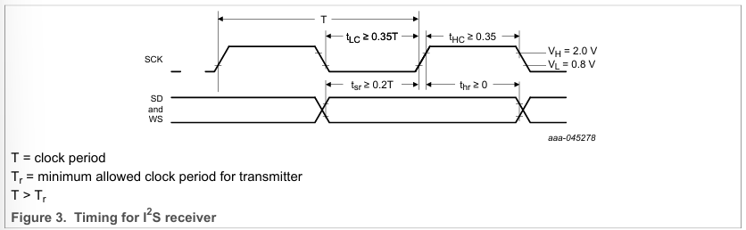
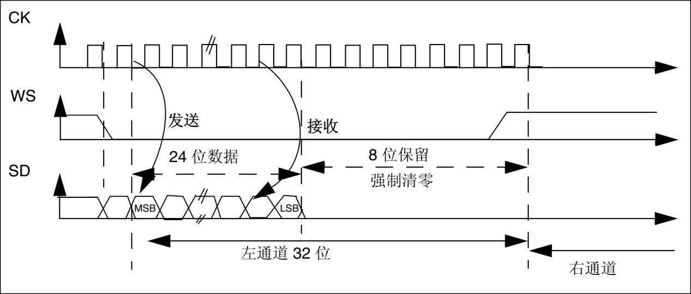
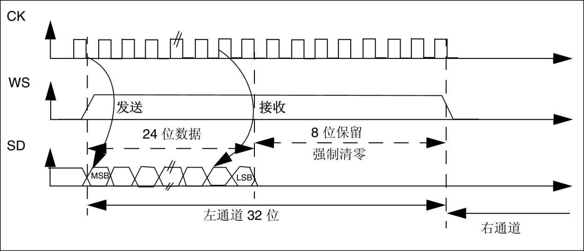
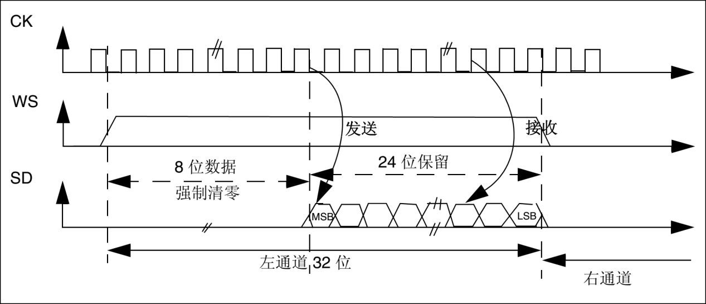
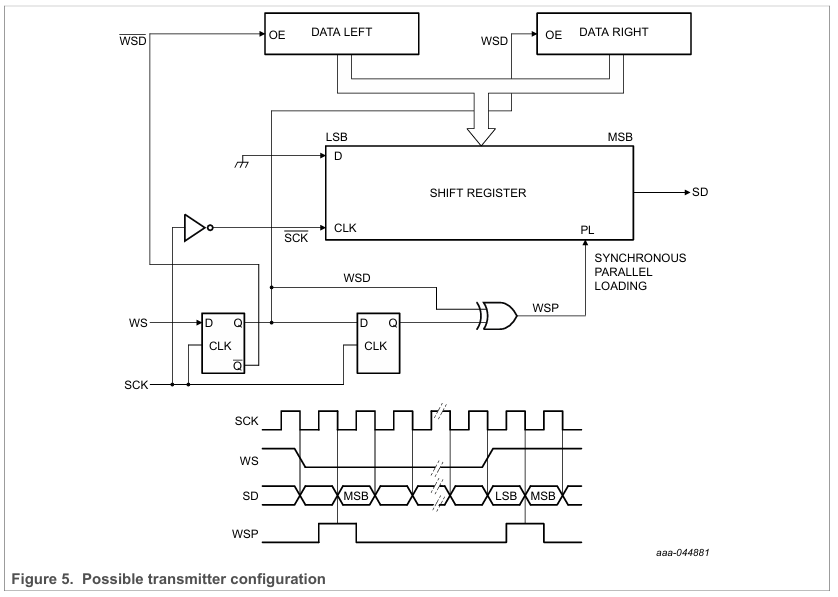
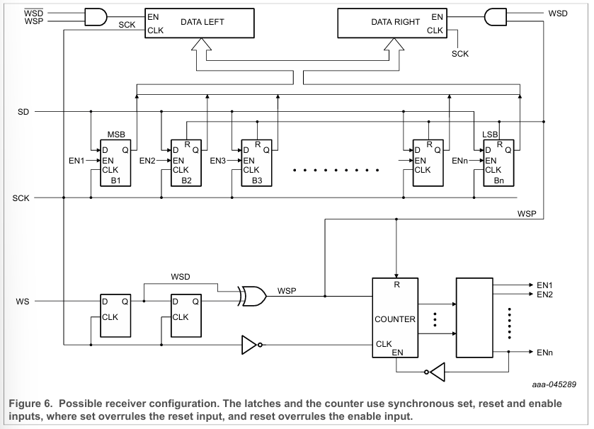
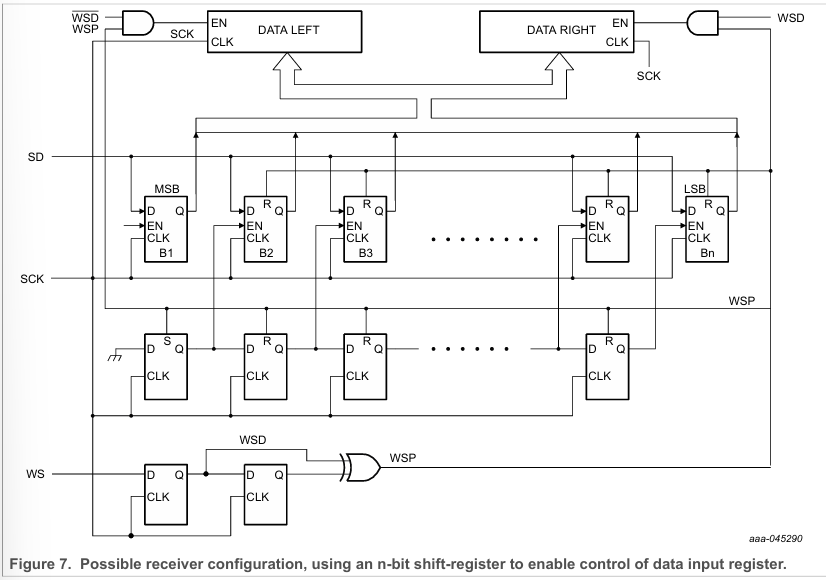

# IIS
`I2S(Inter—IC Sound)`总线, 又称集成电路内置音频总线，是一种同步串行通信协议，通常用于在两个数字音频设备之间传输音频数据，用于解决在集成电路之间传输音频数据的问题，应用场景如下
- **I2SRX**
    录音设备在机械振动下将声音信号转变为电压信号，电压信号经过放大等处理给到ADC采样，将模拟信号转化为数字信号，音频在ADC和DSP之间的传输协议就是使用I2S协议
- **I2STX**
    数字信号通过编码存储压缩等技术后，发送给编码器-DAC（DSP、CodeC等专用解码器），将数字信号还原为模拟信号，最后给到喇叭完成播放，音频在DAC和DSP之间的传输协议就是使用I2S协议
    
## 基础串行总线需求
这个总线只需要去处理音频数据，其他的信号如：子编码和控制信号等都会被单独传输。为了使引脚数量和线缆简单，这个总线使用了3线串行总线，包括了一条用于两个时间多路复用数据通道的线，一个字选择线和一个时钟线    
当发送器和接收器在传输数据时有同样的时钟信号，发送器作为控制器，必须产生位时钟，字选择信号和数据。在复杂的系统，可能有多个发送器和接收器，这会使决定控制器变得困难。    
在这样的系统中，通常有一个系统控制器控制着数字音频数据流在众多IC中，然后传输他们必须在外部时钟下进行产生数据并且作为一个目标，下图说明一些简单的系统配置和基本接口时序请注意，系统控制器可以与发射器或接收器组合使用，并且可以在软件控制或引脚编程下启用或禁用

## I2S总线
如上图示，这个总线包含三条线，产生SCK和WS的是控制器
- **时钟线（Continues Serial Clock，SCK）**  
SCK线提供了同步音频数据传输的时钟信号。确定了数据传输的速度和时序。该时钟也称为Bit Clock（BCLK） 
$f(sck) = 2 * f(sample) * bitwidth$
- **左右声道线（Left-Right Clock，LRCK）**
LRCK线指示了当前传输的左声道和音频数据还是右声道的音频数据。它也被称为帧同步信号
$f(lrck) = f(sample)$
- **数据线（Serial Data，SD）**
SD线用于传输实际的音频数据，数据的位宽可以根据具体应用变化，通常为16位或32位   
### I2S常见的参数
- **位宽（Word Length）**
指定每个采样数据的位数，通常为16位或32位。较大的位宽可以提供更改的分辨率和动态范围
- **时钟极性（Clock Polarity）**
时钟极性确定了数据位阐述的时钟沿。可以定义时钟上升沿或者下降沿数据有效
- **帧同步极性（Frame Sync Polarity）**
帧同步极性确定了帧同步信号的有效电平，帧同步信号指示音频数据的帧起始位和结束位
- **传输数据（Data Format）** 
传输格式定义了音频数据的编码方式，传输格式还可以指定数据的顺序，如左声道先传输还是右声道先传输
### 串行数据
串行数据以两对补码的形式进行传输，MSB在前。因为发送器和接收器可能有不同的字长所以MSB位被最先传输。发送器不需要知道接收器可以处理多少位，接收器也不需要知道正在传输多少位    
当系统字长大于发送器字长，在数据传输的时候，数据会被截断（重要的数据会被置0）。如果接收器接收到大于他字长的数据，LSB位之后的数据会被忽略，另外如果接收器收到比自身字长还少的数据，丢失的位会自动补零。因此MSB有固定的位置而LSB的位置由字长决定。发送器总是在 WS 更改后一个时钟周期发送下一个字的MSB   
发送器发送的串行数据可以与时钟信号的尾随（H-L）和前导（L-H）边沿同步。但是串行数据必须锁定在串行时钟的前导边沿接收器中    
### 字选择
这个字选择意味着通道传输的选择
- WS = 0；通道一（左）
- WS = 1；通道二（右）   

WS 可以在串行时钟的尾随和前导边沿改变，但它不需要对称，作为目标，信号可以被锁存在时钟信号的前导边沿，WS 线路在MSB 发送之前更改一个时钟周期。这允许目标发送器获得将设置为传输的串行数据的同步时序。此外，它允许接收器去存储前一个字的数据和清除下一个输入的字数据
## 时序
在 I2S 格式中，任何器件都可以通过提供必要的时钟信号来充当系统控制器。目标通常从外部时钟输入获取其内部 时钟信号。这意味着，考虑到控制器时钟与数据和/或字选择信号之间的传播延迟，总延迟只是以下各项的总和： 
- 外部（控制器）时钟和目标内部时钟之间的延迟
- 内部时钟与数据和/或字选择信号之间的延迟    
对于数据和字选择的输入，外部到内部的时钟延迟是不连续的因为他又对应的有效启动时序   
     
主要部分的时间边沿是为了去容纳发送器的传播延时和初始化接收器的时间差异      
所有时序要求都是相对于时钟周期或设备的最小允许的时钟周期指定的。这意味着将来可以使用更高的数据速率
   

**具体需要根据数据手册中的时序去适当添加延迟**

### 操作模式
根据SD相对于SCK和WD的位置不同，I2S分为三种不同的操作模式，分别为标准的I2S模式、左对齐模式和右对齐模式

- **标准的I2S模式**
    标准的I2S模式是属于左对齐中的一种特例，是由标准左对齐格式再延迟一个时钟位变化来的，具体可以如图所示
        
    如图，左声道的数据MSB在WS下降沿之后的第二个CK上升沿有效，右声道的数据MSB在WS上升沿的第二个CK上升沿有效，总之数据延后一个时钟位，接着图中左声道为24bit数据封装在32bit帧传输波形，后面8bit空白处理，WS线频率对于采样频率$FS$，一个WS线周期包括发送左声道和右声道数据， 在图中实际需要64个CK周期来完成一次传输
- **左对齐模式**
    标准左对齐较少使用，没有延迟一个时钟位，具体如图所示
    
    左对齐格式下，左声道的数据MSB在WS上升沿后CK的第一个上升沿就有效，右声道的数据MSB在WS下降沿之后的第一个上升沿就有效
- **右对齐模式**
    标准右对齐格式也叫日本格式，具体如图
        
    右对齐格式左声道的数据LSB在WS下降沿的前一个SCK/BCLK上升沿有效，右声道的数据LSB在WS上升沿的前一个SCK/BCLK上升沿有效

## 框图
### 发送器
在每次WS电平变化时，都会派生一个脉冲WSP，用于同步并行加载移位寄存器。然后，根据WS信号启用其中一个数据锁存器的输出。由于串行数据输入为零，因此LSB之后的所有位也将为零
   
### 接收器
跟随第一次WS的电平变化，WSP脉冲会在SCK下降沿重置计数器。在"1 out of n"解码器解码计数器的值。MSB位使能，在SCK的上边沿时，第一个串行数据被锁存在B1中，没一个时钟脉冲当计数器上生，子序列数据位会被锁存在B2到Bn中           
在下一次WS电平更改时，根据WSD的不同，n 个锁存器的内容将并行写入左或右数据字锁存器。在此之后，锁存器 B2 到 Bn 被清除，计数器复位。如果要锁存的串行数据位超过 n 个，则在填充 Bn （接收器的 LSB）后禁止计数器，并忽略后续位
   
