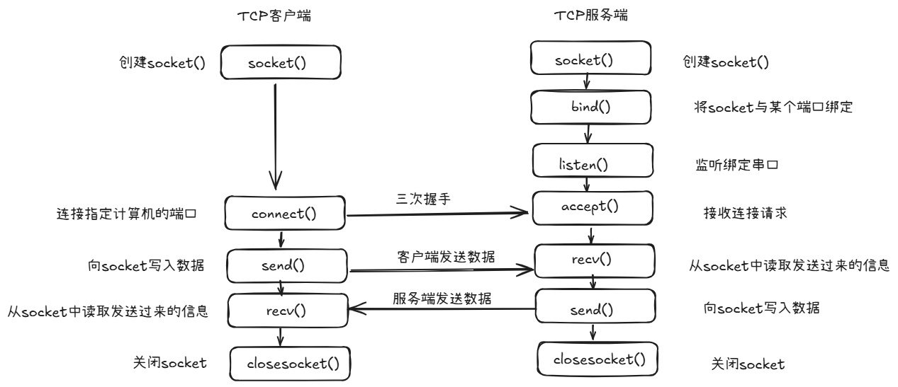

# 网络编程
## TCP/IP
了解Socket编程之前，首先需要了解TCP/IP协议
### OSI七层模型与TCP/IP五层模型
|OSI七层模型|TCP/IP概念层模型|功能|TCP/IP协议族|
|----------|---------------|----|-----------|
|应用层|应用层|文件传输，电子邮件，文件服务，虚拟终端|TFTP, HTTP, SNMP, FTP, SMTP, DNS, Telnet|
|表示层|.|数据格式化，代码转换，数据加密|.|
|会话层|.|解除或简历别的节点的联系|.|
|传输层|传输层|提供端对端的接口|TCP, UDP|
|网络层|网络层|为数据包选择路由|IP, ICMP, RIF, OSTP, BGP, IGMP|
|数据链路层|链路层|传输有地址的帧以及错误检测功能|SLIP, CSLIP, PPP, ARP, RARP, MTU|
|物理层|.|以二进制数据形式再物理媒体上传输数据|IS02110, IEEE802, IEEE802.2|
### 三次握手与四次挥手
#### 三次握手（建立TCP连接）

1. 第一次握手
    - 客户端将SYN置1，随机产生一个值seq = j, 并将该数据包发给服务端，客户端进入SYN_SENT状态，等待服务端确认
    - **第一次握手是为了确认客户端发送数据没有问题**
2. 第二次握手
    - 服务端收到数据包后由标志位SYN = 1确定客户端请求建立连接，服务端将标志位SYN和ACK都置1，ack = j + 1，随机产生一个值seq = k, 并将数据包发给客户端确认连接请求，服务端进入SYN_RCVD状态
    - **第二次握手是为了确认服务端接收和发送数据没有问题**   
3. 第三次握手
    - 客户端收到服务端发来的报文后，会再向服务端发送报文，其中包含标志位ACK = 1， 序列号seq = j + 1, 确认号ack = k + 1。第三次握手前客户端的状态为SYN-SENT， 第三次握手后客户端和服务端的状态都为ESTABLISHED，此时连接建立完成
    - **第三次握手是为了确认通信双方已成功建立连接**
#### 四次挥手（终止TCP连接）

1. 第一次挥手
    - 客户端发送一个FIN，用来关闭客户端到服务端的数据传送，客户端进入FIN-WAIT-1状态
2. 第二次挥手
    - 服务端收到FIN后，发送一个ACK给客户端，确认序号为收到序号+1，服务端进入CLOSE_WAIT状态
3. 第三次挥手
    - 服务端发送一个FIN，用来关闭服务端到客户端的数据传送，服务端进入LAST_ACK状态
4. 第四次挥手
    - 客户端收到FIN后，客户端进入TIME_WAIT状态，接着发送一个ACK给服务端，确认序号为收到序号+1， 服务端进入CLOSE状态完成四次挥手
### TCP和UDP

|特性	|TCP	|UDP|
|-------|-------|----|
|是否连接	|面向连接（需三次握手）	|无连接|
|可靠性|	提供可靠传输（确认机制、重传、排序）|	不保证可靠性|
|数据传输顺序|	按序传输|	数据可能无序到达|
|速度|	较慢（需额外控制机制）|	较快|
|头部开销|	大（20字节或以上）|	小（8字节）|
|应用场景|	文件传输、网页浏览、数据库通信等|	视频直播、在线游戏、DNS等|
|应用层协议|FTP, Telnet, SMTP, POP3, HTTP|DNS, SNMP, TFTP|

## Socket 编程
Socket是对TCP/IP协议族的编程接口封装。它不是协议本身，而是操作系统提供的一套API，让用户可以用编程的方式进行网络通信，简单理解为插座，需要使用机器的时候将机器的插头接入插座中
### Socket 套接字类型
根据数据传输方式，可以将网络套接字分为两种类型，通过`socket()`函数创建连接时，必须指定套接字类型
#### SOCK_STREAM 流格式套接字 --- TCP
也叫面向连接的套接字，使用`SOCK_STREAM`表示，它是一种可靠的、双向的通信数据流，数据可以准确无误的到达另一端，如果损坏或者丢失，可以重新发送。流格式套接字能够使数据在传输过程中不消失，且有序，但是数据的发送和接收不是同步的，浏览器使用的`http`协议就是基于流格式套接字的，因为必须确保数据准确无误，否则加载的网页将无法解析
#### SOCK_DGRAM 数据报格式套接字 --- UDP
也叫做无连接的套接字，使用`SOCK_DGRAM`表示，它不保证数据准确无误的到达另一端，只负责传输，传输数据可能丢失损毁，且无法重传。数据报格式套接字强调数据快速传输，所以数据可能会丢失损毁吗而且每次都限制传输数据带线啊哦，但是数据发送接收都是同步的，可以用于发送短信、聊天、视频聊天等吗，首先确保通信效率，减小延迟，而数据的正确性是次要的，即使丢失了很小的一部分数据
### Socket 套接字使用
这是一个完整的Socket网络通信，由客户端服务端两部分代码组成，即两个程序
      
每一步都是由Socket封装好的函数实现的
#### 相关API
- 创建，使用`socket()`创建套接字，返回一个句柄类似的文件描述符
    ```c
    int socket(int domain, int type, int protocol);
    ```
    - `domain`：协议族，对于`TCP/IP`，使用`AF_INET`足够了，如果支持`IPV6`，那么可以使用`AF_INET6`
    - `type`：套接字类型，常用的是`SOCK_STREAM`和`SOCK_DGRAM`
    - `protocol`：协议，对于`TCP`和`UDP`协议，使用`0`即可
- 绑定，使用`bind()`函数将套接字绑定到指定地址，在服务器端需要将一个地址和端口与进程绑定在一块，
    ```c
    int bind(int sockfd, const struct sockaddr *addr, socklen_t addrlen);
    ```
    - `sockfd`：套接字句柄
    - `addr`：地址，指向套接字地址结构的指针
    - `addrlen`：地址长度
- 监听，使用`listen()`函数将套接字变为监听状态，一般在TCP服务器进程中使用吗，监听等待客户端连接请求
    ```c
    int listen(int sockfd, int backlog);
    ``` 
    - `sockfd`：套接字句柄
    - `backlog`：最大连接数
- 接受，使用`accept()`函数等待客户端连接请求，在服务器端等待客户端连接请求，返回一个新的套接字，用来与客户端通信
    ```c
    int accept(int sockfd, struct sockaddr *addr, socklen_t *addrlen);
    ```
    - `sockfd`：套接字句柄
    - `addr`：客户端地址
    - `addrlen`：地址长度
- 读取，一旦客户端与服务器建立好`TCP`连接，就可以通过套接字描述符收发数据，使用`read()`、`recv()`、`recvfrom()`等函数
    ```c
    ssize_t read(int fd, void *buf, size_t count);
    ssize_t recv(int sockfd, void *buf, size_t len, int flags);
    ssize_t recvfrom(int sockfd, void *buf, size_t len, int flags, struct sockaddr *src_addr, socklen_t *addrlen);
    ```
    - `sockfd`：套接字句柄
    - `buf`：接收缓冲区
    - `len`：接收长度
    - `flags`：接收标志
    - `src_addr`：源地址
    - `addrlen`：地址长度
- 发送，使用`write()`、`send()`、`sendto()`等函数可以发送数据 
    ```c
    ssize_t write(int fd, const void *buf, size_t count);
    ssize_t send(int sockfd, const void *buf, size_t len, int flags);
    ssize_t sendto(int sockfd, const void *buf, size_t len, int flags, const struct sockaddr *dest_addr, socklen_t addrlen);
    ```
    - `sockfd`：套接字句柄
    - `buf`：发送缓冲区
    - `len`：发送长度
    - `flags`：发送标志
    - `dest_addr`：目标地址
    - `addrlen`：地址长度
- 连接，在客户端中，如果使用的是`TCP`那么将发生一个握手的过程建立`TCP`连接，如果是`UDP`那么调用这个函数只是记录远端IP地址和端口号
    ```c
    int connect(int sockfd, const struct sockaddr *addr, socklen_t addrlen);
    ```
    - `sockfd`：套接字句柄
    - `addr`：服务器地址
    - `addrlen`：地址长度
## TCP客户端实验代码
```c
#include <stdio.h> 
#include <stdlib.h>  
#include <string.h>  
#include <sys/types.h>  
#include <sys/socket.h>  
#include <errno.h>
#include <unistd.h>
#include <netinet/in.h>
#include <arpa/inet.h>
#include <netdb.h>

#define HOST "192.168.1.100"
#define PORT 8080 
#define MAX_BUFFER_SIZE (1024 * 4)

int main() 
{
    int sockfd, ret;
    struct sockaddr_in server;
    char buffer[MAX_BUFFER_SIZE];

    if((sockfd = socket(AF_INET, SOCK_STREAM, 0)) == -1)
    {
        printf("create an endpoint for communication fail!\n");
        exit(1);
    }

    bzero(&server, sizeof(server));
    server.sin_family = AF_INET;
    server.sin_port = htons(PORT);
    server.sin_addr.s_addr = inet_addr(HOST);

    if(connect(sockfd, (struct sockaddr *)&server, sizeof(server)) == -1)
    {
        printf("connect to server fail!\n");
        close(sockfd);
        exit(1);
    }

    printf("connect to server success!\n");

    while(1)
    {
        printf("input message to send: ");
        fgets(buffer, MAX_BUFFER_SIZE, stdin);
        if((strncmp(buffer, "exit", 4) == 0))
        {
            break;
        }
        write(sockfd, buffer, strlen(buffer));
    }
    close(sockfd);
    return 0;
}
```
这里需要提及几点
- `sockaddr_in` 结构体
    ```c
    struct sockaddr_in {
        u8_t            sin_len;
        sa_family_t     sin_family;
        in_port_t       sin_port;
        struct in_addr  sin_addr;
        #define SIN_ZERO_LEN 8
        char            sin_zero[SIN_ZERO_LEN];
    };
    ```
    - `sin_len`：长度
    - `sin_family`：协议族
    - `sin_port`：端口号
    - `sin_addr`：IP地址
    - `sin_zero`：填充字节
- `htons()` 函数将主机字节序转换为网络字节序
- `inet_addr()` 函数将点分十进制的IP地址转换为网络字节序的IP地址
## TCP服务器实验代码
```c
#include <stdio.h> 
#include <stdlib.h>  
#include <string.h>  
#include <sys/types.h>  
#include <sys/socket.h>  
#include <errno.h>
#include <unistd.h>
#include <netinet/in.h>
#include <arpa/inet.h>
#include <netdb.h>

#define PORT 8080 
#define MAX_BUFFER_SIZE (1024 * 10)

int main()
{
    char buffer[MAX_BUFFER_SIZE];
    int n;
    int sockfd, connfd, len;
    struct sockaddr_in server, client;

    sockfd = socket(AF_INET, SOCK_STREAM, 0);
    if(sockfd == -1)
    {
        printf("create an endpoint for communication fail!\n");
        exit(1);
    }
    printf("create a socket for communication success!\n");
    bzero(&server, sizeof(server));
    server.sin_family = AF_INET;
    server.sin_addr.s_addr = htonl(INADDR_ANY);
    server.sin_port = htons(PORT);

    if(bind(sockfd, (struct sockaddr *)&server, sizeof(server)) != 0)
    {
        printf("bind socket fail!\n");
        exit(1);
    };

    printf("bind socket success!\n");

    if(listen(sockfd, 5) != 0)
    {
        printf("listen socket fail!\n");
        exit(1);
    };

    printf("listen socket success!\n");

    len = sizeof(client);
    connfd = accept(sockfd, (struct sockaddr *)&client, &len);
    if(connfd == -1)
    {
        printf("accept socket fail!\n");
        exit(1);
    };

    printf("accept socket success!\n");

    while(1)
    {
        bzero(buffer, MAX_BUFFER_SIZE);
        n = read(connfd, buffer, MAX_BUFFER_SIZE - 1);
        if(n == -1)
        {
            printf("read socket fail!\n");
            exit(1);
        }
        else if(n == 0)
        {
            printf("client close the connection!\n");
            break;
        }
        printf("receive message from client: %s\n", buffer);
        bzero(buffer, MAX_BUFFER_SIZE);
    }
    close(connfd);
    exit(0);
}
```
