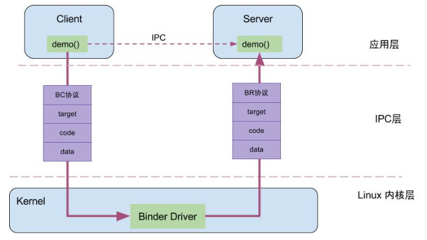
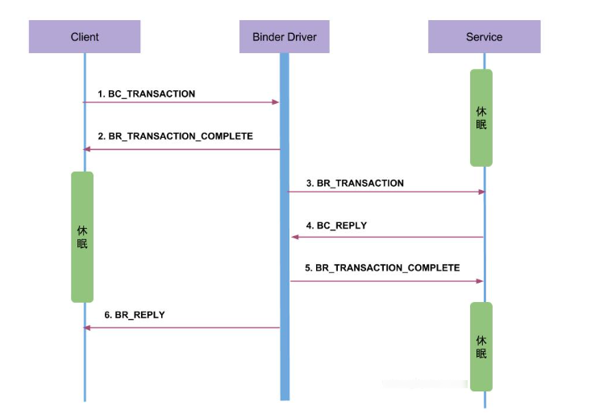
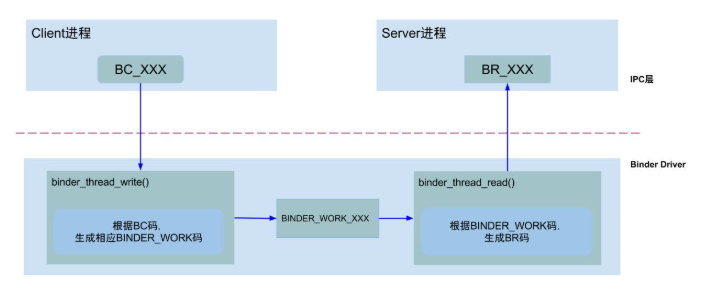
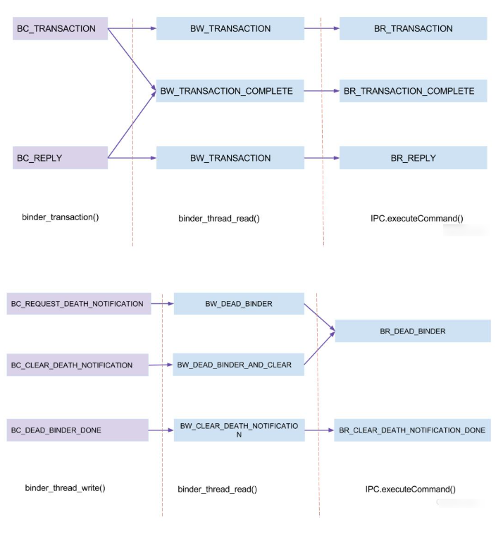
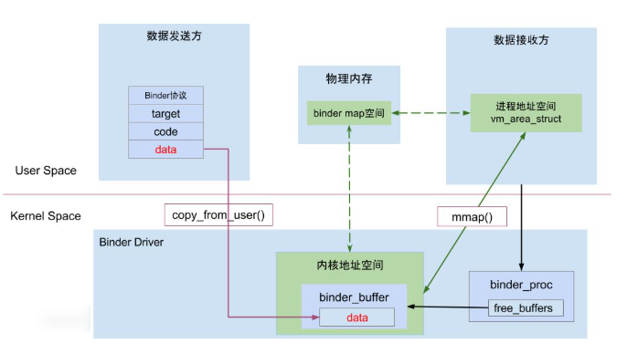

# Binder Driver 再探
## Binder 通信简述
Client 进程通过 RPC（Remote Procedure Call Pratocol）与 Server 通信，可以简单的划分为三层：驱动层、IPC层、业务层。`demo()` 是客户端和服务端共同协商好的同意方法；IPC 层的数据包含了 handle、RPC 数据、代码、协议这四项，通过 IPC 层进行数据传输；而真正的客户端和服务端建立通信的基础设施就是 Binder Driver     

例如，当名为 `BatteryStatsService` 的客户端项 `ServiceManager` 注册服务的过程中，IPC层的数据组成为：`handle = 0`，RPC代码为 `ADD_SERVICE_TRANSACTION`，RPC数据为 `BatteryStatsService`，Binder协议为 `BC_TRANSACTION`
## Binder 通信协议 
### 通信模型

Binder 协议包含在 IPC 数据中，分为两类
1. `BINDER_COMMAND_PROTOCOL`: binder 请求码，以 BC_开头简称 BC 码，用于从 IPC 层传递到 BinderDriver 层
2. `BINDER_RETURN_PROTOCOL`: binder 响应码，以 BR_ 开头简称 BR 码，用于从 BinderDriver 层传递到 IPC 层    
### 通信过程
Binder IPC 通信至少是两个进程的交互
- client 进程执行 `binder_thread_write()`，根据 `BC_XX` 码，生成相应的 binder_work
- server 进程执行 `binder_thread_read()`，根据 `binder_work_type` 类型，生成相应的 BR_XX，发送到用户处理空间

### `binder_thread_write()` 
请求处理过程时通过 `binder_thread_write()` 方法，改方法用于处理 Binder 协议中的请求码，当`binder_buffer` 存在数据，binder 线程的写操作循环执行，对于请求命令 `BC_TRANSACTION` 或 `BC_REPLY`时，会执行 `binder_transaction()`方法

#### `binder_transcaction()`
他把一次 Binder 请求从发送方整理成内核事务，再投递给目标进程/线程，事务中转核心函数，主要干六件事情：
1. 找目标
    - 看这次事务发给谁
    - 可能是通过 `handle->binder_ref->binder_node`
    - 最后找到目标进程 `binder_proc`，以及可能的目标线程
2. 创建事务对象
    - 在内核里创建一个 `binder_transaction` 对象
    - 用它表示这次 IPC 请求/回复
    - 把发送方、接收方、数据、事务关系都挂进去
3. 分配缓冲区
    - 在目标进程的 Binder 映射缓冲区里分配 `binder_buffer`
    - 用来存放此次事务数据
4. 拷贝和解析数据
    - 把发送方的用户空间数据拷贝到内核管理的事务缓冲区
    - 如果里面有 `flat_binder_object`、文件描述等特殊对象，还要额外和转换
5. 建立事务关系
    - 记录这是同步调用还是异步调用
    - 如果是同步调用，还会挂到线程的事务z栈上，后面要等回复
    - 如果是reply，也要和原事务对应起来
6. 投递给目标端
    - 把这个事务封装成工作项
    - 挂到目标线程或目标进程的待处理队列
    - 之后目标线程在 `binder_thread_read()` 里读到 `BR_TRANSACTION`
#### `BC_PROTOCOL`
binder 请求码，在`enum binder_driver_command_protocol` 有定义，用于应用程序项 binder 驱动设备发送请求信息
### `binder_thread_read()`
通过该函数响应处理过程，根据不同的 `binder_work_type` 类型，生成不同的 `binder_return`，处理响应码的过程是在用户态处理
### `BR_PROTOCOL`
binder 响应码，在`enum binder_driver_return_protocol` 有定义，用于应用程序项 binder 驱动设备发送响应信息
### `binder_work` 类型
- `BINDER_WORK_TRANSACTION`
    - binder_transaction()
    - binder_release_work()
- `BINDER_WORK_TRANSACTION_COMPLETE`
binder_transaction()
    - binder_release_work()
- `BINDER_WORK_NODE`
    - binder_new_node()
- `BINDER_WORK_DEAD_BINDER`
    - binder_thread_write()，收到BC_REQUEST_DEATH_NOTIFICATION
- `BINDER_WORK_DEAD_BINDER_AND_CLEAR`
    - binder_thread_write()，收到BC_CLEAR_DEATH_NOTIFICATION
- `BINDER_WORK_CLEAR_DEATH_NOTIFICATION`
    - binder_thread_write()，收到BC_CLEAR_DEATH_NOTIFICATION
    - binder_thread_write()，收到BC_DEAD_BINDER_DONE
## 场景总结
### BC 协议使用场景
|BC 协议|使用场景|
|`BC_TRANSACTION`|`IPC.transact()`|
|`BC_REPLY`|`IPC.sendReply()`|
|`BC_FREE_BUFFER`|`IPC.freeBuffer()`|
|`BC_REQUEST_DEATH_NOTIFICATION`|`IPC.requestDeathNotification()`|
|`BC_CLEAR_DEATH_NOTIFICATION`|`IPC.clearDeathNotification()`|
|`BC_DEAD_BINDER_DONE`|`IPC.execute()`|

`binder_thread_write()`根据不同的BC协议而执行不同流程
### BR 协议使用场景
|BR 协议| 触发时机 |
|`BR_TRANSACTION`|收到`BINDER_WORK_TRANSACTION`|
|`BR_REPLY`|收到`BINDER_WORK_TRANSACTION`|
|`BR_TRANSACTION_COMPLETE`|收到`BINDER_WORK_TRANSACTION_COMPLETE`|
|`BR_DEAD_BINDER`|收到`BINDER_WORK_DEAD_BINDER或BINDER_WORK_DEAD_BINDER_AND_CLEAR`|
|`BR_CLEAR_DEATH_NOTIFICATION_DONE`|收到`BINDER_WORK_CLEAR_DEATH_NOTIFICATION`|

## Binder 内存机制
本质上，发送方先把数据交给 Binder 驱动，驱动把数据放到接收方可访问的映射缓冲区里面，接收方再从自己的映射区读取数据完成通信
