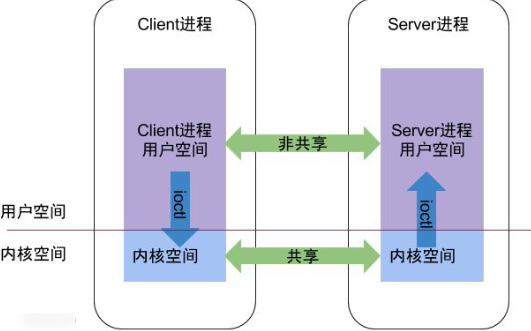
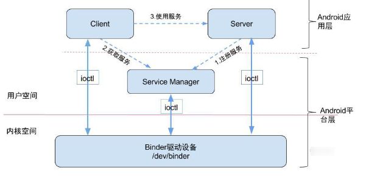

# 第一节 Binder 系列 —— 开篇
## 概述
Android 系统中，每个应用程序是由 Android 的 `Activity, Service, Broadcast, ContentProvider` 这四剑客中的一个或者多个组合而成的，这四个所设计的多线程间通信底层都是依赖于 Binder IPC 机制
## Binder 
### IPC 原理
从进程角度看 IPC 机制     


每个 Android 进程，只能在自己进程所有用的虚拟地址空间，对于一个虚拟空间，分为两个区域：用户空间和内核空间，对于用户空间，不同进程之间彼此是不能共享的，内存空间却可以。Client 进程和 Server 进程的通信，是利用进程间可共享的内核内存空间来完成底层通信工作，他们采用 `ioctl` 的方式访问内核驱动
### Binder 原理
Bineder 通信采用 C/S 架构，从组合视角来说，包含了 Client、Server、ServiceManager 以及 Binder 驱动。架构图如下         

  
无论是注册服务和获取服务的过程的都需要 ServiceManager，这的 ServiceManager 是 Native 层的 ServiceManager，不是 framework 层的 ServiceManager。ServiceManager 是整个 Binder 通信机制的大管家，是 Android 进程间通信机制 Binder 的守护进程，了解 Binder 机制，首先要需要了解如何**启动 ServiceManager**，启动后Client 和 Server 通信都需要先获取 **Service Manager 接口**，才能获取通信服务。图中 Client/Server/ServiceManage 之间的通信都是基于 Binder 机制，同样也是 C/S 架构，就会有对应的**注册服务，获取服务和使用服务**
## 提纲
## 源码目录
从上而下，整个Binder 架构所设计的总共有已选五个地方
```
/framework/base/core/java
/framework/base/core/jni
/framework/native/libs/binder
/framework/native/cmds/servicemanger
/kernel/drivers/staging/android
```