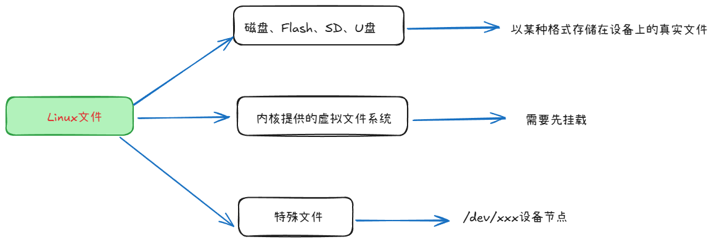
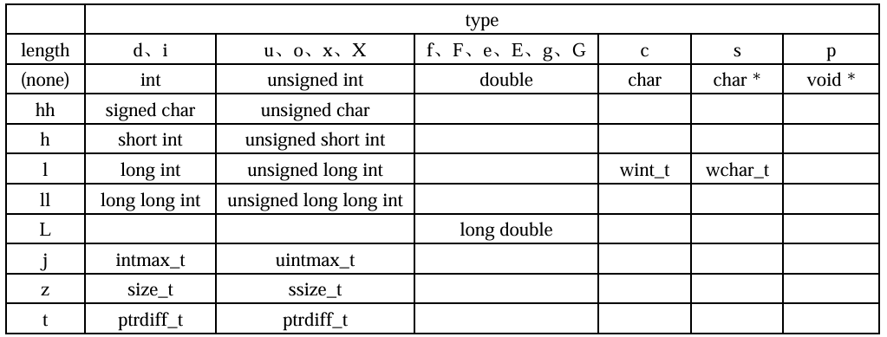

# ```Linux``` 应用开发基础知识
## 文件```IO```基础
```Linux``` 系统下，一切皆文件，也包括各种硬件设备，使用```open```函数打开任何文件成功情况下便会返回对应的文件描述符```fd```。每一个硬件设备都会对应于Linux系统下的某一个文件，把这类文件称为设备文件。所以设备文件对应的其实是某一硬件设备，应用程序通过对设备文件进行读写等操作、来使用、操控硬件设备
### 文件来源

### 访问文件
#### 通用的 ```IO``` 函数
**open**
- 函数原型和头文件包含
    ```c
    #include <sys/types.h>
    #include <sys/stat.h>
    #include <fcntl.h>

    int open(const char *pathname, int flags);
    int open(const char *pathname, int flags, mode_t mode);
    ```
    1. 打开文件
        ```c
        int fd = open("filename", O_RDWR);
        close(fd);
        ```
        - ```O_RDWR``` : 只读模式。文件必须存在，否则打开失败
    2. 创建文件
        ```c
        int fd = open("filename", O_RDWR | O_CREAT | O_TRUNC, 0777);
        ```
        - ```O_CREAT``` : 如果文件不存在，则创建新文件。需配合 ```mode``` 参数指定权限如 ```0777```
        - ```O_TRUNC``` : 若文件已存在且以 **可写方式（```O_WRONLY``` 或 ```O_RDWR```）** 打开，则清空文件内容。    

**write**
- 函数原型和头文件包含
    ```c 
    #include <unistd.h>
    ssize_t write(int __fd, const void *__buf, size_t __n);
    ```
    1. 写入文件，每次执行都会清空文件重新写入
        ```c
        int fd = open("filename", O_RDWR | O_CREAT | O_TRUNC, 0777);
        write(fd, "string to write", string_to_write_len);
        close(fd);
        ```

**lseek**
- 函数原型和头文件包含
    ```c
    #include <sys/types.h>
    #include <unistd.h>
    off_t lseek(int __fd, off_t __offset, int __whence)
    ```
    1. 写入文件，在与文件开头偏移的某个地方写入
        ```c
        int fd = open(argv[1], O_RDWR | O_CREAT, 0644);
        lseek(fd, 3, SEEK_SET);
        write(fd, "123", 3);
        close(fd);
        ```

**read**
- 函数原型和头文件包含
    ```c
    #include <unistd.h>
    ssize_t read(int fd, void *buf, size_t count);
    ```
    1. 读取文件，以块读取的方式进行
        ```c
        int fd = open(argv[1], O_RDONLY);
        int len = 0;
        unsigned char buf[100]
        while(1)
        {
            // 每次都以长度为sizeof(buf) - 1来进行读取
            // 如果读取到的长度小于sizeof(buf) - 1，那么len就为实际读取到的长度
            // 如果读取到的长度大于sizeof(buf) - 1，那么len就为sizeof(buf) - 1
            len = read(fd, buf, sizeof(buf) - 1);
            if(len < 0)
            {
                perror("read");
                close(fd);
                return -1;
            }
            else if(len == 0)
            {
                break;
            }
            else
            {
                buf[len] = '\0';
                printf("%s". buf);
            }
        }
        close(fd);
        ```
#### 非通用的 ```IO``` 函数
- ```void *mmap(void *__addr, size_t __len, int __prot, int __flags, int __fd, off_t __offset); ```
    - 在Linux中，还可以把一个文件的所有内容映射到内存，然后直接读写内存
    即可读写文件
    - 需要包含头文件 ```#include <sys/mman.h>```
    1. 将一个老文件映射到内存，通过读取内存写入新文件
        ```c
        struct stat stat;
        // 打开旧文件
        int fd_old = open("flie_old", O_RDONLY);
        // 获取旧文件状态
        fstat(fd_old, &stat);
        // 将旧文件的内容映射到内存
        char *buf = mmap(NULL, stat.st_size, PORT_READ, MAP_SHARED, fd_old, 0);
        // 创建新文件
        int fd_new = open("file_new", O_WRONLY | O_CREAT | O_TRUNC, 0666)) 
        // 将内存里的内容写入新文件
        write(fd_new, buf, stat.st_size);
        close(fd_old);
        close(fd_new);
        ```
#### ```fcntl```和```ioctl```
**fcntl**
- 函数原型和头文件包含
    ```c
        #include <unistd.h>
        #include <fcntl.h>

        int fcntl(int fd, int cmd, ... /* arg */ );
    ```
    1. 复制文件描述符
    ```c
    int fd1 = open("./test_file", O_RDONLY);
    int fd2 = fcntl(fd1, F_DUPFD, 0);
    ```
    2. 获取/设置文件标志位
    ```c
    int fd1 = open("./test_file", O_RDWR);
    int flag = fcntl(fd1, F_GETFL);
    fcntl(fd1, F_SETFL, flag | O_APPEND)
    ```
    等等    

**ioctl**
- 函数原型和头文件包含
    ```c
       #include <sys/ioctl.h>

       int ioctl(int fd, unsigned long request, ...);
    ```
    1. 主要用于设备控制，而不是普通文件操作，下方是操作屏幕背光的例子
    ```c
    int backlight_fd = open("/dev/backlight", O_RDWR);
    struct backlight_info info = {0};

    ioctl(backlight_fd, BACKLIGHT_GET_INFO, &info);
    info.brightness_value = backlight_val;
    ioctl(backlight_fd, BACKLIGHT_SET_INFO, &info);
    ioctl(backlight_fd, BACKLIGHT_START);

    ```


## 查看函数帮助
- 在 ```Linux``` 系统下，可以通过```man```命令（手册）来查看某一个 ```Linux``` 系统调用的帮助信息，```man```命令可以将该系统调用的详细信息显示出来，譬如函数功能介绍、函数原型、参数、返回值以及使用该函数所需包含的头文件等信息
- ```man``` 命令后面跟着两个参数
    - 数字```2```表示系统调用，```man```命令除了可以查看系统调用的帮助信息外，还可以查看```Linux```命令（对应数字```1```）以及标准```C```库函数（对应数字```3```）所对应的帮助信息
    - 最后一个参数表示需要查看的系统调用函数名。
    ```bash
    man ls 
    man 2 open
    ```

## 深入探究文件 ```IO```
### 错误处理与 ```errno```
当程序中调用函数发生错误的时候，操作系统内部会通过设置程序的```errno```变量来告知调用者究竟发生了什么错误
#### ```strerror``` 函数
这是一个```C```库函数，该函数可以将对应的```errno```转换为我们可以查看的字符串信息
- 函数原型和头文件包含
    ```c
    #include <string.h>
    char *strerror(int errnum);
    ```
#### ```perror``` 函数
这也是一个```c```库函数，调用此函数不需要传入```errno```，函数内部会自己去获取```errno```的值，此函数会直接将错误提示打印出来
- 函数原型和头文件包含
    ```c
    #include <stdio.h>
    void perror(const char *s);
    ```
### EXIT
在```Linux```系统中，进程退出可以分为正常退出和异常退出，进程正常退出除了```return```，还可以是使用```exit、_exit、_Exit```
- 函数原型和头文件包含
    ```c
    #include <unistd.h>
    void _exit(int status);
    #include <stdlib.h>
    void _Exit(int status);
    void exit(int status);
    ```
这三个函数在调用需要传入```status```状态标志，```0```表示正常结束、若为其它值则表示程序执行过程中检测到有错误发生。
### 空洞文件```Sparse File```
1. **概念**：又称稀疏文件，是一种在文件系统中优化存储的特殊文件。其核心特点是逻辑大小大于实际占用的物理存储空间，文件中的“空洞”部分并未写入实际数据，系统也不会为其分配磁盘块
2. **应用例子**：在使用迅雷下载文件时，还未下载完成，就发现该文件已经占据了全部文件大小的空间，这也是空洞文件；下载时如果没有空洞文件，多线程下载时文件就只能从一个地方写入，这就不能发挥多线
程的作用了；如果有了空洞文件，可以从不同的地址同时写入，就达到了多线程的优势
### 文件共享
同一个文件被该文件的不同文件描述符同时进行IO操作
#### 多文件操作
1. 一个进程内多次```open```打开同一个文件，会得到多个不同的文件描述符，关闭时也需要多次调用
2. 一个进程内多次```open```打开同一个文件，在内存中并不会存在多分动态文件，只有一份
3. 一个进程内多次```open```打开同一个文件，不同文件描述符所对应的读写位置偏移量是相互独立的
#### 复制文件描述符
复制文件操作符可以实现同一个文件连续写
- 函数原型和头文件包含
    ```c
       #include <unistd.h>

       int dup(int oldfd);
       int dup2(int oldfd, int newfd);
    ```
    1. ```dup``` 这个函数系统调用分配的文件描述符是由系统分配的，不能自行指定
    2. ```dup2``` 这个函数允许指定新的文件描述符，并自动处理已有描述符的冲突关闭
#### 原子操作和竞争冒险
**原子操作**：是指在多线程或并发环境中不可被中断的一个或一系列操作，这些操作要么完全执行，要么完全不执行，不会出现执行到中间状态的情况     
**竞争冒险**：是指多个线程或进程同时访问共享资源，并且至少有一个访问是写操作时，由于执行顺序的不确定性导致程序行为出现错误的情况

## 标准```I/O```库
### 流和```FILE```对象
```FILE``` 是一个结构体数据类型，它包含了标准```I/O```库函数为管理文件所需要的所有信息，包括用于实际```I/O``` 的文件描述符、指向文件缓冲区的指针、缓冲区的长度、当前缓冲区中的字节数以及出错标志等
```c
#ifndef _FILE_DEFINED
  struct _iobuf {
#ifdef _UCRT
    void *_Placeholder;
#else
    char *_ptr;
    int _cnt;
    char *_base;
    int _flag;
    int _file;
    int _charbuf;
    int _bufsiz;
    char *_tmpfname;
#endif
  };
  typedef struct _iobuf FILE;
#define _FILE_DEFINED
#endif
```
### 标准输入、标准输出以及标准错误
- 标准输入设备指的就是计算机系统的标准的输入设备，通常指的是计算机所连接的键盘
- 标准输出设备指的是计算机系统中用于输出标准信息的设备，通常指的是计算机所连接的显示器  
- 标准错误设备则指的是计算机系统中用于显示错误信息的设备，通常也指的是显示器设备
```c
#define STDIN_FILENO    0     /* Standard input.  */ 
#define STDOUT_FILENO   1     /* Standard output.  */ 
#define STDERR_FILENO   2     /* Standard error output.  */ 
```
### 格式化```I/O```
#### 格式化输出
```c
#include <stdio.h>

int printf(const char *format, ...);
int fprintf(FILE *stream, const char *format, ...);
int dprintf(int fd, const char *format, ...);
int sprintf(char *str, const char *format, ...);
int snprintf(char *str, size_t size, const char *format, ...);

#include <stdarg.h>

int vprintf(const char *format, va_list ap);
int vfprintf(FILE *stream, const char *format, va_list ap);
int vdprintf(int fd, const char *format, va_list ap);
int vsprintf(char *str, const char *format, va_list ap);
int vsnprintf(char *str, size_t size, const char *format, va_list ap);
```
1. ```printf```
    - 用于将程序中的字符串信息输出显示到终端
2. ```fprintf```
    - 可将格式化数据写入到由FILE指针指定的文件中
3. ```dprintf```
    - 可将格式化数据写入到由文件描述符fd指定的文件中
4. ```sprintf```
    - 函数将格式化数据存储在由参数 buf 所指定的缓冲区中
5. ```snprintf```
    - 在 ```sprintf``` 的基础上，显示指定缓冲区大小    
##### 格式控制字符```format```
```%[flags][width][.precision][length]type```
- **type**，用于指定输出数据的类型，使用一个字符表示
    |字符|数据类型|含义|实例说明|
    |----|-------|----|-------|
    |```d```|```int```|输出有符号十进制表示的整数|```printf("%d\n", 123)```，输出：123|
    |```o```|```unsigned int```|输出无符号八进制表示的整数|```printf("%o\n", 123)```，输出：173|
    |```u```|```unsigned int```|输出无符号十进制表示的整数|```printf("%u\n", 123)```，输出：123|
    |```x```|```unsigned int```|输出无符号十进制表示的整数，小写字母|```printf("%x\n", 123)```，输出：7b|
    |```f```|```double```|输出浮点数，单精度浮点数类型和双精度浮点数类型都可以使用，在没指定精度的情况下，默认保留小数点后6位数字 |```printf("%f\n", 520.1314)```，输出：520.131400|
    |```e```|```double```|输出以科学计数法表示的浮点数，使用指数表示浮点数 |```printf("%e\n", 520.1314)```，输出：:5.201314e+02 |
    |```g```|```double```|根据数值的长度，选择以最短的方式输出，%f/%e |```printf("%g  %g\n", 0.000000123, 0.123);```，输出：1.23e-07  0.123 |
    |```c```|```char```|字符型，可以把输入的数字按照ASCII码相应转换为对应的字符输出 |```printf("%c\n", 64)```，输出：A|
    |```s```|```char*```|字符串，输出字符串中的字符直至终止字符```\0``` |```printf("%s\n", Hello World")```，输出：Hello World|
    |```p```|```void *```|输出十六进制表示的指针  |```printf("%p\n", "Hello World")```，输出：0x400624|    

    其中```x```、```e```、```f```、```g```都有对应的大写形式    

- **flags** 用于规定输出样式，```%```后面可以跟多个或者不跟一下表示
    |字符|名称|作用|
    |----|----|----|
    |`#`|井号|<ul><li> `type`等于`o`时，输出字符串增加前缀`0`；</li><li>  `type`等于`x`或`X`时，输出字符串增加前缀`0x`或`0X`；</li><li>`type`等于`a`、`A`、`e`、`E`、`f`、`F`、`g`和`G`其中之一时，在默认情况下，只有输出小数部分时才会输出小数点，如果使用`.0`控制不输出小数部分，那么小数点是不会输出的，然而在使用了标志`#`的情况下，输出结果始终包含小数点；</li><li>`type`等于`g`和`G`时，保留尾部的`0`|
    |`0`|数字零|当输出数字时，在输出字符串前面补`0`，直到占满指定的最小输出宽度|
    |`-`|减号|输出字符串默认情况下是右对齐的，不足最小输出宽度时在左边填空格或`0`；使用了`-`标志，则会变成左对齐，然后在右边填空格|
    |``|空格|输出正数时在前面加一个空格，输出负数时，前面加一个负号`-`|
    |`+`|加号|默认情况下，只有输出负数时，才会输出负号`-`；正数前面是没有正号`+`的；而使用了标志`+`后，输出的数字前面都带有符号（正数为`+`、负数为`-`）|   

- **width** 最小的输出宽度，用十进制数来表示输出的最小位数，若实际的输出位数大于指定的输出的最小位数，则以实际的位数进行输出，若实际的位数小于指定输出的最小位数，则可按照指定的`flags`标志补`0`或补空格
    |`width`|描述|示例|
    |----|----|----|   
    |数字|十进制正数|```printf("%06d", 1000);```  输出: 001000|
    |`*`|星号，不显示指出最小输出宽度，而是以星号代替，会在参数列表中指定 |```printf("%0*d", 6, 1000);```  输出: 001000|
- **precision**，精度字段一点号`.`开头，后面跟一个十进制整数，取值如下：
    1. 对于整形，`precision`表示输出的最小的数字个数，不足补前导零，超过不截断。这里要注意：是数字的个数、与`width`字段是有区别的，`width`指的是整个输出字符串的最小位数（最小宽度），并不是数字的最小宽度，譬如：`printf("%8.5d\n", 100);` 输出:`   00100`（前面有3个空格）
    2. 对于浮点型，`precision`表示小数点后数字的个数，也就是浮点数精度；默认为六位，不足补后置`0`，超过则截断。譬如： `printf("%.8f\n", 520.1314); `输出:`520.13140000` 
    3. 对于字符串，`precision`表示输出字符串中最大可输出的字符数，不足正常输出，超过则截断。譬如：` printf("%.5s\n", "hello world"); `输出:`hello`；超过5个字符的部分被丢弃
    4. 以星号代替十进制数字，类似于`width`字段中的`*`，表示在参数列表中指定；譬如： `printf("%.*s\n", 5, "hello world");` 输出:`hello`
- **length**，长度修饰符指明待转换数据的长度
    
#### 格式化输入
```c
#include <stdio.h>

int scanf(const char *format, ...);
int fscanf(FILE *stream, const char *format, ...);
int sscanf(const char *str, const char *format, ...);

#include <stdarg.h>

int vscanf(const char *format, va_list ap);
int vsscanf(const char *str, const char *format, va_list ap);
int vfscanf(FILE *stream, const char *format, va_list ap);
```

## 文件属性与目录
