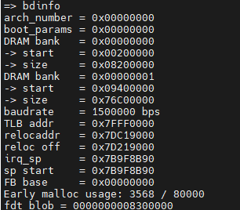
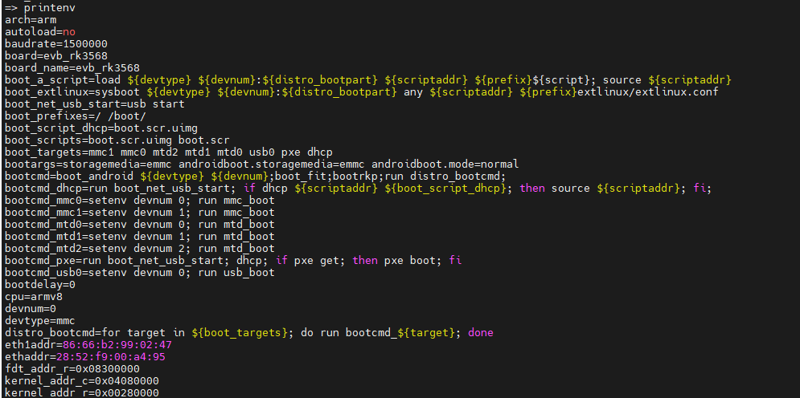
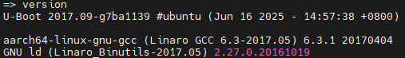

# U-Boot 使用
## U-Boot 简介
U-Boot 用于引导Linux系统，Linux系统要启动需要通过bootloader程序引导，也就说芯片上电以后先运行一段bootloader程序。这段bootloader程序会先初始化DDR等外设，然后将Linux内核从flash(NAND，NOR FLASH，SD，EMMC 等)拷贝到DDR中，最后启动Linux内核
uboot的全称是 Universal Boot Loader，uboot是一个遵循GPL协议的开源软件，uboot是一个裸机代码，可以看作是一个裸机综合例程。
## U-Boot 初次编译
### 编译与烧写
```bash
# 使用build.sh对uboot进行单独编译
./build.sh u-boot
# 进入uboot目录，使用make.sh进行编译
./make.sh rk3566
```
### U-Boot 启动过程
使用串口工具连接开发板，Rockchip平台的uboot只能通过按`CTRL+C`组合键进入uboot命令行，效果如下
```bash
U-Boot 2017.09-g7ba1139 #ubuntu (Jun 16 2025 - 14:57:38 +0800)

Model: Rockchip RK3568 Evaluation Board
MPIDR: 0x81000000
PreSerial: 2, raw, 0xfe660000
DRAM:  2 GiB
Sysmem: init
Relocation Offset: 7d219000
Relocation fdt: 7b9f8ba8 - 7b9fecd0
CR: M/C/I
Using default environment

Hotkey: ctrl+c
optee api revision: 2.0
dwmmc@fe2b0000: 1, dwmmc@fe2c0000: 2, sdhci@fe310000: 0
Bootdev(atags): mmc 0
MMC0: HS200, 200Mhz
PartType: EFI
TEEC: Waring: Could not find security partition
DM: v1
boot mode: normal
RESC: 'boot', blk@0x00012e01
resource: sha256+
FIT: no signed, no conf required
   - dev=saradc, channel=2, dtb_adc=0, read=175, found=0
   - dev=saradc, channel=2, dtb_adc=341, read=175, found=0
   - dev=saradc, channel=2, dtb_adc=702, read=175, found=0
DTB: rk-kernel.dtb
HASH(c): OK
I2c0 speed: 100000Hz
vsel-gpios- not found! Error: -2
vdd_cpu init 900000 uV
PMIC:  RK8090 (on=0x40, off=0x00)
vdd_logic init 900000 uV
vdd_gpu init 900000 uV
vdd_npu init 900000 uV
io-domain: OK
INFO:    ddr dmc_fsp already initialized in loader.
iCould not find baseparameter partition
Model: Rockchip RK3568 ATK EVB1 DDR4 V10 Board
MPIDR: 0x81000000
Rockchip UBOOT DRM driver version: v1.0.1
VOP have 2 active VP
vp0 have layer nr:3[1 3 5 ], primary plane: 5
vp1 have layer nr:3[0 2 4 ], primary plane: 4
vp2 have layer nr:0[], primary plane: 0
Using display timing dts
dsi@fe070000:  detailed mode clock 65000 kHz, flags[a]
    H: 0720 0768 0776 0828
    V: 1280 1296 1302 1317
bus_format: 100e
VOP update mode to: 720x1280p60, type: MIPI1 for VP1
VP1 set crtc_clock to 65000KHz
VOP VP1 enable Smart0[654x270->654x270@33x505] fmt[2] addr[0x7df2c000]
final DSI-Link bandwidth: 432 Mbps x 4
hdmi@fe0a0000 disconnected
CLK: (sync kernel. arm: enter 816000 KHz, init 816000 KHz, kernel 0N/A)
  apll 1416000 KHz
  dpll 528000 KHz
  gpll 1188000 KHz
  cpll 1000000 KHz
  npll 1200000 KHz
  vpll 650000 KHz
  hpll 24000 KHz
  ppll 200000 KHz
  armclk 1416000 KHz
  aclk_bus 150000 KHz
  pclk_bus 100000 KHz
  aclk_top_high 500000 KHz
  aclk_top_low 400000 KHz
  hclk_top 150000 KHz
  pclk_top 100000 KHz
  aclk_perimid 300000 KHz
  hclk_perimid 150000 KHz
  pclk_pmu 100000 KHz
Net:   eth0: ethernet@fe2a0000, eth1: ethernet@fe010000
Hit key to stop autoboot('CTRL+C'):  0
=> <INTERRUPT>
=> <INTERRUPT>
=> <INTERRUPT>
=> <INTERRUPT>
=>
```
## U-Boot 命令使用
进入uboot的命令行模式可以键入`help`或者`?`来查看当前uboot所支持的命令
### 查询命令
- `bdinfo`可以用于查看板子信息
    
- `printenv`可以用于输出环境变量信息，下图为部分环境变量信息
    
- `version`用于查看uboot的版本号
    
### 环境变量操作
1. 修改环境变量
    - `setenv`命令用于设置或者修改环境变量的值
    - `saveenv`命令用于保存修改后的环境变量
    ```bash
    setenv bootdelay 5
    saveenv
    ```
    一般环境变量存放在外部的flash中，uboot启动的时候会将环境变量从flash读到dram中。所以使用`setenv`修改的是dram中的环境变量值，`saveenv`将修改的环境变量的值保存到flash
2. 新建环境变量
    - `setenv`命令也可以用于新建命令，用法和修改环境变量一样
    ```bash
    setenv author 'igotu'
    saveenv
    ```
3. 删除环境变量
    - `setenv`命令也可以用于删除环境变量，只要给环境变量赋控制即可
### 内存操作命令
内存操作命令就是用于直接对dram进行读写操作的，**uboot命令中的数字都是十六进制的**
1. `md`命令用于显示内存值，格式如下：
    ```bash
    md[.b,.w,.l] address [# of objects]
    ```
    1. [.b,.w,.l] 分别以一个字节、两个字节、四个字节来显示内存值
    2. address 是要查看内存的起始地址
    3. [# of objects]表示要看的数据长度
    ```bash
    # 查看 0X08300000 开始的 20 个字节的内存值
    md.b 8300000 14
    ```
2. `nm`命令用于修改指定地址的内存值，格式如下
    ```bash
    nm[.b,.w,.l] address
    ```
    1. [.b,.w,.l] 分别以一个字节、两个字节、四个字节来指定操作格式
    2. address 是要修改内存的起始地址
    ```bash
    => nm.l 8300000
    08300000: edfe0dd0 ? 1111111
    08300000: 01111111 ? q
    ```
3. `mm`命令用于修改指定地址的内存值的，使用该命令修改内存值的时候地址会自增，而`nm`地址不会自增
    ```bash
    mm[.b,.w,.l] address
    ```
    1. [.b,.w,.l] 分别以一个字节、两个字节、四个字节来指定操作格式
    2. address 是要修改内存的起始地址
    ```bash
    => mm.l 8300000
    08300000: 01111111 ? 11111111
    08300004: d82b0200 ? 11111111
    08300008: 38000000 ? 11111111
    0830000c: 60f80100 ? 11111111
    08300010: 28000000 ? 11111111
    08300014: 11000000 ? 11111111
    08300018: 10000000 ? q
    ```
4. `mw`用于使用一个指定数据填充一段内存，格式如下：
    ```bash
    mw[.b,.w,.l] address value [count]
    ```
    1. [.b,.w,.l] 分别以一个字节、两个字节、四个字节来指定操作格式
    2. address 是要修改内存的起始地址
    3. value 为要填充的数据
    4. count 是填充的长度
5. `cp`用于拷贝数据，将dram中的数据从一段内存拷贝到另一段内存中，或者把norflash中的数据拷贝到dram中，格式如下：
    ```bash
    cp[.b,.w,.l] source target count
    ```
    1. [.b,.w,.l] 分别以一个字节、两个字节、四个字节来指定操作格式
    2. source 为源地址
    3. target 为目标地址
    4. count 为拷贝长度
6. `cmp`用于比较数据，格式如下：
    ```bash
    cp[.b,.w,.l] addr1 addr2 count
    ```
    1. [.b,.w,.l] 分别以一个字节、两个字节、四个字节来指定操作格式
    2. addr1 为地址1
    3. addr2 为地址2
    4. count 为对比长度
### 网络操作命令
一直uboot时候一般要调通网络功能，因为移植kernel中需要使用uboot的网络调试功能
|环境变量|描述|
|-------|-----|
|ipaddr|开发板ip，可以不设置使用`dhcp`命令来从路由器获取IP地址|
|ethaddr|开发板的MAC地址|
|gatewayip|网关地址|
|netmask|子网掩码|
|serverip|服务器IP地址|     

注意，网络地址环境变量的设置要根据自己的实际情况，确保 Ubuntu 主机和开发板的 IP
地址在同一个网段内
```bash
=> setenv ipaddr 192.168.5.224
=> setenv gatewayip 192.168.5.1
=> setenv netmask 255.255.255.0
=> setenv serverip 192.168.5.223
=> saveenv
```
1. `ping`命令
2. `dhcp`命令
3. `nfs`命令
4. `tftp`命令
**由于RJ45网口驱动为适配，uboot网络部分暂时留坑**
### EMMC和SD卡操作
uboot中常用操作MMC设备的命令为`mmc`，该命令为一系列命令，后面可以跟不同的参数
1. `mmc info`用于输出当前选择的mmc info设备信息
    ```bash
    => mmc info
    Device: sdhci@fe310000
    Manufacturer ID: d6
    OEM: 100
    Name: MMC8G
    Timing Interface: HS200
    Tran Speed: 200000000
    Rd Block Len: 512
    MMC version 5.1
    High Capacity: Yes
    Capacity: 7.3 GiB
    Bus Width: 8-bit
    Erase Group Size: 512 KiB
    HC WP Group Size: 8 MiB
    User Capacity: 7.3 GiB WRREL
    Boot Capacity: 4 MiB ENH
    RPMB Capacity: 4 MiB ENH
    ```
2. `mmc rescan`用于扫描当前开发板上所有的MMC设备
3. `mmc list`用于来查看当前开发板一共有几个MMC设备
    ```bash
    => mmc list
    dwmmc@fe2b0000: 1
    dwmmc@fe2c0000: 2
    sdhci@fe310000: 0 (eMMC)
    ```
    一共有三个个MMC设备
    - sdhci@fec310000:0 (eMMC)是EMMC
    - dwmmc@fe2b0000:1 (SD)是SD卡
    - dwmmc@fe2c0000: 2（SDIO）是SDIOWIFI设备（若没有接MMC设备，这里就代表SDIO总线）
4. `mmc dev`用于切换当前MMC设备，格式如下：
    ```bash
    mmc dev [dev] [part]
    ```
    1. [dev]用来设置要切换的MMC设备号
    2. [part]是分区号，如果不写分区号的话默认为分区0
5. `mmc part`用于查看当前设备分区
    ```bash
    => mmc part
    Partition Map for MMC device 0  --   Partition Type: EFI

    Part    Start LBA       End LBA         Name
            Attributes
            Type GUID
            Partition GUID
    1     0x00004000      0x00005fff      "uboot"
            attrs:  0x0000000000000000
            type:   2e660000-0000-441d-8000-125f000073d1
            guid:   9c4e0000-0000-4258-8000-5a3b00000b17
    2     0x00006000      0x00007fff      "misc"
            attrs:  0x0000000000000000
            type:   e4700000-0000-4210-8000-1b1500004a0b
            guid:   9f180000-0000-4d24-8000-482700004cb7
    3     0x00008000      0x00027fff      "boot"
            attrs:  0x0000000000000000
            type:   a5320000-0000-4c01-8000-18e800006863
            guid:   10170000-0000-4779-8000-5a1300007d98
    4     0x00028000      0x00047fff      "recovery"
            attrs:  0x0000000000000000
            type:   395e0000-0000-4911-8000-43a000004720
            guid:   b92e0000-0000-4a4d-8000-3dc800002a04
    5     0x00048000      0x00057fff      "backup"
            attrs:  0x0000000000000000
            type:   680a0000-0000-4206-8000-3a050000078c
            guid:   60240000-0000-4c37-8000-010f00000541
    6     0x00058000      0x00c57fff      "rootfs"
            attrs:  0x0000000000000000
            type:   fa2e0000-0000-4f4b-8000-00de00006aed
            guid:   614e0000-0000-4b53-8000-1d28000054a9
    7     0x00c58000      0x00c97fff      "oem"
            attrs:  0x0000000000000000
            type:   b6280000-0000-486d-8000-7af50000578c
            guid:   cb410000-0000-4f60-8000-616d00003b51
    8     0x00c98000      0x00e8ffbf      "userdata"
            attrs:  0x0000000000000000
            type:   65390000-0000-451f-8000-741000005ab1
            guid:   1f6a0000-0000-4102-8000-121600002cb4
    ```
6. `mmc read`用于读取mmc设备的数据，格式如下：
    ```bash
    mmc read addr blk# cnt
    ```
    1. addr 是数据读取到dram中的地址
    2. blk 是要读取的块起始地址(十六进制)
    3. cnt 是要读取的块数量(十六进制)
    ```bash
    EMMC 的第 1024(0x400)个块开始，读取 16(0x10)个块的数据到 DRAM 的0XC0000000 地址处
    => mmc read 8300000 400 10
    ```

### BOOT操作
### 其他常用
### MII命令