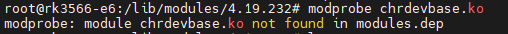
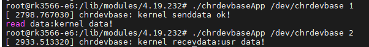

# 字符设备驱动开发
## 字符设备驱动简介
字符设备是Linux驱动中最基本的一类设备驱动，字符设备就是一个一个字节，按照字节流进行读写操作的设备，读写数据是分先后顺序的   
- **应用程序对驱动层序的调用**
    
    1. 驱动加载成功后会在`/dev`目录下生成一个响相应的文件，应用程序通过对这个名为`/dev/xxx`的文件进行相应的操作即可实现对硬件的操作，`xxx`是具体的驱动文件名字
    2. 应用程序运行在用户空间，而Linux驱动属于内核的一部分，因此驱动运行于内核空间。所以我们在用户空间想要实现对内核的操作，得使用系统调用
- **Linux驱动的两种运行方式**
    1. 将驱动编译进Linux内核中，这样当Linux内核启动的时候就会自动运行驱动程序
    2. 将驱动编译成模块，Linux下模块扩展名为`.ko`，在Linux内核启动以后使用`modprobe`或者`insmod`命令加载驱动模块
### `file_operations`结构体
```c
struct file_operations {
	struct module *owner;
	loff_t (*llseek) (struct file *, loff_t, int);
	ssize_t (*read) (struct file *, char __user *, size_t, loff_t *);
	ssize_t (*write) (struct file *, const char __user *, size_t, loff_t *);
	ssize_t (*read_iter) (struct kiocb *, struct iov_iter *);
	ssize_t (*write_iter) (struct kiocb *, struct iov_iter *);
	int (*iopoll)(struct kiocb *kiocb, struct io_comp_batch *,
			unsigned int flags);
	int (*iterate_shared) (struct file *, struct dir_context *);
	__poll_t (*poll) (struct file *, struct poll_table_struct *);
	long (*unlocked_ioctl) (struct file *, unsigned int, unsigned long);
	long (*compat_ioctl) (struct file *, unsigned int, unsigned long);
	int (*mmap) (struct file *, struct vm_area_struct *);
	unsigned long mmap_supported_flags;
	int (*open) (struct inode *, struct file *);
	int (*flush) (struct file *, fl_owner_t id);
	int (*release) (struct inode *, struct file *);
	int (*fsync) (struct file *, loff_t, loff_t, int datasync);
	int (*fasync) (int, struct file *, int);
	int (*lock) (struct file *, int, struct file_lock *);
	unsigned long (*get_unmapped_area)(struct file *, unsigned long, unsigned long, unsigned long, unsigned long);
	int (*check_flags)(int);
	int (*flock) (struct file *, int, struct file_lock *);
	ssize_t (*splice_write)(struct pipe_inode_info *, struct file *, loff_t *, size_t, unsigned int);
	ssize_t (*splice_read)(struct file *, loff_t *, struct pipe_inode_info *, size_t, unsigned int);
	void (*splice_eof)(struct file *file);
	int (*setlease)(struct file *, int, struct file_lock **, void **);
	long (*fallocate)(struct file *file, int mode, loff_t offset,
			  loff_t len);
	void (*show_fdinfo)(struct seq_file *m, struct file *f);
#ifndef CONFIG_MMU
	unsigned (*mmap_capabilities)(struct file *);
#endif
	ssize_t (*copy_file_range)(struct file *, loff_t, struct file *,
			loff_t, size_t, unsigned int);
	loff_t (*remap_file_range)(struct file *file_in, loff_t pos_in,
				   struct file *file_out, loff_t pos_out,
				   loff_t len, unsigned int remap_flags);
	int (*fadvise)(struct file *, loff_t, loff_t, int);
	int (*uring_cmd)(struct io_uring_cmd *ioucmd, unsigned int issue_flags);
	int (*uring_cmd_iopoll)(struct io_uring_cmd *, struct io_comp_batch *,
				unsigned int poll_flags);
} __randomize_layout;
```
- `owner`拥有该结构体的模块的指针，一般设置为THIS_MODULE
- `llseek`函数用于修改文件当前的读写位置
- `read`函数用于读取设备文件
- `write`函数用于像设备文件写入发送数据
- `poll`函数用于查询设备是否可以进行非阻塞的读写
- `unlocked_ioctl`函数用于提供对设备的控制，与应用程序中的`ioctl`函数对应
- `mmap`函数用于将设备的内存映射到进程空间中(也就是用户空间)，一般帧缓冲设备会使用此函数
- `open`函数用于打开设备文件
- `release`函数用于释放(关闭)设备文件，与应用程序中的 close 函数对应
- `fasync`函数用于刷新待处理的数据，用于将缓冲区中的数据刷新到磁盘中    


## 字符设备驱动开发步骤
### 驱动模块的加载和卸载
- 模块加载操作    
    ```module_init(xxx_init);```
    `module_init`函数用来向Linux内核注册一个模块加载函数，参数`xxx_init`就是需要注册的具体函数，当使用`modprobe`命令或者`insmod`命令加载驱动的时候，`xxx_init`这个函数就会被调用。
- 模块卸载操作
    ```module_exit(xxx_exit);```
    `module_exit`函数用来向Linux内核注册一个模块卸载函数，参数`xxx_exit`就是需要注册的具体函数，当使用`rmmod`命令卸载具体驱动的时候`xxx_exit`函数就会被调用。
- 字符设备驱动模块加载和卸载函数模板
    ```c
    /* 驱动入口函数 */ 
    static int __init xxx_init(void)
    {
        /* 入口函数具体内容 */ 
        return 0;
    }
    /* 驱动出口函数 */ 
    static void __exit xxx_exit(void)
    {
        /* 出口函数具体内容 */ 
    }
    /* 将上面两个函数指定为驱动的入口和出口函数 */ 
    module_init(xxx_init);
    module_exit(xxx_exit);
    ```
驱动编译完成以后扩展名为`.ko`，可以使用`modprobe`命令或者`insmod`命令加载驱动，
- 假设加载`drv.ko`模块:
    1. ```insmod drv.ko```
        - 该命令不能解决模块的依赖关系，比如`drv.ko`依赖`first.ko`这个模块，就必须先使用`insmod`命令加载`first.ko`这个模块，然后再加载`drv.ko`这个模块
    2. ```modprobe drv.ko```
        - `modprobe`会分析模块的依赖关系，然后会将所有的依赖模块都加载到内核中
- 假设卸载`drv.ko`模块:
    1. ```rmmod drv.ko```
    2. ```modprobe -r drv.ko```
        - `modprobe`命令可以卸载掉驱动模块所依赖的其他模块，前提是这些依赖模块已经没有被其他模块所使用，否则就不能使用`modprobe`来卸载驱动模块
### 字符设备注册与注销
对于字符设备驱动而言，当驱动模块加载成功以后需要注册字符设备，同样，卸载驱动模块的时候也需要注销掉字符设备，其函数原型如下
```c
static inline int register_chrdev(
        unsigned int major,
        const char *name, 
        const struct file_operation *fops);
static inline void unregister_chrdev(
        unsigned int major,
        const char *name);
```
1. `register_chrdev`函数用于注册字符设备
    - `major`，主设备号
    - `name`，设备名字，指向一串字符串
    - `fops`，结构体file_operations 类型指针，指向设备的操作函数集合变量
2. `unregister_chrdev`函数用于注销字符设备
    - `major`，主设备号
    - `name`，设备名字，指向一串字符串
- 字符设备驱动模块加入字符设备注册和注销 
    ```c
    static struct file_operation test_fops;
    /* 驱动入口函数 */ 
    static int __init xxx_init(void)
    {
        /* 入口函数具体内容 */
        int ret_value = 0;
        ret_value = register_chrdev(200, "chrtest", &test_fops);
        if(ret_value < 0)
        {
            /* 字符设备注册失败,自行处理 */ 
        }
        return 0;
    }
    /* 驱动出口函数 */ 
    static void __exit xxx_exit(void)
    {
        /* 注销字符设备驱动 */ 
        unregister_chrdev(200, "chrtest"); 
    }
    /* 将上面两个函数指定为驱动的入口和出口函数 */ 
    module_init(xxx_init);
    module_exit(xxx_exit);
    ```
### 实现设备的具体操作函数
`file_operations`结构体就是设备的具体操作函数，上文中，只是声明了设备，并没有初始化设备，即初始化设备的打开、释放、读写等操作
- 字符设备驱动模块加入加入设备操作函数
    ```c
    /* 打开设备 */
    static int chrtest_open(struct inode* inode, struct file* filp)
    {
        /* 用户实现具体功能 */ 
        return 0;
    }

    /* 从设备读取 */
    static ssize_t chrtest_read(struct file* filp, 
                            char __user* buf, 
                            size_t cnt, 
                            loff_t* offt)
    {
        /* 用户实现具体功能 */ 
        return 0;
    }

    /* 向设备写数据 */ 
    static ssize_t chrtest_write(struct file* filp, 
                            char __user* buf, 
                            size_t cnt, 
                            loff_t* offt)
    {
        /* 用户实现具体功能 */ 
        return 0;
    }

    /* 关闭/释放设备 */ 
    static int chrtest_release(struct inode* inode, struct file* filp)
    {
        /* 用户实现具体功能 */ 
        return 0;
    }

    static struct file_operation test_fops = {
        .owner = THIS_MODULE, 
        .open = chrtest_open, 
        .read = chrtest_read,
        .write = chrtest_write,
        .release = chrtest_release,
    };
    /* 驱动入口函数 */ 
    static int __init xxx_init(void)
    {
        /* 入口函数具体内容 */
        int ret_value = 0;
        ret_value = register_chrdev(200, "chrtest", &test_fops);
        if(ret_value < 0)
        {
            /* 字符设备注册失败,自行处理 */ 
        }
        return 0;
    }
    /* 驱动出口函数 */ 
    static void __exit xxx_exit(void)
    {
        /* 注销字符设备驱动 */ 
        unregister_chrdev(200, "chrtest"); 
    }
    /* 将上面两个函数指定为驱动的入口和出口函数 */ 
    module_init(xxx_init);
    module_exit(xxx_exit);
    ```
### 添加LICENSE和作者信息
LICENSE信息是必须添加的，否则的话编译的时候会报错，作者信息可以添加也可以不添加
```c
MODULE_LICENSE();
MODULE_AUTHOR();
```
- 字符设备驱动模块加入加入LICENSE和作责信息
    ```c
    /* 打开设备 */
    static int chrtest_open(struct inode* inode, struct file* filp)
    {
        /* 用户实现具体功能 */ 
        return 0;
    }

    /* 从设备读取 */
    static ssize_t chrtest_read(struct file* filp, 
                            char __user* buf, 
                            size_t cnt, 
                            loff_t* offt)
    {
        /* 用户实现具体功能 */ 
        return 0;
    }

    /* 向设备写数据 */ 
    static ssize_t chrtest_write(struct file* filp, 
                            char __user* buf, 
                            size_t cnt, 
                            loff_t* offt)
    {
        /* 用户实现具体功能 */ 
        return 0;
    }

    /* 关闭/释放设备 */ 
    static int chrtest_release(struct inode* inode, struct file* filp)
    {
        /* 用户实现具体功能 */ 
        return 0;
    }

    static struct file_operation test_fops = {
        .owner = THIS_MODULE, 
        .open = chrtest_open, 
        .read = chrtest_read,
        .write = chrtest_write,
        .release = chrtest_release,
    };
    /* 驱动入口函数 */ 
    static int __init xxx_init(void)
    {
        /* 入口函数具体内容 */
        int ret_value = 0;
        ret_value = register_chrdev(200, "chrtest", &test_fops);
        if(ret_value < 0)
        {
            /* 字符设备注册失败,自行处理 */ 
        }
        return 0;
    }
    /* 驱动出口函数 */ 
    static void __exit xxx_exit(void)
    {
        /* 注销字符设备驱动 */ 
        unregister_chrdev(200, "chrtest"); 
    }
    /* 将上面两个函数指定为驱动的入口和出口函数 */ 
    module_init(xxx_init);
    module_exit(xxx_exit);
    MODULE_LICENSE("GPL");
    MODULE_AUTHOR("xxx");
    ```

## Linux设备号
### 设备号组成
- Linux中每个设备都有一个设备号，设备号由主设备号和次设备号两部分组成，主设备号表示某一个具体的驱动，次设备号表示使用这个驱动的各个设备，可以使用`cat /proc/devices`查看已经占用的了设备号
- Linux中提供了一个名为`dev_t`的数据类型表示设备号，其类型为`u32`，其中高12位为主设备号，低次设备号
### 设备号的分配
- 静态分配设备号
    驱动开发者可以指定分配一个设备号，前提是这个设备号没被分配过
- 动态分配设备号
    `int alloc_chrdev_region(dev_t *dev, unsigned baseminor, unsigned count, const char *name) `
    - `dev`，保存申请到的设备号
    - `baseminor`，次设备号起始地址
    - `count`，要申请的设备号数量
    - `name`，设备名字    

    `void unregister_chrdev_region(dev_t from, unsigned count) `
    - `from`，要释放的设备号
    - `count`，要释放的设备号数量

## 字符设备驱动实验
在内核中，使用`printk`来输出调试信息，`printk`可以根据日志级别对消息进行分类，一
共有8个消息级别，其中0的优先级最高，7的优先级最低
```c
#define KERN_SOH	"\001"		/* ASCII Start Of Header */
#define KERN_SOH_ASCII	'\001'

#define KERN_EMERG	KERN_SOH "0"	/* system is unusable */
#define KERN_ALERT	KERN_SOH "1"	/* action must be taken immediately */
#define KERN_CRIT	KERN_SOH "2"	/* critical conditions */
#define KERN_ERR	KERN_SOH "3"	/* error conditions */
#define KERN_WARNING	KERN_SOH "4"	/* warning conditions */
#define KERN_NOTICE	KERN_SOH "5"	/* normal but significant condition */
#define KERN_INFO	KERN_SOH "6"	/* informational */
#define KERN_DEBUG	KERN_SOH "7"	/* debug-level messages */
```
1. 完成驱动文件`chrdevbase.c`、`Makefile`和测试应用`chrdevbaseApp.c`的编写
2. 编译程序
    1. 编译`chrdevbase.c`使用`make ARCH=arm64`
    2. 单独编译`chrdevbaseApp.c`需要使用交叉编译工具
    ```aarch64-linux-gnu-gcc -o chrdevbaseApp chrdevbaseApp.c ```
3. 推送驱动模块和测试应用
    ```bash
    adb push chrdevbase.ko /data/local/tmp/
    adb push chrdevbaseApp /data/local/tmp/
    ```
4. 加载驱动模块
     `modprobe chrdevbase.ko`或者`insmod chrdevbase.ko`
    - 可以使用`cat /proc/devices`进行查看是否加载成功
    - 如果使用`modprobe`加载驱动的话可能会出现如下提示
           
        `modprobe`会在`/lib/modules/4.19.232`目录下解析`modules.dep`文件，该文件保存了要加载的`.ko`模块，该文件不需要我们手动创建，可以通过`depmod`命令生成，最后在重新使用`modprobe`加载模块，注意使用这个模块尽量不要加尾缀`.ko`
    - 输入`lsmod`可以查看当前系统中存在的模块
5. 创建设备节点文件
    `mknod /dev/chrdevbase c 200 0 `
    - `/dev/chrdevbase`，表示要创建的节点文件
    - `c`，表示这是一个字符设备
    - `200`，表示主设备号
    - `0`，表示次设备号
    创建完之后可以使用`ls /dev/chrdevbase -l`进行查看
6. `chrdevbase` 设备操作测试
    ```bash
    ./chrdevbaseApp /dev/chrdevbase 1
    ./chrdevbaseApp /dev/chrdevbase 2
    ```
    
7. 卸载驱动模块
    `rmmod chrdevbase`
    - 可以使用`lsmod`查看模块是否存在

**内核日志可以通过`dmesg`查看**
