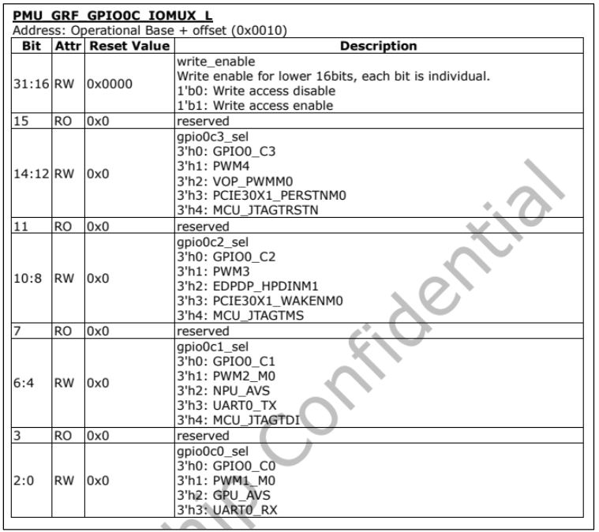
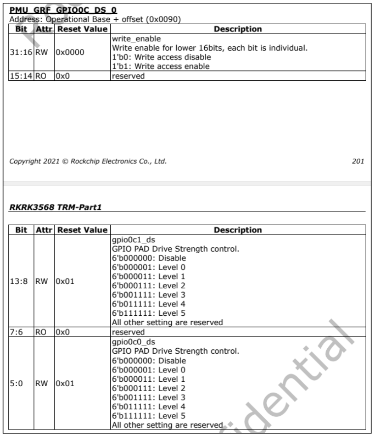
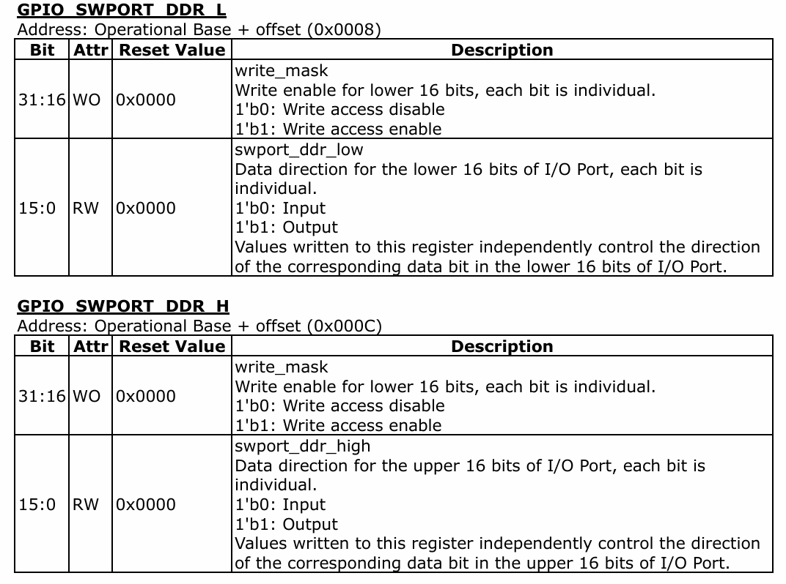
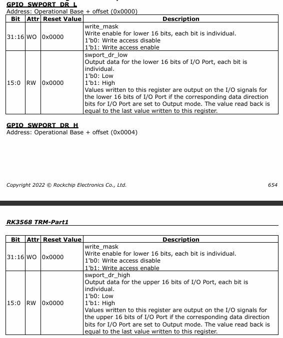

# LED 驱动
## LED 驱动原理
Linux 下的任何外设驱动，最终都是要配置相应的硬件寄存器
### 地址映射
- MMU(Memory Manage Unit)，内存管理单元，主要完成虚拟空间到物理空间的映射，内存保护，设置存储器的访问权限没设置虚拟存储空间的缓冲特性；
    - 虚拟地址`VA,Virtual Address`、物理地址`PA，Physcical Address`。
        - 对于32位的处理器，虚拟地址的范围是$2^{32}=4GB$
        - 对于64位的处理器来说，虚拟地址范围是$2^{64}=16EB(1EB=1024PB=1024*1024TB)$。
    虚拟地址范围比物理地址范围大的问题处理器自会通过MMU处理
- Linux内核启动的时候会初始化MMU，设置好内存映射，设置好以后CPU访问的都是虚拟地址
    - 如果没有开启MMU，便可以直接像寄存器物理地址写入配置
    - 如果开启了MMU，设置了内存映射，则不能直接访问寄存器物理地址，而是需要访问物理地址在系统里对应的虚拟地址   

- 物理内存和虚拟内存之间转换需要用到`ioremap`和`iounmap`
    1. `ioremap` 函数用于获取指定物理地址空间对应的虚拟地址空间
    ```void __iomem *ioremap(resource_size_t res_cookie, size_t size);```
        - `res_cookie`，要映射的物理起始地址
        - `size`，要映射的内存空间大小
        - 返回`__iomem`类型的指针，指向映射后的虚拟空间首地址
    2. 卸载驱动的时候需要使用`iounmap`函数释放掉ioremap函数所做的映射
    ```void iounmap (volatile void __iomem *addr)```
        - `addr`，是要取消映射的虚拟地址空间首地址
### I/O内存访问函数
当外部寄存器或内存映射到IO空间时，称为I/O端口，当外部寄存器或内存映射到内存空间时，称为I/O内存。但是在ARM体系中，只有I/O内存。使用`ioremap`函数将寄存器的物理地址映射到虚拟地址以后，可以直接使用指针访问地址，但linux内核不建议，而是提供了一组读写函数来进行操作
1. 读操作函数
```c
u8 readb(const volatile void __iomem *addr)
u16 readw(const volatile void __iomem *addr)
u32 readl(const volatile void __iomem *addr)
```
`addr`为需要读取的内存地址，返回读取到的数据
1. 写操作函数
```c 
void writeb(u8 value, const volatile void __iomem *addr)
void writew(u16 value, const volatile void __iomem *addr)
void writel(u32 value, const volatile void __iomem *addr)
```
`addr`为需要写入的内存地址，`value`为需要写入的数据

## GPIO驱动原理
这里记录如何驱动一个IO，并配置什么寄存器
### 引脚复用设置
1. 首先需要设置好引脚对应的功能，例如使用GPIO_C0的GPIO功能，找到`PMU_GRF_GPIO0C_IOMUX_L`这个寄存器，描述如下    

    - PMU_GRF的外设及地址为`0xFDC20000`， 该寄存器的偏移为`0x0010`，所以该寄存器的地址为`0xFDC20010`
    - 该寄存器的低16位为写使能位，高16位为功能配置位，一一对应
    
    要将`GPIO0_C0`设置为GPIO，所以该寄存器的`bit2:0`这三位设置000。另外`bit18:16`要设置为111，允许写`bit2:0`
2. 接着设置引脚的驱动能力

    - PMU_GRF的外设及地址为`0xFDC20000`， 该寄存器的偏移为`0x0090`，所以该寄存器的地址为`0xFDC20090`
    - 该寄存器的低16位为写使能位，高16位为功能配置位，一一对应

    要将`GPIO0_C0`的驱动能力设置为等级5，所以该寄存器的`bit5:0`这三六设置111111。另外`bit21:16`要设置为111111，允许写`bit5:0`
### GPIO输入输出设置
在RK3568中，一共有五组GPIO为GPIO10 ~ 4，其中GPIO0 ~ 3这四组每组都有A0 ~ A7、B0 ~ B7、C0 ~ C7和D0 ~ D7这32个GPIO，每个GPIO需要一个位曲设置输入输出功能，一组GPIO就需要32位，`GPIO_SWPORT_DDR_H`和`GPIO_SWPORT_DDR_L`这两个寄存求就用来设置一组GPIO所有引脚的输入输出功能，下表为GPIO对应的bitmap
|GPIO组|GPIOX_A0-A7|GPIOX_B0~B7|GPIOX_C0~C7|GPIOX_D0~D7|
|------|-----------|-----------|-----------|-----------|
|对应的位|bit0~bit7|bit8~bit15|bit16~bit23|bit24~bit31|    


同样低十六位为写使能位，高十六位为功能配置位，寄存器地址同样采用基地址+偏移的方式
### GPIO引脚高低电平设置
GPIO配置好以后就需要控制引脚输出高低电平了，需要用到`GPIO_SWPORT_DR_L`和`GPIO_SWPORT_DR_H`这两个寄存器

同样低十六位为写使能位，高十六位为功能配置位，寄存器地址同样采用基地址+偏移的方式

## 程序编写
### 驱动程序编写
```c
#include <linux/types.h>
#include <linux/kernel.h>
#include <linux/delay.h>
#include <linux/ide.h>
#include <linux/init.h>
#include <linux/module.h>
#include <linux/errno.h>
#include <linux/gpio.h>
#include <asm/uaccess.h>
#include <asm/io.h>
#include <asm-generic/unistd.h>

#define LED_MAJOR   200
#define LED_NAME    "led"

#define LEDOFF  0
#define LEDON   1

#define PMU_GRF_BASE                (0xfd520000)
/* 引脚复用功能 */
#define PMU_GRF_GPIO0C_IOMUX_L      (PMU_GRF_BASE + 0x0010)
/* 引脚驱动能力 */
#define PMU_GRF_GPIO0C_DS_0         (PMU_GRF_BASE + 0x0090)

#define GPIO0_BASE                  (0xfdd60000)
/* 引脚高低电平 */
#define GPIO_SWPORT_DR_H            (GPIO0_BASE + 0x0004)
/* 引脚输入输出 */
#define GPIO_SWPORT_DDR_H           (GPIO0_BASE + 0x000c)

static void __iomem* PMU_GRF_GPIO0C_IOMUX_L_PI;
static void __iomem* PMU_GRF_GPIO0C_DS_0_PI;
static void __iomem* GPIO_SWPORT_DR_H_PI;
static void __iomem* GPIO_SWPORT_DDR_H_PI;

void led_switch(u8 sta)
{
    u32 val = 0;
    if (sta == LEDOFF)
    {
        val = readl(GPIO_SWPORT_DR_H_PI);
        /* bit0 清零 */
        val &= ~(0x1 << 0);
        /* bit16 置1，允许写bit0 低电平 */
        val |= ((0x1 << 16) | (0x0 << 0));
        writel(val, GPIO_SWPORT_DR_H_PI);
    }
    else if (sta == LEDON)
    {
        val = readl(GPIO_SWPORT_DR_H_PI);
        /* bit0 清零 */
        val &= ~(0x1 << 0);
        /* bit16 置1，允许写bit0 高电平 */
        val |= ((0x1 << 16) | (0x1 << 1));
        writel(val, GPIO_SWPORT_DR_H_PI);
    }
}

void led_remap(void)
{
    PMU_GRF_GPIO0C_IOMUX_L_PI = ioremap(PMU_GRF_GPIO0C_IOMUX_L, 4);
    PMU_GRF_GPIO0C_DS_0_PI = ioremap(PMU_GRF_GPIO0C_DS_0, 4);
    GPIO_SWPORT_DR_H_PI = ioremap(GPIO_SWPORT_DR_H, 4);
    GPIO_SWPORT_DDR_H_PI = ioremap(GPIO_SWPORT_DDR_H, 4);
}

void led_unmap(void)
{
    iounmap(PMU_GRF_GPIO0C_IOMUX_L_PI);
    iounmap(PMU_GRF_GPIO0C_DS_0_PI);
    iounmap(GPIO_SWPORT_DR_H_PI);
    iounmap(GPIO_SWPORT_DDR_H_PI);
}

/* 打开设备 */
static int led_open(struct inode* inode, struct file* filp)
{
    /* 用户实现具体功能 */
    return 0;
}

/* 从设备读取 */
static ssize_t led_read(struct file* filp, char __user* buf, size_t cnt, loff_t* offt)
{
    return 0;
}

/* 向设备写数据 */
static ssize_t led_write(struct file* filp, const char __user* buf, size_t cnt, loff_t* offt)
{
    int ret_value = 0;
    unsigned char databuf[1];
    unsigned char ledstat;
    ret_value = copy_from_user(databuf, buf, cnt);
    if (ret_value < 0)
    {
        printk(KERN_ERR "led: kernel write failed");
        return -EFAULT;
    }
    ledstat = databuf[0];
    if (ledstat == LEDOFF)
    {
        led_switch(LEDOFF);
    }
    else
    {
        led_switch(LEDON);
    }

    return 0;
}

/* 关闭/释放设备 */
static int led_release(struct inode* inode, struct file* filp)
{
    /* 用户实现具体功能 */
    return 0;
}

static struct file_operations test_fops = {
    .owner = THIS_MODULE,
    .open = led_open,
    .read = led_read,
    .write = led_write,
    .release = led_release,
};
/* 驱动入口函数 */
static int __init led_init(void)
{
    int ret_value = 0;
    u32 val = 0;
    /* 初始化 LED */
    /* 1、寄存器地址映射 */
    led_remap();
    /* 2、设置GPIO0_C0为GPIO功能 */
    val = readl(PMU_GRF_GPIO0C_IOMUX_L_PI);
    val &= ~(0x7 << 0);
    val |= ((0x7 << 16) | (0x0 << 0));
    writel(val, PMU_GRF_GPIO0C_IOMUX_L_PI);
    /* 3、设置GPIO0_C0驱动能力为level5 */
    val = readl(PMU_GRF_GPIO0C_DS_0_PI);
    val &= ~(0x3f << 0);
    val |= ((0x3f << 16) | (0x3f << 0));
    writel(val, PMU_GRF_GPIO0C_DS_0_PI);
    /* 4、设置 GPIO0_C0 为输出 */
    val = readl(GPIO_SWPORT_DDR_H_PI);
    val &= ~(0x1 << 0);
    val |= ((0x1 << 16) | (0x1 << 0));
    writel(val, GPIO_SWPORT_DDR_H_PI);
    /* 5、设置 GPIO0_C0 为低电平，关闭 LED 灯。*/
    val = readl(GPIO_SWPORT_DR_H_PI);
    val &= ~(0x1 << 0);
    val |= ((0x1 << 16) | (0x0 << 0));
    writel(val, GPIO_SWPORT_DR_H_PI);
    ret_value = register_chrdev(LED_MAJOR, LED_NAME, &test_fops);
    if (ret_value < 0)
    {
        printk(KERN_INFO "led: register chrdev failed!\r\n");
        goto fail_map;
    }
    return 0;

fail_map:
    led_unmap();
    return -EIO;
}

/* 驱动出口函数 */
static void __exit led_exit(void)
{
    /* 取消映射 */
    led_unmap();
    /* 注销字符设备驱动 */
    unregister_chrdev(LED_MAJOR, LED_NAME);
    printk(KERN_INFO "led: module exit successfully\r\n");
}

module_init(led_init);
module_exit(led_exit);
MODULE_LICENSE("GPL");
MODULE_AUTHOR("igotu");
MODULE_INFO(intree, "Y");
```
### 应用程序编写
```c
#include <stdio.h>
#include <unistd.h>
#include <sys/types.h>
#include <sys/stat.h>
#include <fcntl.h>
#include <stdlib.h>
#include <string.h>

#define LEDOFF  0
#define LEDON   1

int main(int argc, char* argv[])
{
    if (argc != 3)
    {
        printf("Error Usage!\r\n");
        return -1;
    }
    char* filename = argv[1];
    int fd = open(filename, O_RDWR);
    if (fd < 0)
    {
        printf("file %s open failed!\r\n", argv[1]);
        return -1;
    }
    unsigned char databuf[1];
    databuf[0] = atoi(argv[2]);
    int ret_value = ret_value = write(fd, databuf, sizeof(databuf));
    if (ret_value <= 0)
    {
        printf("LED Control Failed!\r\n");
        close(fd);
         return -1; 
    }
    close(fd);
    return 0;
}
```
## 运行测试
### 加载并测试驱动
1. 挂载驱动
    ```bash
    depmod
    modprobe led
    ```
2. 创建设备节点
    ```bash
    mknod /dev/led c 200 0
    ```
3. 测试驱动
    ```bash
    ./ledApp /dev/led 1
    ./ledApp /dev/led 0
    ```