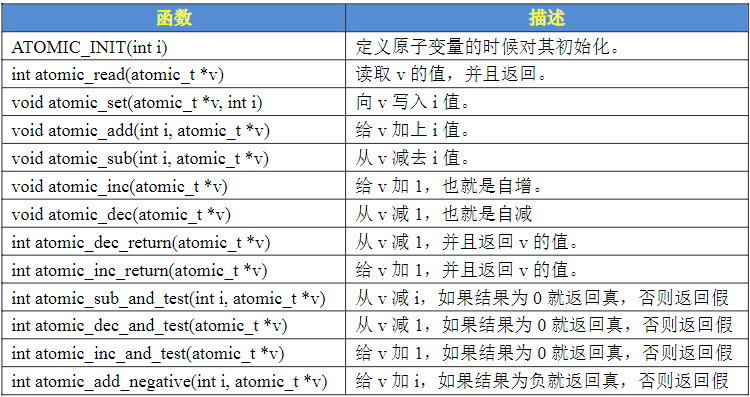
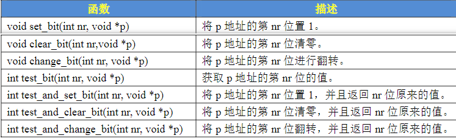
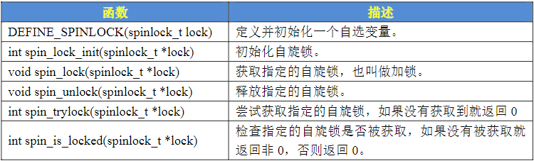
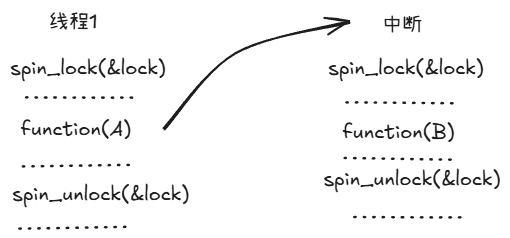
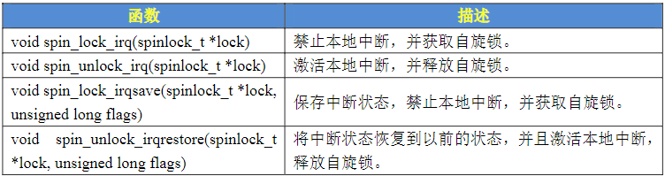
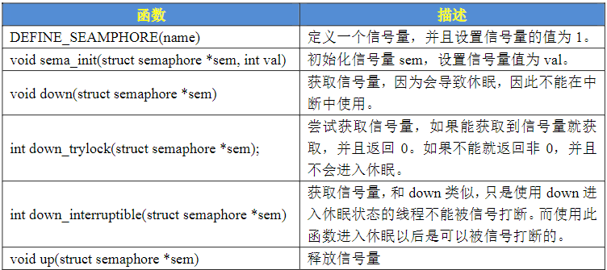

# Linux并发与竞争
## 并发与竞争
1. **并发与竞争简介**
    并发就是多个用户同时访问一个共享资源，Linux系统是个多任务操作系统，会存在多个任务同时访问同一片区域这些任务可能会相互覆盖这段内存中的数据，造成内存数据混乱，针对这个问题必须要做处理，严重的话可能会导致系统崩溃，以下是Linux几个主要的访问
    1. 多线程并发访问
    2. 抢占式并发访问
    3. 中断程序并发访问
    4. SMP（多核）核间并发访问

    并发访问带来的问题就是竞争，在`rtos`中有一个临界区的概念，即共享数据段，对于临界区必须保证一次仅有一个线程，也就是保证临界区是原子访问的，一个访问就是一个步骤
2. **保护内容**
    保护共享资源即保护共享数据，防止进行并发访问
## 原子操作
原子操作指不能再进一步分割的操作，一般原子操作用于变量或者位操作
### 原子整形操作API函数
Linux内核中定义了`atomic_t`的结构体来完成整形数据的原子操作，在使用中只用原子变量来代替整形变量，此结构体定义在`include/linux/types.h`中，如果是64位的Soc就需要用到64位的原子变量，API的前缀也要加上`atiomic64_`
```c
typedef struct {
	int counter;
} atomic_t;

#ifdef CONFIG_64BIT
typedef struct {
	long counter;
} atomic64_t;
#endif
```

### 原子位操作API函数
原子位操作是直接对内存进行操作的

## 自旋锁
### 自旋锁简介
当一个线程尝试去获取某一把锁的时候，如果这个锁此时已经被别人获取(占用)，那么此线程就无法获取到这把锁，该线程将会等待，间隔一段时间后会再次尝试获取。自旋锁有以下特性:
1. **忙等待（Busy-Waiting）** 线程在等待锁时持续占用CPU（在用户态循环检查），不做实际工作
2. **低延迟（当锁很快释放时）**  如果锁持有时间非常短，等待线程能第一时间（几乎在锁释放的瞬间）获取到锁，避免了上下文切换的开销
3. **高CPU消耗（当锁持有时间长时）** 如果锁持有时间较长，或者争用激烈，自旋会浪费大量CPU时间片
4. **不适用单核（抢占式调度）** 在单核系统上，如果一个线程自旋等待锁，而持有锁的线程无法获得CPU运行来释放锁，就会导致死锁。需要内核支持（如禁用中断）或配合其他机制。

在Linux内核中使用结构体`spinlock_t`表示自旋锁
```c
typedef struct spinlock {
	union {
		struct raw_spinlock rlock;

#ifdef CONFIG_DEBUG_LOCK_ALLOC
# define LOCK_PADSIZE (offsetof(struct raw_spinlock, dep_map))
		struct {
			u8 __padding[LOCK_PADSIZE];
			struct lockdep_map dep_map;
		};
#endif
	};
} spinlock_t;
```
### 自旋锁API函数

上述API适用于SMP或支持抢占的单CPU下线程之间的线程并发访问，被自旋锁保护的临界区一定不能调用任何能够引起睡眠或者阻塞的API函数，否则会导致死锁现象。

自旋锁会自动禁止抢占，当线程A得到锁以后，中断发生抢走CPU资源，中断服务函数也需要获取这个锁但是被线程A占有者，中断服务函数就会一直自旋等待锁有效，但是线程A只能等中断服务函数执行完之后在执行，所以死锁发生，解决方法就是在获取锁之前关闭本地中断，Linux内核提供了相应的API

下面是示例伪代码
```c
DEFINE_SPINLOCK(lock)						/* 定义并初始化一个锁  */

void functionA()
{
	unsigned long flags;					/* 中断状态     */
	spin_lock_irqsave(&lock, flags);		/* 获取锁      */
	/* 临界区 */ 
	spin_lock_irqrestore(&lock, flags);		/* 释放锁      */ 
}

void irq()
{
	spin_lock(&lock);						/* 获取锁      */
	/* 临界区 */ 
	spin_unlock(&lock);						/* 释放锁      */ 
}
```
### 自旋锁使用注意事项
1. 自旋锁的持有时间不能太长，一定要短，临界区一定要小
2. 自旋锁保护的临界区内不能调用任何可能导致线程休眠的API函数
3. 不能递归申请自旋锁
4. 编写驱动时应该考虑驱动程序的可移植性
## 信号量 
### 信号量简介
信号量是同步的一种方式，常常用于控制对共享资源的访问，相比于自旋锁，信号量可以使线程进入休眠状态。以下是信号量的特点：
1. 信号量适用于那些占用资源比较久的场合
2. 信号量不能用于中断中，因为信号量会引起休眠，中断不能休眠
3. 如果共享资源的持有时间比较短，那就不适合使用信号量了，因为频繁的休眠、切换程引起的开销要远大于信号量带来的那点优势

信号量有一个信号量值，如果信号量值大于一，那么这个信号量就是计数信号量，如果等于一，那么这个信号量就是二值信号量
### 信号量API函数
Linux 内核使用 `semaphore` 结构体表示信号量
```c
struct semaphore {
	raw_spinlock_t		lock;
	unsigned int		count;
	struct list_head	wait_list;
};
```

下面是示例代码
```c
struct semaphore sem;
sema_init(&sem, 1);
down(&sem);
up(&sem);
```
## 互斥体
互斥访问表示一次只有一个线程可以访问共享资源，不能递归申请互斥体
```c
struct mutex {
	atomic_long_t		owner;
	spinlock_t		wait_lock;
#ifdef CONFIG_MUTEX_SPIN_ON_OWNER
	struct optimistic_spin_queue osq; /* Spinner MCS lock */
#endif
	struct list_head	wait_list;
#ifdef CONFIG_DEBUG_MUTEXES
	void			*magic;
#endif
#ifdef CONFIG_DEBUG_LOCK_ALLOC
	struct lockdep_map	dep_map;
#endif
};
```
使用互斥量的时候需要注意以下几点
1. 互斥量可以导致休眠，因此不能再中断中使用互斥量，中断中只能使用自旋锁
2. 互斥量保护的临界区可以调用引起阻塞的API函数
3. 一次只能一个线程可以持有互斥量
### 互斥量API函数

下面是示例代码
```c
struct mutex lock;
mutex_init(&lock);
mutex_lock(lock);
mutex_unlock(lock);
```