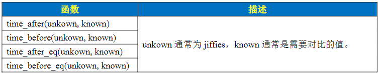
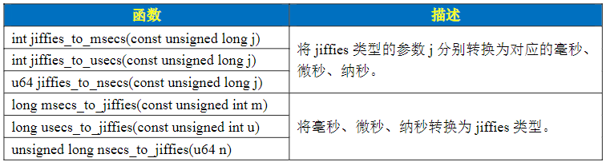
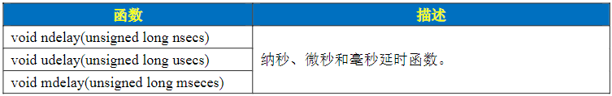

# Linux 内核定时器
## Linux 时间管理和内核定时器其介绍
### 内核时间管理介绍
- Linux 内核中有大量的函数需要时间管理，比如周期性的调度程序、延时程序还有驱动开发最常用的定时器。硬件定时器提供时钟源，时钟源的频率可以设置，设置好以后就可以周期的产生定时器中断，系统使用定时中断来计时。中断周期性产生的频率就是系统频率，即**节拍率**，单位是$HZ$，可以在图形化进行设置，设置好以后可以打开内核目录下的`.config`文件中看到定义`CONFIG_HZ_300=y`
    ```bash
    make ARCH=arm64 menuconfig
    -> kernel Features
        -> Timer frequency(<choice>[y])
    ```    
- Linux 内核中使用全局变量`jiffies`来记录系统从启动以来的系统节拍数，系统启动的时候会将`jiffies`初始化为0，其定义在`include/linuxjiffies_convert/jiffies.h
    ```c
    extern u64 __cacheline_aligned_in_smp jiffies_64;
    extern unsigned long volatile __cacheline_aligned_in_smp __jiffy_arch_data jiffies;
    ```
    一个是64位一个是32位，不管多少位，`jiffies`都有溢出，重新从0开始计数的风险，有些资料称之为绕回，假设$HZ$的最大值为1000，那么32的`jiffies`绕回需要49.7天，但是64位的`jiffies`就可以忽略不计了因为需要5.8亿年，所以需要处理32位`jiffies`的绕回，内核提供了如下几个函数
     
    同样为了方便开发，Linux内核提供了几个`jiffies`和`ms`、`us`、`ns`之间转换的函数
    
### 内核定时器使用
Linux内核定时器使用只需要提供超时时间和定时处理函数即可，当超时时间到了以后设置的定时处理函数就会执行，只是需要注意，内核定时器并不是周期运行的，超时以后就会自动关闭，如果想要实现周期性定时，那么需要在定时处理函数宠幸开启定时器。Linux内核使用`time_list`结构体表示内核定时器，其定义在`include/linux/timer.h`
```c
struct timer_list {
	/*
	 * All fields that change during normal runtime grouped to the
	 * same cacheline
	 */
	struct hlist_node	entry;
	unsigned long		expires;
	void			(*function)(struct timer_list *);
	u32			flags;

#ifdef CONFIG_LOCKDEP
	struct lockdep_map	lockdep_map;
#endif

	ANDROID_KABI_RESERVE(1);
	ANDROID_KABI_RESERVE(2);
};
```
定义定时器后可以通过以下函数操作定时器
1. `timer_setup`函数
    用于初始化`timer_list`类型变量，函数原型如下
    ```c
    #define timer_setup(timer, callback, flags)			\
	__init_timer((timer), (callback), (flags))
    ``` 
    - `timer` 需要初始化的定时器
    - `callback` 定时器的回调函数
    - `flags` 标志位
    返回值：没有返回值
2. `add_timer`函数
    用于向Linux内核注册定时器，使用该函数之后定时器就会开始运行，函数原型如下
    ```c
    void add_timer(struct timer_list *timer);
    ```
    - `timer` 需要注册的定时器
    返回值：没有返回值
3. `del_timer`函数
    用于删除一个定时器，不管定时器是否激活，函数原型如下
    ```c
    int del_timer(struct timer_list * timer);
    ```
    - `timer` 需要删除的定时器
    返回值：0，定时器还没被激活，1，定时器已经激活
4. `del_timer_sync`函数
    该函数会等待其他处理器使用完定时器在删除，并且不能使用在中断上下文中，函数原型如下
    ```c
    int del_timer_sync(struct timer_list *timer);
    ```
    - `timer` 需要删除的定时器
    返回值：0，定时器还没被激活，1，定时器已经激活
5. `mod_timer`函数
    用于修改定时值，如果定时器没有激活的话，会激活，函数原型如下
    ```c
    int mod_timer(struct timer_list *timer, unsigned long expires);
    ```
    - `timer` 需要修改的定时器
    - `expires` 需要修改的值
    返回值：0，使用该函数之前定时器还没被激活，1，使用该函数之前定时器已经激活

内核定时器使用流程一般如下
```c
/* 定义定时器 */
struct timer_list timer;

/* 定时器回调函数 */
void function(struct timer_list* arg)
{
    /* 定时器处理 */
    /* 如果需要定时器周期性运转的化就是用mod_timer函数重新设置定时器超时值并启动 */
    mod_timer(&dev->timertest, jiffies + msecs_to_jiffies(2000));
}

/* 初始化函数 */
void init(void)
{
    timer_setup(&timerdev.timer, timer_function, 0);
    timer.expires = jiffies + msecs_to_jiffies(2000);
    add_timer(&timer);
}
/* 退出函数 */
void exit(void)
{
    del_timer(&timer);
    del_timer_sync(&timer);
}
```
### Linux 内核短延时函数

## 内核定时器实验
### 驱动代码
```c
#include <linux/types.h>
#include <linux/kernel.h>
#include <linux/delay.h>   
#include <linux/ide.h>
#include <linux/init.h>
#include <linux/module.h>
#include <linux/gpio.h>
#include <linux/cdev.h>
#include <linux/device.h>
#include <linux/of.h>
#include <linux/of_address.h>
#include <linux/of_gpio.h>
#include <linux/semaphore.h>
#include <linux/timer.h>
#include <asm/uaccess.h>
#include <asm/io.h>

#define TIMER_CNT       1
#define TIMER_NAME      "timer"
#define CLOSE_CMD       (_IO(0xef, 0x1))
#define OPEN_CMD        (_IO(0xef, 0x2))
#define SETPERIOD_CMD   (_IO(0xef, 0x3))
#define LEDON           1
#define LEDOFF          0

struct timer_dev
{
    dev_t devid;
    struct cdev cdev;
    struct class* class;
    struct device* device;
    int major;
    int minor;
    struct device_node* nd;
    int led_gpio;
    int timerperiod;
    struct timer_list timer;
    spinlock_t lock;
};

struct timer_dev timerdev;

static int led_init(void)
{
    int ret;
    const char* str;

    timerdev.nd = of_find_node_by_path("/gpioled");
    if (timerdev.nd == NULL)
    {
        printk("timerdev node not find!\r\n");
        return -EINVAL;
    }

    ret = of_property_read_string(timerdev.nd, "status", &str);
    if (ret < 0)
    {
        return -EINVAL;
    }
    if (strcmp(str, "okay"))
    {
        return -EINVAL;
    }

    ret = of_property_read_string(timerdev.nd, "compatible", &str);
    if (ret < 0)
    {
        printk("timerdev: Failed to get compatible property\n");
        return -EINVAL;
    }
    if (strcmp(str, "alientek, led"))
    {
        printk("timerdev: Compatible match failed\n");
        return -EINVAL;
    }

    timerdev.led_gpio = of_get_named_gpio(timerdev.nd, "led-gpio", 0);
    if (timerdev.led_gpio < 0)
    {
        printk("can't get led-gpio!\r\n");
        return -EINVAL;
    }

    ret = gpio_request(timerdev.led_gpio, "led");
    if (ret)
    {
        printk(KERN_ERR "timerdev: Failed to request led-gpio\n");
        return ret;
    }

    ret = gpio_direction_output(timerdev.led_gpio, 1);
    if (ret < 0)
    {
        printk("can't set gpio!\r\n");
        return ret;
    }
    return 0;
}

static int timer_open(struct inode* inode, struct file* filp)
{
    int ret = 0;
    filp->private_data = &timerdev;
    timerdev.timerperiod = 1000;
    ret = led_init();
    if (ret < 0)
    {
        return ret;
    }
    return 0;
}

static long timer_unlocked_ioctl(struct file* filp, unsigned int cmd, unsigned long arg)
{
    struct timer_dev* dev = (struct timer_dev*)filp->private_data;
    int timerperiod;
    unsigned long flags;

    switch (cmd)
    {
    case CLOSE_CMD:
        del_timer_sync(&dev->timer);
        break;
    case OPEN_CMD:
        spin_lock_irqsave(&dev->lock, flags);
        timerperiod = dev->timerperiod;
        spin_unlock_irqrestore(&dev->lock, flags);
        mod_timer(&dev->timer, jiffies + msecs_to_jiffies(timerperiod));
        break;
    case SETPERIOD_CMD:
        spin_lock_irqsave(&dev->lock, flags);
        dev->timerperiod = arg;
        spin_unlock_irqrestore(&dev->lock, flags);
        mod_timer(&dev->timer, jiffies + msecs_to_jiffies(arg));
        break;
    default:
        break;
    }
    return 0;
}

static int led_release(struct inode* inode, struct file* filp)
{
    struct timer_dev* dev = filp->private_data;
    gpio_set_value(dev->led_gpio, 0);
    gpio_free(dev->led_gpio);
    del_timer_sync(&dev->timer);
    return 0;
}

static struct file_operations timer_fops = {
    .owner = THIS_MODULE,
    .open = timer_open,
    .unlocked_ioctl = timer_unlocked_ioctl,
    .release = led_release,
};

void timer_function(struct timer_list* arg)
{
    struct timer_dev* dev = from_timer(dev, arg, timer);
    static int sta = 1;
    int timerperiod;
    unsigned long flags;

    sta = !sta;
    gpio_set_value(dev->led_gpio, sta);

    spin_lock_irqsave(&dev->lock, flags);
    timerperiod = dev->timerperiod;
    spin_unlock_irqrestore(&dev->lock, flags);
    mod_timer(&dev->timer, jiffies + msecs_to_jiffies(dev->timerperiod));
}

static int __init timer_init(void)
{
    int ret;
    spin_lock_init(&timerdev.lock);
    if (timerdev.major)
    {
        timerdev.devid = MKDEV(timerdev.major, 0);
        ret = register_chrdev_region(timerdev.devid, TIMER_CNT, TIMER_NAME);
        if (ret < 0)
        {
            pr_err("cannot register %s char driver [ret=%d]\n", TIMER_NAME, TIMER_CNT);
            return -EIO;
        }
    }
    else
    {
        ret = alloc_chrdev_region(&timerdev.devid, 0, TIMER_CNT, TIMER_NAME);
        if (ret < 0)
        {
            pr_err("%s couldn' t alloc_chrdev_region, ret=%d\r\n", TIMER_NAME, ret);
            return -EIO;
        }
        timerdev.major = MAJOR(timerdev.devid);
        timerdev.minor = MINOR(timerdev.devid);
    }
    printk("timerdev major = %d, minor = %d\r\n", timerdev.major, timerdev.minor);

    timerdev.cdev.owner = THIS_MODULE;
    cdev_init(&timerdev.cdev, &timer_fops);

    cdev_add(&timerdev.cdev, timerdev.devid, TIMER_CNT);
    if (ret < 0)
    {
        goto del_unregister;
    }

    timerdev.class = class_create(THIS_MODULE, TIMER_NAME);
    if (IS_ERR(timerdev.class))
    {
        goto del_cdev;
    }

    timerdev.device = device_create(timerdev.class, NULL, timerdev.devid, NULL, TIMER_NAME);
    if (IS_ERR(timerdev.device))
    {
        goto destroy_class;
    }
    timer_setup(&timerdev.timer, timer_function, 0);
    return 0;

destroy_class:
    device_destroy(timerdev.class, timerdev.devid);
del_cdev:
    cdev_del(&timerdev.cdev);
del_unregister:
    unregister_chrdev_region(timerdev.devid, TIMER_CNT);
    return -EIO;
}

static void __exit timer_exit(void)
{
    del_timer_sync(&timerdev.timer);
#if 0
    del_timer(&timerdev.timer);
#endif
    cdev_del(&timerdev.cdev);
    unregister_chrdev_region(timerdev.devid, TIMER_CNT);
    device_destroy(timerdev.class, timerdev.devid);
    class_destroy(timerdev.class);
}

module_init(timer_init);
module_exit(timer_exit);
MODULE_LICENSE("GPL");
MODULE_AUTHOR("igotu");
MODULE_INFO(intree, "Y");
```
### 应用代码
```c
#include <stdio.h>
#include <unistd.h>
#include <sys/types.h>
#include <sys/stat.h>
#include <sys/ioctl.h>
#include <fcntl.h>
#include <stdlib.h>
#include <string.h>

#define CLOSE_CMD           (_IO(0xef, 0x1))
#define OPEN_CMD            (_IO(0xef, 0x2))
#define SETPERIOD_CMD       (_IO(0xef, 0x3))

int main(int argc, char* argv[])
{
    int fd, ret;
    char* filename;
    unsigned int cmd;
    unsigned int arg;
    unsigned char str[100];

    if (argc != 2)
    {
        printf("Error Usage!\r\n");
        return -1;
    }

    filename = argv[1];

    if (argc != 2)
    {
        printf("Error Usage!\r\n");
        return -1;
    }

    filename = argv[1];

    fd = open(filename, O_RDWR);
    if (fd < 0)
    {
        printf("Can't open file %s\r\n", filename);
        return -1;
    }

    while (1)
    {
        printf("Input CMD: ");
        ret = scanf("%d", &cmd);
        if (ret != 1)
        {
            fgets(str, sizeof(str), stdin);
        }
        if (cmd == 4)
        {
            goto out;
        }
        if (cmd == 1)
        {
            cmd = CLOSE_CMD;
        }
        else if (cmd == 2)
        {
            cmd = OPEN_CMD;
        }
        else if (cmd == 3)
        {
            cmd = SETPERIOD_CMD;
            printf("Input Timer Period:");
            ret = scanf("%d", &arg);
            if (ret != 1)
            {
                fgets(str, sizeof(str), stdin);
            }
        }
        ioctl(fd, cmd, arg);
    }

out:
    close(fd);
}

```
### Makefile脚本
```makefile
CURRENT_PATH:=$(shell pwd)
obj-m:=kernel_timer.o

ARCH:=arm64
CROSS_COMPILE:=aarch64-linux-gnu-
KERNELDIR:=/home/ubuntu/ubuntu_2204_workplace/Rockchip/rk356x/rk356x_linux/E6_rk3566_linux/kernel
build:kernel_modules

kernel_modules:
	$(MAKE) -C $(KERNELDIR) M=$(CURRENT_PATH) \
	ARCH=$(ARCH) CROSS_COMPILE=$(CROSS_COMPILE) \
	EXTRA_CFLAGS="-I$(KERNELDIR)/arch/arm64/include" modules
clean:
	$(MAKE) -C $(KERNELDIR) M=$(CURRENT_PATH) clean
```
