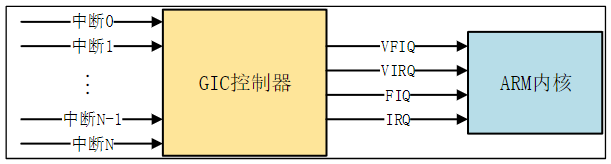
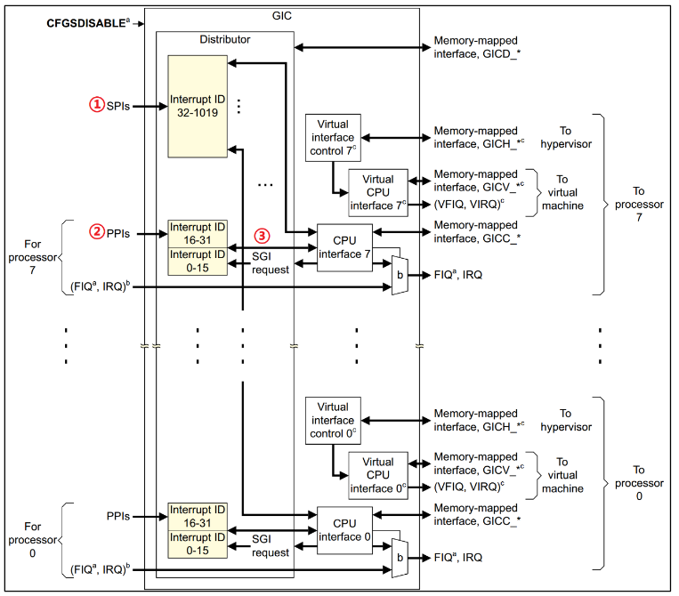

# Linux 中断
Linux内核提供了完善的中断框架，只需要申请中断，然后注册中断处理函数即可
## Linux中断
### Linux中断API函数
1. 中断号
每个中断都有一个中断号，通过中断号区分不同的中断，在Linux中使用一个`int`变量表示中断号
2. `request_irq`函数
在内核使用某个中断是需要申请的，该函数用于申请使能中断，`request_irq`中断上下文或者其他禁止睡眠的代码段中使用`request_irq`函数。函数原型如下：
    ```c
    int request_irq(unsigned int irq, irq_handler_t handler, unsigned long flags, const char* name, void* dev);
    ```
    - `irq` 要申请的中断号
    - `handler` 中断处理函数，当中断发生以后就会执行此中断处理函数
    - `flags` 中断处理函数，可以在`include/linux/interrupt.h`中查看所有的中断标志
        ```c
        #define IRQF_TRIGGER_NONE	0x00000000
        #define IRQF_TRIGGER_RISING	0x00000001
        #define IRQF_TRIGGER_FALLING	0x00000002
        #define IRQF_TRIGGER_HIGH	0x00000004
        #define IRQF_TRIGGER_LOW	0x00000008
        #define IRQF_TRIGGER_MASK	(IRQF_TRIGGER_HIGH | IRQF_TRIGGER_LOW | \
                        IRQF_TRIGGER_RISING | IRQF_TRIGGER_FALLING)
        #define IRQF_TRIGGER_PROBE	0x00000010
        ```
    - `name` 中断名字，设置后可以在系统的`proc/interrupts`文件中看到对应的中断名字
    - `dev` 如果将`flags`设置为`IRQF_SHARED`的话，`dev`用来区分不同的中断，一般情况下将`dev`设置位设备结构体，传递给中断处理函数`irq_handler_t`的第二参数
    返回值：0 中断申请成功，其他负值 中断申请失败，如果是`-EBUSY`表示中断已经被注册
3. `free_irq`函数
该函数用于释放对应的中断，如果中断不是共享的，那么`free_irq`会删除中断处理函数并且禁止中断。函数原型如下：
    ```c
    void free_irq(unsigned int irq, void *dev_id);
    ```
    - `irq` 要释放的中断
    - `dev_id` 如果中断设置位共享的话，此参数用来区分具体的中断。共享中断只有在释放最后中断处理函数的时候才会被禁止掉
    返回值：无
4. 中断处理函数
使用`request_irq`函数申请中断的时候需要设置中断处理函数，中断处理函数格式如下
    ```c
    irqreturn_t (*irq_handler_t)(int, void *)
    ```
    - `int` 要中断处理函数要对应的中断号
    - `void*` 需要与`request_irq`函数的`dev_id` 参数保持一致，用于区分共享中断的不同设备，`dev_id`也可以指向设备数据结构
    返回值：`irqreturn_t`类型
        ```c
        enum irqreturn {
            IRQ_NONE		= (0 << 0),
            IRQ_HANDLED		= (1 << 0),
            IRQ_WAKE_THREAD		= (1 << 1),
        };
        typedef enum irqreturn irqreturn_t;
        ```
5. 中断使能与禁止函数
    `enable_irq` 和 `disable_irq` 用于使能和禁止指定的中断
    ```c
    void enable_irq(unsigned int irq)
    void disable_irq(unsigned int irq)
    ```
    - `irq`是要使能或者禁止的中断号

    `disable_irq`函数要等到当前正在执行的中断处理函数执行完才返回，因此使用者需要保证不会产生新的中断并且确保所有已经开始执行的中断处理程序已经全部退出。这种情况下，内核提供了另一个中断禁止函数
    ```c
    void disable_irq_nosync(unsigned int irq);
    ```
    使用这个函数以后立即返回，不会等待当前中断处理程序执行完毕
### 上半部和下半部
1. 上半部就是中断处理函数，那些处理过程比较快，不会占用很长时间的处理就可以放在上半部完成
2. 下半部用于处理那些中断中比较耗时的代码，这样中断处理函数就会快进快出

以下有三点可以考虑参考把处理代码放在上半部，其余放下半部
1. 如果要处理的内容不希望被其他中断打断
2. 如果要处理的任务对时间敏感
3. 如果要处理的任务与硬件有关 

上半部处理直接编写中断处理函数就好了，下半部内核则提供多种处理机制
- **软中断**
    Linux内核使用`softirq_action`结构体表示软中断，定义在`include/linux/interrupt.h`
    ```c
    struct softirq_action
    {
        void	(*action)(struct softirq_action *);
    };
    ```
    在`kernel/softirq.c`中定义了10个软中断
    ```c
    static struct softirq_action softirq_vec[NR_SOFTIRQS] __cacheline_aligned_in_smp;
    DEFINE_PER_CPU(struct task_struct *, ksoftirqd);
    const char * const softirq_to_name[NR_SOFTIRQS] = {
        "HI", "TIMER", "NET_TX", "NET_RX", "BLOCK", "BLOCK_IOPOLL", 
        "TASKLET", "SCHED", "HRTIMER", "RCU"
    };
    ```
    `NR_SOFTIRQS`的定义在`include/linux/interrupt.h`
    ```c
    enum
    {
        HI_SOFTIRQ=0,
        TIMER_SOFTIRQ,
        NET_TX_SOFTIRQ,
        NET_RX_SOFTIRQ,
        BLOCK_SOFTIRQ,
        BLOCK_IOPOLL_SOFTIRQ,
        TASKLET_SOFTIRQ,
        SCHED_SOFTIRQ,
        HRTIMER_SOFTIRQ, /* Unused, but kept as tools rely on the numbering. Sigh! */
        RCU_SOFTIRQ,    /* Preferable RCU should always be the last softirq */

        NR_SOFTIRQS
    };
    ```
    综上，结构体`softirq_action`中的`action`软中断的服务函数，数组`softirq_vec`是个全局数组，因此所有的CPU都可以访问到，每个CPU都有自己的触发和控制机制，并且只执行自己所触发的软中断，但是各个CPU所执行的软中断服务函数确实相同的，都是`softirq_vec`中的`action`函数

    - `open_softirq`函数
    要使用软中断，必须先使用这个函数注册对应软中断处理函数，原型如下
        ```c
        void open_softirq(int nr, void (*action)(struct softirq_action *));
        ```
        - `nr` 要开启的软中断
        - `action` 软中断对应的处理函数
        返回值：没有返回值
    - `raise_softirq`函数
    注册号软中断后需要哦通过该函数触发
        ```c
        void raise_softirq(unsigned int nr);
        ```
        - `nr` 要触发的软中断 
        返回值：没有返回值  

    软中断必须在编译的时候静态注册，内核使用`softirq_init`函数初始化软中断，默认打开`TASKLET_SOFTIRQ`和`HI_SOFTIRQ`
    ```c
    void __init softirq_init(void) 
    {
        int cpu;

        for_each_possible_cpu(cpu) {
            per_cpu(tasklet_vec, cpu).tail =
                &per_cpu(tasklet_vec, cpu).head;
            per_cpu(tasklet_hi_vec, cpu).tail =
                &per_cpu(tasklet_hi_vec, cpu).head;
        }

        open_softirq(TASKLET_SOFTIRQ, tasklet_action);
        open_softirq(HI_SOFTIRQ, tasklet_hi_action);
    }
    ``` 
- **tasklet** 
    `tasklet`是利用软中断来实现的另外一种下半部机制，`tasklet_struct`结构体如下
    ```c
    struct tasklet_struct
    {
        struct tasklet_struct *next;
        unsigned long state;
        atomic_t count; 
        void (*func)(unsigned long);
        unsigned long data;
    };
    ```
    其中`func`就是`tasklet`要执行的处理函数相当于中断处理函数
    - `tasklet_init`函数
    该函数用于初始化`tasklet`
    ```c
    void tasklet_init(struct tasklet_struct *t,
			 void (*func)(unsigned long), unsigned long data);
    ```
    - `t` 是要初始户的`tasklet`
    - `func` `tasklet`的处理函数
    - `data` 要传递给`func`函数的参数
    返回值：没有返回值  
    
    也可以使用宏`DECLARE_TASKLET(name, func, data)`一次性完成`tasklet`的定义和初始化，在中断处理函数中调用`tasklet_schedule`可以使`tasklet`在合适的时间运行
    ```c
    static inline void tasklet_schedule(struct tasklet_struct *t);
    ```
    - `t` 要调度的`tasklet`
    返回值：没有返回值  
    
    关于`tasklet`的参考使用如下
    ```c
    /* 定义tasklet */ 
    struct tasklet_struct testtasklet;
    /* tasklet处理函数 */
    void testtasklet_func(unsigned long data)
    {
        /* tasklet 具体处理内容 */
    }
    /* 中断处理函数 */
    irqreturn_t test_handler(int irq, void* dev_id)
    {
        /* 调度tasklet */
        tasklet_schedule(&testtasklet);
    }
    /* 驱动入口函数 */
    static int __init xxxx_init(void)
    {
        /* 初始化tasklet */
        tasklet_init(&testtasklet, testtasklet_func, data);
        /* 注册中断处理函数 */
        request_irq(xxx_irq, test_handler, 0, "xxx", &xxx_dev);
    }
    ```
- **工作队列**
    工作队列是另外一种下半部执行方式，工作队列在进程上下文执行，工作队列将要推后的工作交给一个内核线程去执行，因为工作队列工作在进程上下文，因此工作队列允许睡眠或重新调度。因此如果你要推后的工作可以睡眠那么就可以选择工作队列，否则的话就只能选择软中断或 tasklet。在内核中使用`work_struct`表示一个工作
    ```c
    struct work_struct {
        atomic_long_t data;
        struct list_head entry;
        work_func_t func;
    #ifdef CONFIG_LOCKDEP
        struct lockdep_map lockdep_map;
    #endif
    };
    ```
    工作队列使用`workqueue_struct`表示
    ```c
    /*
    * The externally visible workqueue.  It relays the issued work items to
    * the appropriate worker_pool through its pool_workqueues.
    */
    struct workqueue_struct {
        struct list_head	pwqs;		/* WR: all pwqs of this wq */
        struct list_head	list;		/* PR: list of all workqueues */

        struct mutex		mutex;		/* protects this wq */
        int			work_color;	/* WQ: current work color */
        int			flush_color;	/* WQ: current flush color */
        atomic_t		nr_pwqs_to_flush; /* flush in progress */
        struct wq_flusher	*first_flusher;	/* WQ: first flusher */
        struct list_head	flusher_queue;	/* WQ: flush waiters */
        struct list_head	flusher_overflow; /* WQ: flush overflow list */

        struct list_head	maydays;	/* MD: pwqs requesting rescue */
        struct worker		*rescuer;	/* I: rescue worker */

        int			nr_drainers;	/* WQ: drain in progress */
        int			saved_max_active; /* WQ: saved pwq max_active */

        struct workqueue_attrs	*unbound_attrs;	/* PW: only for unbound wqs */
        struct pool_workqueue	*dfl_pwq;	/* PW: only for unbound wqs */

    #ifdef CONFIG_SYSFS
        struct wq_device	*wq_dev;	/* I: for sysfs interface */
    #endif
    #ifdef CONFIG_LOCKDEP
        struct lockdep_map	lockdep_map;
    #endif
        char			name[WQ_NAME_LEN]; /* I: workqueue name */

        /*
        * Destruction of workqueue_struct is sched-RCU protected to allow
        * walking the workqueues list without grabbing wq_pool_mutex.
        * This is used to dump all workqueues from sysrq.
        */
        struct rcu_head		rcu;

        /* hot fields used during command issue, aligned to cacheline */
        unsigned int		flags ____cacheline_aligned; /* WQ: WQ_* flags */
        struct pool_workqueue __percpu *cpu_pwqs; /* I: per-cpu pwqs */
        struct pool_workqueue __rcu *numa_pwq_tbl[]; /* PWR: unbound pwqs indexed by node */
    };
    ```
    内核使用`worker thread`来处理工作队列中的各个工作，使用`worker`结构体表示工作者线程
    ```c
    /*
    * The poor guys doing the actual heavy lifting.  All on-duty workers are
    * either serving the manager role, on idle list or on busy hash.  For
    * details on the locking annotation (L, I, X...), refer to workqueue.c.
    *
    * Only to be used in workqueue and async.
    */
    struct worker {
        /* on idle list while idle, on busy hash table while busy */
        union {
            struct list_head	entry;	/* L: while idle */
            struct hlist_node	hentry;	/* L: while busy */
        };

        struct work_struct	*current_work;	/* L: work being processed */
        work_func_t		current_func;	/* L: current_work's fn */
        struct pool_workqueue	*current_pwq; /* L: current_work's pwq */
        bool			desc_valid;	/* ->desc is valid */
        struct list_head	scheduled;	/* L: scheduled works */

        /* 64 bytes boundary on 64bit, 32 on 32bit */

        struct task_struct	*task;		/* I: worker task */
        struct worker_pool	*pool;		/* I: the associated pool */
                            /* L: for rescuers */
        struct list_head	node;		/* A: anchored at pool->workers */
                            /* A: runs through worker->node */

        unsigned long		last_active;	/* L: last active timestamp */
        unsigned int		flags;		/* X: flags */
        int			id;		/* I: worker id */

        /*
        * Opaque string set with work_set_desc().  Printed out with task
        * dump for debugging - WARN, BUG, panic or sysrq.
        */
        char			desc[WORKER_DESC_LEN];

        /* used only by rescuers to point to the target workqueue */
        struct workqueue_struct	*rescue_wq;	/* I: the workqueue to rescue */
    };
    ```
    实际开发中，只需要定义`work_struct`即可，然后调用`INIT_WORK`宏来初始化结构体，也可以使用`DECLARE_WORK`来一次性完成工作的创建和初始化
    ```c
    #define INIT_WORK(_work, _func)	
    #define DECLARE_WORK(n, f)	
    ```
    第一个参数表示工作，第二个参数表示工作对应处理函数，工作也需要调度函数去调度运行
    ```c
    static inline bool schedule_work(struct work_struct *work);
    ```
    关于`workqueue`的参考使用如下
    ```c
    /* 定义work */
    struct work_struct testwork;
    /* work处理函数 */
    void work_func_t(struct work_struct* work)
    {
        /* work 具体处理内容 */
    }
    /* 中断处理函数 */
    irqreturn_t test_handler(int irq, void* dev_id)
    {
        /* 调度work */
        schedule_work(&testwork);
    }
    /* 驱动入口函数 */
    static int __init xxxx_init(void)
    {
        /* 初始化work */
        INIT_WORK(&testwork, work_func_t);
        /* 注册中断处理函数 */
        request_irq(xxx_irq, test_handler, 0, "xxx", &xxx_dev);
    }
    ```
### 设备树中断信息节点 
- **GIC中断控制器**
    是ARM多核处理系统的神经中枢，负责高效、有序地管理和分发所有硬件中断事件到各个CPU核心。它实现了中断优先级仲裁、多核分发、虚拟化支持等关键功能，对于系统性能、实时性和可靠性至关重要，以`Contex-A55`内核为例，arm内核提供四个信息给gic汇报情况
    - VFIQ 虚拟快速FIQ
    - VIRQ 虚拟快速IRQ
    - FIQ 快速中断FIQ
    - IRQ 快速中断IRQ
    
    下图为GIC总体框图，左边为中断源，中间为GIC控制器，右侧为中断控制器向处理器内核发送中断信息
    
    1. `SPI(Shared Peripheral Interrupt)` 共享中断，所有外部中断都属于共享中断
    2. `PPI(Private Peripheral Interrupt)` 私有中断，每个内核都有私有中断做核心处理
    3. `SGI(Software Generated Interrupt)` 软件中断，由软件触发引起的
- **中断ID**
    每个中断都以一个唯一的ID，每一个CPU最多支持1020个中断ID，0 ~ 15分配给`SGI`，16 ~ 31分配给`PPI`，32 ~ 1019分配给`SPI`
- **GIC控制器节点**
    以`rk3568.dtsi`的中断控制器节点为例
    ```dts
    gic: interrupt-controller@fd400000 {
		compatible = "arm,gic-v3";
		#interrupt-cells = <3>;
		#address-cells = <2>;
		#size-cells = <2>; 
		ranges;
		interrupt-controller;
 
		reg = <0x0 0xfd400000 0 0x10000>, /* GICD */
		      <0x0 0xfd460000 0 0xc0000>; /* GICR */
		interrupts = <GIC_PPI 9 IRQ_TYPE_LEVEL_HIGH>;
		its: interrupt-controller@fd440000 {
			compatible = "arm,gic-v3-its";
			msi-controller;
			#msi-cells = <1>;
			reg = <0x0 0xfd440000 0x0 0x20000>; 
		};
	};
    ```
    - `compatible` 指定此设备兼容 ARM GICv3 标准，驱动将按 GICv3 规范初始化
    - `#interrupt-cells` 定义引用此中断说明符由三个整数组成
        - 第一个是中断类型
            1. `SGI`
            2. `PPI`
            3. `SGI`
        - 第二个是中断号
        - 第三个是触发类型
    - `#address-cells` 地址用 2 个 32 位数表示（64 位地址）
    - `#size-cells` 大小用 2 个 32 位数表示（64 位）
    - `interrupt-controller` 明确标识此为中断控制器
    - `ranges` 子节点地址空间与父节点直连
    - `reg` 寄存器映射
    - `interrupts` 控制器使用`PPI 9`作为系统中断源，触发类型为高电平有效
 
    找到`rk3568.dtsi`中的，`spi0`节点，在RK的TRM手册中可以查到`spi0`的中断号是135，但是这里加上了私有的`PPI`32个中断号，如果不算的话中断号就是103
    ```dts
    spi0: spi@fe610000 {
        compatible = "rockchip,rk3066-spi";
        reg = <0x0 0xfe610000 0x0 0x1000>;
        interrupts = <GIC_SPI 103 IRQ_TYPE_LEVEL_HIGH>;
        #address-cells = <1>;
        #size-cells = <0>;
        clocks = <&cru CLK_SPI0>, <&cru PCLK_SPI0>;
        clock-names = "spiclk", "apb_pclk";
        dmas = <&dmac0 20>, <&dmac0 21>;
        dma-names = "tx", "rx";
        pinctrl-names = "default", "high_speed";
        pinctrl-0 = <&spi0m0_cs0 &spi0m0_cs1 &spi0m0_pins>;
        pinctrl-1 = <&spi0m0_cs0 &spi0m0_cs1 &spi0m0_pins_hs>;
        status = "disabled";
	};
    ```
    综上所述，与中断有关的设备树属性信息：
    1. `#interrupt-cells` 指定中断源的信息`cells`个数
    1. `interrupt-controller` 表示当前节点为中断控制器
    1. `interrupts` 指定中断号，触发方式
    1. `interrupts` 指定父中断，也就是中断控制器
### 获取中断号
- `irq_of_parse_and_map`函数
    用于从`interrupt`属性中提取到对应的设备号，函数原型如下
    ```c
    unsigned int irq_of_parse_and_map(struct device_node *node, int index);
    ```
    - `dev` 设备节点
    - `index` 索引号
    返回值：中断号
- `gpio_to_irq`函数
    这个函数可以用于获取`gpio`对应的中断号，函数原型如下
    ```c
    static inline int gpio_to_irq(unsigned int gpio)
    ```
    - `gpio` 要获取的GPIO编号
    返回值：GPIO对应的中断号
## 实验程序    
### 修改设备树文件
```dts
key{
    compatible = "alientek,key";
    pinctrl-names = "alientek,key";
    pinctrl-0 = <&key_gpio>;
    key-gpio = <&gpio3 RK_PC3 GPIO_ACTIVE_HIGH>;
    interrupt-parent = <&gpio3>;
    interrupts = <21 IRQ_TYPE_EDGE_BOTH>;
    status = "okay";
}
```
其中`IRQ_TYPE_EDGE_BOTH`的定义在`include/linux/irq.h`
### 驱动程序
```c
#include <linux/types.h>
#include <linux/kernel.h>
#include <linux/delay.h>   
#include <linux/ide.h>
#include <linux/init.h>
#include <linux/module.h>
#include <linux/gpio.h>
#include <linux/cdev.h>
#include <linux/device.h>
#include <linux/of.h>
#include <linux/of_address.h>
#include <linux/of_gpio.h>
#include <linux/semaphore.h>
#include <linux/irq.h>
#include <linux/of_irq.h>
#include <linux/timer.h>
#include <asm/uaccess.h>
#include <asm/io.h>


#define KEY_CNT     1
#define KEY_NAME    "key"

enum key_status
{
    KEY_PRESS = 0,
    KEY_RELEASE,
    KEY_KEEP,
};

struct key_dev
{
    dev_t devid;
    struct cdev cdev;
    struct class* class;
    struct device* device;
    struct device_node* nd;
    int key_gpio;
    struct timer_list timer;
    int irq_num;
    spinlock_t spinlock;
};

static struct key_dev key;
static int status = KEY_KEEP;

static irqreturn_t key_interrupt(int irq, void *dev_id)
{
    /* 消抖处理 */
    mod_timer(&key.timer, jiffies + msecs_to_jiffies(50));
    return IRQ_HANDLED;
}

static int key_parse_dt(void)
{ 
    int ret;
    const char* str;
    key.nd = of_find_node_by_path("/key");
    if (key.nd == NULL)
    {
        printk(KERN_ERR "key: Failed to get key node.\r\n");
        return -EINVAL;
    }
    ret = of_property_read_string(key.nd, "status", &str);
    if (ret < 0)
    {
        return -EINVAL;
    }
    if (strcmp(str, "okay"))
    {
        return -EINVAL;
    }
    ret = of_property_read_string(key.nd, "compatible", &str);
    if (ret < 0)
    {
        printk(KERN_ERR "key: Failed to get compatible.\r\n");
        return -EINVAL;
    }
    if (strcmp(str, "alientek,key"))
    {
        printk(KERN_ERR "key: Incompatible compatible.\r\n");
        return -EINVAL;
    }
    key.key_gpio = of_get_named_gpio(key.nd, "key-gpios", 0);
    if (key.key_gpio < 0)
    {
        printk(KERN_ERR "key: Failed to get key0 pin.\r\n");
        return -EINVAL;
    }
    key.irq_num = gpio_to_irq(key.key_gpio);
    if (!key.irq_num)
    {
        printk(KERN_ERR "key: Failed to get key0 irq number.\r\n");
        return -EINVAL;
    }
    printk(KERN_INFO "key: key0 pin = %d, irq number = %d.\r\n", key.key_gpio, key.irq_num);
    
    return 0;
}

static void key_timer_function(struct timer_list* arg)
{
    static int last_val = 0;
    unsigned long flags;
    int current_val;

    spin_lock_irqsave(&key.spinlock, flags);

    current_val = gpio_get_value(key.key_gpio);
    if (1 == current_val && !last_val)
    {
        status = KEY_PRESS;
    }
    else if (0 == current_val && last_val)
    {
        status = KEY_RELEASE;
    }
    else
    {
        status = KEY_KEEP;
    }
    last_val = current_val;
    spin_unlock_irqrestore(&key.spinlock, flags);
}
static int key_gpio_init(void)
{
    int ret;
    unsigned long irq_flags;

    ret = gpio_request(key.key_gpio, "key0");
    if (ret < 0)
    {
        printk(KERN_ERR "key: Failed to request key0 pin.\r\n");
        return ret;
    }
    gpio_direction_input(key.key_gpio);

    irq_flags = irq_get_trigger_type(key.irq_num);
    if (irq_flags == IRQF_TRIGGER_NONE)
    {
        irq_flags = IRQF_TRIGGER_RISING | IRQF_TRIGGER_FALLING;
    }

    ret = request_irq(key.irq_num, key_interrupt, irq_flags, "key0_irq", &key);
    if (ret)
    {
        gpio_free(key.key_gpio);
        return ret;
    }
    return 0;
}

static int key_open(struct inode *inode, struct file *file)
{
    return 0;
}

static ssize_t key_read(struct file *file, char __user *buf, size_t count, loff_t *ppos)
{ 
    unsigned long flags;
    int ret;

    spin_lock_irqsave(&key.spinlock, flags);
    ret = copy_to_user(buf, &status, sizeof(int));
    status = KEY_KEEP;
    spin_unlock_irqrestore(&key.spinlock, flags);
    return ret;
}

static ssize_t key_write(struct file *file, const char __user *buf, size_t count, loff_t *ppos)
{
    return 0;
}

static int key_release(struct inode *inode, struct file *file)
{
    return 0;
}

static struct file_operations key_fops =
{
    .owner = THIS_MODULE,
    .open = key_open,
    .release = key_release,
    .read = key_read,
    .write = key_write,
};

static int __init mykey_init(void)
{
    int ret;

    spin_lock_init(&key.spinlock);

    timer_setup(&key.timer, key_timer_function, 0);

    ret = key_parse_dt();
    if (ret)
    {
        return ret;
    }
    ret = key_gpio_init();
    if (ret)
    {
        return ret;
    }
    ret = alloc_chrdev_region(&key.devid, 0, KEY_CNT, KEY_NAME);
    if (ret)    
    {
        pr_err("key: Failed to alloc chrdev region, ret = %d.\r\n", ret);
        goto free_gpio;
    }

    key.cdev.owner = THIS_MODULE;
    cdev_init(&key.cdev, &key_fops);

    ret = cdev_add(&key.cdev, key.devid, KEY_CNT);
    if (ret)
    {
        pr_err("key: Failed to add cdev, ret = %d.\r\n", ret);
        goto del_unregister;
    }

    key.class = class_create(THIS_MODULE, KEY_NAME);
    if (IS_ERR(key.class))
    {
        ret = PTR_ERR(key.class);
        goto del_cdev;
    }

    key.device = device_create(key.class, NULL, key.devid, NULL, KEY_NAME);
    if (IS_ERR(key.device))
    { 
        goto destroy_class;
    }
    return 0;
destroy_class:
    class_destroy(key.class);
del_cdev:
    cdev_del(&key.cdev);
del_unregister:
    unregister_chrdev_region(key.devid, KEY_CNT);
free_gpio:
    free_irq(key.irq_num, NULL);
    gpio_free(key.key_gpio);
    return -EIO;
}

static void __exit mykey_exit(void)
{
    cdev_del(&key.cdev);
    unregister_chrdev_region(key.devid, KEY_CNT);
    del_timer_sync(&key.timer);
    device_destroy(key.class, key.devid);
    class_destroy(key.class);
    free_irq(key.irq_num, NULL);
    gpio_free(key.key_gpio);
}

module_init(mykey_init);
module_exit(mykey_exit);
MODULE_LICENSE("GPL");
MODULE_AUTHOR("igotu");
MODULE_INFO(intree, "Y");
```
### 应用程序
```c
#include <stdio.h>  
#include <stdlib.h>  
#include <string.h>
#include <sys/types.h>  
#include <sys/stat.h>  
#include <fcntl.h>  
#include <unistd.h>  

int main(int argc, char* argv[])
{
    int fd, ret;
    int key_val;

    if (2 != argc)
    {
        printf("Usage\n"
            "\t ./keyirqApp %s\n", argv[0]);
        return -1;
    }

    fd = open(argv[1], O_RDONLY);
    if (fd < 0)
    {
        printf("Failed to open %s\n", argv[1]);
        return -1;
    }

    while (1)
    {
        ret = read(fd, &key_val, sizeof(key_val));
        if (0 == key_val)
        {
            printf("Key press\n");
        }
        else if (1 == key_val)
        {
            printf("Key release\n");
        }
    }
    close(fd);
    return 0;
}
```
### 测试运行
驱动加载成功以后可以通过查看`/proc/interrupts`来查看中断信息