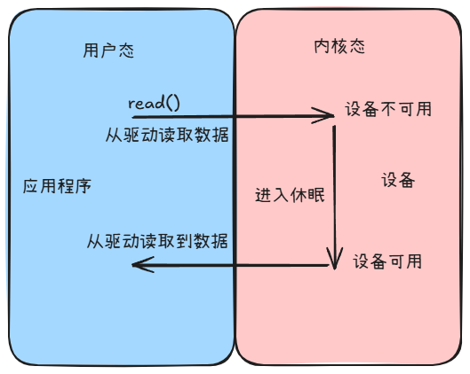
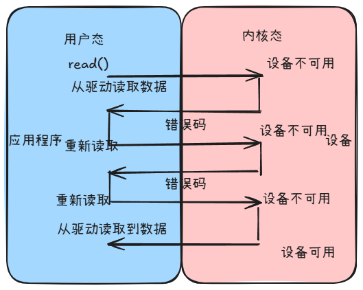

# Linux 阻塞和非阻塞
## 阻塞和非阻塞IO
这里的IO指的是输入输出，是应用程序对驱动设备的输入输出操作
### 阻塞和非阻塞IO简介
- 阻塞IO：应用程序发起IO请求后，必须等待IO操作完成后才能继续运行，直到IO操作完成才返回结果。
    
    应用程序可以通过如下示例代码来进行阻塞访问
    ```c
    int data;
    int fd = open("/dev/xxx", O_RDWR); 
    int ret = read(fd, &data, sizeof(data));
    ```
    默认情况下，对于驱动文件的读取方式是阻塞式的
- 非阻塞IO：应用程序发起IO请求后，立即返回，不等待IO操作完成，直到IO操作完成后才返回结果。
    
    应用程序可以通过如下示例代码来进行非阻塞访问
    ```c
    int data;
    int fd = open("/dev/xxx", O_RDWR | O_NONBLOCK); 
    int ret = read(fd, &data, sizeof(data));
    ```
    在打开设备的时候添加参数`O_NONBLOCK`即可实现非阻塞IO。
### 等待队列
等待队列是一个双向链表，链表的头部是等待队列头，链表的尾部是等待队列尾。当一个进程发起IO请求时，如果设备不可用，则该进程会被加入到等待队列尾部，等待设备可用。当设备可用时，等待队列头部的进程会被唤醒，并被调度执行。内核提供等待队列来实现阻塞进程的唤醒工作
1. **等待队列头**
    阻塞访问的进程会被加入到等待队列的头部，在内核中使用`wait_queue_head_t`结构来表示等待队列头，其定义在`include/linux/wait.h`中
    ```c
    struct wait_queue_head {
        spinlock_t lock;
        struct list_head task_list;
    };
    typedef struct wait_queue_head wait_queue_head_t;
    ``` 
    等待队列头的`lock`是一个自旋锁，用来保护等待队列的并发访问。`task_list`是一个双向链表，用来存储等待队列中的进程。定义好等待队列头以后需要初始化，使用`init_waitqueue_head`函数来完成初始化
    ```c
    wait_queue_head_t my_wait_queue;
    init_waitqueue_head(&my_wait_queue);
    ```
    也可以使用宏`DECLARE_WAITQUEUE`来定义等待队列头
    ```c
    DECLARE_WAITQUEUE(my_wait_queue);
    ```
2. **等待队列项**
    每个访问设备的进程都会被封装成一个等待队列项，当设备不可用的时候就要将这些进程对应的队列项添加到等待队列中。在内核中使用`wait_queue_entry_t`结构来表示等待队列项，其定义在`include/linux/wait.h`中
    ```c
    struct wait_queue_entry {
        struct list_head entry;
        unsigned int flags;
        void *func;
        void *data;
    };
    typedef struct wait_queue_entry wait_queue_entry_t;
    ```
    - `entry`是一个双向链表的节点，用来链接到等待队列头的`task_list`中。
    - `flags`是一个标志位，用来表示等待队列项的状态。
    - `func`是一个回调函数，当设备可用时，等待队列项对应的进程会被唤醒，并调用这个回调函数。
    - `data`是一个指针，用来传递给回调函数的数据。

    使用宏`DECLARE_WAITQUEUE`来定义等待队列项
    ```c
    DECLARE_WAITQUEUE(my_wait_queue, my_wait_queue_entry);
    ```
3. **将队列项添加/移除到等待队列头**
    当设备不可访问的时候就需要将进程对应的等待队列项添加到等待队列头中，当设备可用的时候就需要将进程对应的等待队列项从等待队列头中移除。内核提供了两个函数来完成这两个操作
    - `add_wait_queue`：将一个等待队列项添加到等待队列中。
        ```c
        void add_wait_queue(wait_queue_head_t *q, wait_queue_entry_t *wq)
        ```
        - `q`：等待队列头。
        - `wq`：等待队列项。
    - `remove_wait_queue`：将一个等待队列项从等待队列中移除。
        ```c
        void remove_wait_queue(wait_queue_head_t *q, wait_queue_entry_t *wq)
        ```
        - `q`：等待队列头。
        - `wq`：等待队列项。
4. **等待唤醒**
    当设备可以使用的时候，内核会将等待队列头的进程唤醒，并调用对应的回调函数。唤醒可以使用如下两个函数
    ```c
    void wake_up(struct wait_queue_head *q);
    void wake_up_interruptible(struct wait_queue_head *q);
    ```
    - `wake_up`：唤醒等待队列头的进程，不允许被中断。
    - `wake_up_interruptible`：唤醒等待队列头的进程，允许被中断。
5. **等待事件**
    除了主动唤醒意外，也可以设置等待队列等待某个事件的发生。当某个事件发生时，等待队列头的进程，以下是相关的api函数
    ```c
    wait_event(wait_queue_head_t *q, int condition);
    wait_event_interruptible(wait_queue_head_t *q, int condition);
    wait_event_timeout(wait_queue_head_t *q, int condition, unsigned long timeout);
    wait_event_interruptible_timeout(wait_queue_head_t *q, int condition, unsigned long timeout);
    ```
    - `wait_event`：等待某个条件成立，不允许被中断。
    - `wait_event_interruptible`：等待某个条件成立，允许被中断。
    - `wait_event_timeout`：等待某个条件成立，超时时间为`timeout`毫秒，不允许被中断。
    - `wait_event_interruptible_timeout`：等待某个条件成立，超时时间为`timeout`毫秒，允许被中断。
### 轮询
如果用户应用程序以非阻塞的方式访问设备，设备驱动程序就要提供非阻塞的处理方式，即轮询，应用程序通过调用`poll`、`select`、`epoll`等函数来实现轮询。
- `poll`：是Linux提供的一种IO多路复用机制，可以同时监视多个文件描述符，并根据每个文件描述符的事件来通知应用程序。
    ```c
    int poll(struct pollfd *fds, nfds_t nfds, int timeout);
    ```
    - `fds`：是一个数组，用来描述需要监视的文件描述符。
    - `nfds`：数组中需要监视的文件描述符的个数。
    - `timeout`：超时时间，单位为毫秒。
    - 返回值：返回就绪的文件描述符个数，如果超时返回0。
- `select`：是Unix系统提供的一种IO多路复用机制，可以同时监视多个文件描述符，并根据每个文件描述符的事件来通知应用程序。
    ```c
    int select(int nfds, fd_set *readfds, fd_set *writefds, fd_set *exceptfds, struct timeval *timeout);
    ```
    - `nfds`：需要监视的文件描述符的最大值+1。
    - `readfds`：监视可读的文件描述符集合。
    - `writefds`：监视可写的文件描述符集合。
    - `exceptfds`：监视异常的文件描述符集合。
    - `timeout`：超时时间，单位为秒和微秒。
    - 返回值：返回就绪的文件描述符个数，如果超时返回0。
- `epoll`：是Linux提供的一种IO多路复用机制，可以同时监视多个文件描述符，并根据每个文件描述符的事件来通知应用程序。
    ```c
    int epoll_create(int size);
    int epoll_ctl(int epfd, int op, int fd, struct epoll_event *event);
    int epoll_wait(int epfd, struct epoll_event *events, int maxevents, int timeout);
    ```
    - `epfd`：是epoll句柄，由`epoll_create`函数创建。
    - `op`：操作类型，可以是`EPOLL_CTL_ADD`、`EPOLL_CTL_MOD`、`EPOLL_CTL_DEL`。
    - `fd`：需要监视的文件描述符。
    - `event`：是一个`epoll_event`结构，用来描述需要监视的文件描述符的事件。
    - `events`：是一个数组，用来存放监视的文件描述符的事件。
    - `maxevents`：数组中监视的文件描述符的个数。
    - `timeout`：超时时间，单位为毫秒。
    - 返回值：返回就绪的文件描述符个数，如果超时返回0。
### Liunx 驱动下的poll函数
Liunx 驱动中，poll 函数的作用是用来实现设备的非阻塞访问。在驱动中，poll 函数的作用是用来实现设备的非阻塞访问。poll 函数的原型如下：
```c
unsigned int poll(struct file *file, struct poll_table_struct *wait);
```
- `file`：是文件指针，指向需要轮询的文件。
- `wait`：是一个`poll_table_struct`结构，用来描述需要轮询的事件。
- 返回值：返回就绪的事件个数。
我们需要在驱动程序的`poll`函数中调用`poll_wait`函数，`poll_wait`函数不会引起进程睡眠，而是将进程加入到等待队列中，等待设备的可用。
```c
void poll_wait(struct file *file, wait_queue_head_t *wait_queue, poll_table *wait);
```
- `file`：是文件指针，指向需要轮询的文件。  
- `wait_queue`：是等待队列头。
- `wait`：是一个`poll_table_struct`结构，用来描述需要轮询的事件。 