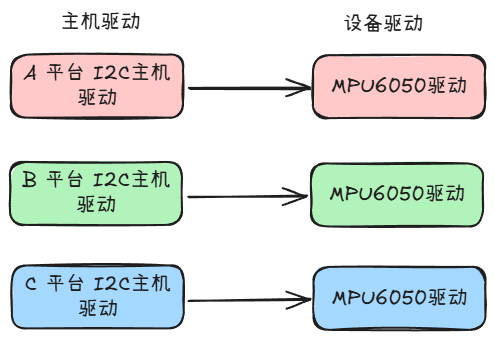
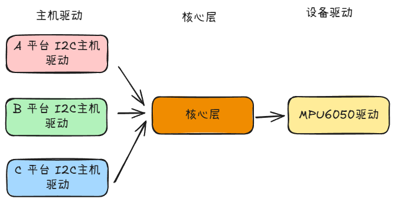
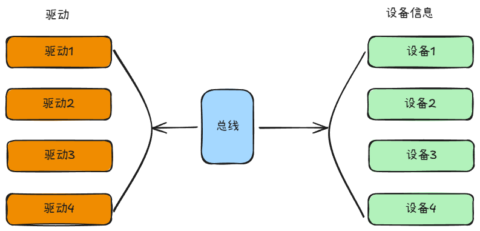

# Platform 设备驱动实验
简单的GPIO可以使用简单的读写操作，但是复杂的外设驱动就不能简单地使用简单的读写操作了。Linux系统考虑到驱动的可重用性，因此提出驱动的分离和平台化的设计理念。
## Linux 驱动的分离与分层
### 驱动的分隔与分离
起初，对于同一个设备，同一个接口，每个厂家都有自己的写法，因此驱动程序的数量也就很多。

随着Linux系统的发展，越来越多的厂家开始提供统一的驱动程序，这就导致了驱动程序的数量急剧增加。

为了解决这个问题，Linux系统提出了驱动的分离和分层的设计理念。 

当我们向系统注册一个驱动的时候，总线会在右侧的设备进行查找，看有没有符合要求的驱动。如果有，则加载驱动，如果没有，则会继续向上查找，直到找到一个符合要求的驱动。同样到系统在注册一个设备中，总线就会在左侧的驱动进行查找，看有没有符合要求的驱动。如果有，则加载驱动，如果没有，则会继续向下查找，直到找到一个符合要求的驱动。这样，驱动的数量就会大大减少，而且可以避免驱动之间的冲突。
### 驱动的分层
驱动的分层设计理念是指将驱动按照功能分成不同的层次，每一层都有自己的职责。
- 最底层的驱动是设备驱动，它负责与硬件设备进行交互，并向上层提供服务。
- 中间层是总线驱动，它负责管理设备的总线，并向上层提供服务。
- 最上层是系统驱动，它负责管理系统的资源，并向下层提供服务。

这样，驱动的职责就会明确，而且可以避免驱动之间的依赖。 
## platform 总线
platform总线是Linux系统中用于管理设备的总线，它可以让驱动程序与设备硬件解耦，使得驱动程序可以运行在不同的硬件平台上。内核使用`bus_type`结构体来表示总线，其中包含了总线的名称、总线号、总线类别、总线的操作函数等。
```c
struct bus_type {
	const char		*name;
	const char		*dev_name;
	struct device		*dev_root;
	const struct attribute_group **bus_groups;
	const struct attribute_group **dev_groups;
	const struct attribute_group **drv_groups;

	int (*match)(struct device *dev, struct device_driver *drv);
	int (*uevent)(struct device *dev, struct kobj_uevent_env *env);
	int (*probe)(struct device *dev);
	void (*sync_state)(struct device *dev);
	int (*remove)(struct device *dev);
	void (*shutdown)(struct device *dev);

	int (*online)(struct device *dev);
	int (*offline)(struct device *dev);

	int (*suspend)(struct device *dev, pm_message_t state);
	int (*resume)(struct device *dev);

	int (*num_vf)(struct device *dev);

	int (*dma_configure)(struct device *dev);

	const struct dev_pm_ops *pm;

	const struct iommu_ops *iommu_ops;

	struct subsys_private *p;
	struct lock_class_key lock_key;

	bool need_parent_lock;

	ANDROID_KABI_RESERVE(1);
	ANDROID_KABI_RESERVE(2);
	ANDROID_KABI_RESERVE(3);
	ANDROID_KABI_RESERVE(4);
};
```
这里尤其要注意的是`match`函数，它是总线驱动用来匹配设备和驱动的函数。每一条总线都有自己的匹配规则，因此总线驱动必须实现`match`函数。
platform总线是`bus_type`结构体的一个实例，它被命名为`platform_bus_type`，它定义了platform总线的各种操作函数。
```c
struct bus_type platform_bus_type = {
    .name		= "platform",
    .dev_groups	= platform_dev_groups,
    .match		= platform_match,
    .uevent		= platform_uevent,
    .dma_configure	= platform_dma_configure,
    .pm		= &platform_dev_pm_ops,
};
```
platform提供了四种匹配方式，下面是`platform_match`函数的实现。
```c
static int platform_match(struct device *dev, struct device_driver *drv)
{
	struct platform_device *pdev = to_platform_device(dev);
	struct platform_driver *pdrv = to_platform_driver(drv);

	/* When driver_override is set, only bind to the matching driver */
	if (pdev->driver_override)
		return !strcmp(pdev->driver_override, drv->name);

	/* Attempt an OF style match first */
	if (of_driver_match_device(dev, drv))
		return 1;

	/* Then try ACPI style match */
	if (acpi_driver_match_device(dev, drv))
		return 1;

	/* Then try to match against the id table */
	if (pdrv->id_table)
		return platform_match_id(pdrv->id_table, pdev) != NULL;

	/* fall-back to driver name match */
	return (strcmp(pdev->name, drv->name) == 0);
}
```
- 第一中匹配方式是通过OF风格的匹配，如果设备的OF节点中有`compatible`属性，则会尝试使用OF风格的匹配方式。
- 第二种匹配方式是通过ACPI风格的匹配，如果设备的ACPI表中有`compatible`属性，则会尝试使用ACPI风格的匹配方式。
- 第三种匹配方式是通过id表的匹配，如果驱动的id表中有匹配的id，则会尝试使用id表的匹配方式。
- 最后一种匹配方式是通过驱动名称的匹配，如果设备的名称和驱动的名称相同，则会尝试使用驱动名称的匹配方式。

总线驱动的实现可以参考`drivers/base/bus.c`文件。

### platform 设备驱动 
`platform_driver`结构体表示一个platform设备驱动，它包含了驱动的名称、probe函数、remove函数、shutdown函数等。
```c
sstruct platform_driver {
	int (*probe)(struct platform_device *);
	int (*remove)(struct platform_device *);
	void (*shutdown)(struct platform_device *);
	int (*suspend)(struct platform_device *, pm_message_t state);
	int (*resume)(struct platform_device *);
	struct device_driver driver;
	const struct platform_device_id *id_table;
	bool prevent_deferred_probe;

	ANDROID_KABI_RESERVE(1);
};
```
- `probe`函数是设备插入时调用的函数，它负责初始化设备非常重要
- `remove`函数是设备移除时调用的函数，它负责释放设备占用的资源
- `shutdown`函数是设备关闭时调用的函数，它负责关闭设备
- `suspend`函数是设备挂起时调用的函数，它负责保存设备的状态
- `resume`函数是设备恢复时调用的函数，它负责恢复设备的状态
- `driver`成员是一个`device_driver`结构体，它包含了驱动的名称、probe函数、remove函数、shutdown函数等。
- `id_table`成员是一个`platform_device_id`数组，它包含了驱动支持的设备的id。
- `prevent_deferred_probe`成员是一个标志，它表示是否禁止延迟的probe。

在编写platform的时候，首先定义一个·platform_driver结构体，然后实现结构体中的各个成员变量，重点是实现匹配方法以及probe函数。当驱动和设备匹配成功以后probe函数就会被调用，具体的驱动程序在probe函数中编写，比如字符设备驱动等      

定义完相关变量后，就可以调用`platform_driver_register`函数注册驱动了。函数原型如下：
```c
int platform_driver_register(struct platform_driver *drv);
```
- `drv`是指向`platform_driver`结构体的指针，表示要注册的驱动。
- 函数返回0表示注册成功，返回非0表示注册失败。

还需要在驱动卸载的时候调用`platform_driver_unregister`函数。函数原型如下：
```c
void platform_driver_unregister(struct platform_driver *drv);
```
- `drv`是指向`platform_driver`结构体的指针，表示要注销的驱动。

### platform 设备
`platform_device`结构体表示一个platform设备，它包含了设备的名称、id、资源等信息。如果内核支持设备树的话，则可以从设备树中解析出`platform_device`结构体，否则需要在驱动中初始化。即改用设备树去描述设备，驱动只需要解析设备树。下面是`platform_device`结构体的定义
```c
struct platform_device {
	const char	*name;
	int		id;
	bool		id_auto;
	struct device	dev;
	u64		platform_dma_mask;
	struct device_dma_parameters dma_parms;
	u32		num_resources;
	struct resource	*resource;

	const struct platform_device_id	*id_entry;
	char *driver_override; /* Driver name to force a match */

	/* MFD cell pointer */
	struct mfd_cell *mfd_cell;

	/* arch specific additions */
	struct pdev_archdata	archdata;

	ANDROID_KABI_RESERVE(1);
	ANDROID_KABI_RESERVE(2);
};
```
- `name`成员是设备的名称，要和驱动的名称匹配。
- `id`成员是设备的id。
- `id_auto`成员是一个标志，表示是否自动生成id。
- `dev`成员是一个`device`结构体，它包含了设备的父设备、子设备、类、属性等信息。
- `platform_dma_mask`成员是一个64位的掩码，表示设备的DMA掩码。
- `dma_parms`成员是一个`device_dma_parameters`结构体，它包含了设备的DMA参数。
- `num_resources`成员是一个整数，表示设备的资源数量。
- `resource`成员是一个`resource`数组，它包含了设备的资源，也就是设备信息。内核使用`resource`结构体表示资源
	```c
	struct resource {
		resource_size_t start;
		resource_size_t end;
		const char *name;
		unsigned long flags;
		unsigned long desc;
		struct resource *parent, *sibling, *child;

		ANDROID_KABI_RESERVE(1);
		ANDROID_KABI_RESERVE(2);
		ANDROID_KABI_RESERVE(3);
		ANDROID_KABI_RESERVE(4);
	};
	```
	- `start`成员是一个资源的起始地址。
	- `end`成员是一个资源的结束地址。
	- `name`成员是一个字符串，表示资源的名称。
	- `flags`成员是一个整数，表示资源的标志。
	- `desc`成员是一个整数，表示资源的描述。
	- `parent`成员是一个`resource`结构体的指针，表示资源的父资源。
	- `sibling`成员是一个`resource`结构体的指针，表示资源的兄弟资源。
	- `child`成员是一个`resource`结构体的指针，表示资源的子资源。

- `id_entry`成员是一个`platform_device_id`结构体的指针，表示设备的id。
- `driver_override`成员是一个字符串，表示驱动的名称。
- `mfd_cell`成员是一个`mfd_cell`结构体的指针，表示设备的MFD子设备。
- `archdata`成员是一个`pdev_archdata`结构体，它包含了设备的arch相关信息。

## 设备树下的platform驱动
在由设备树的Linux内核下，我们使用设备树去描述设备，驱动只需要解析设备树。所以`plaftorm_device`就不需要我们去编写，我们只需要实现`platform_driver`即可
### 创建设备的`pinctrl`节点
在`platform`驱动框架下必须使用`pinctrl`节点来配置设备的引脚复用。
```dts
led-gpios{
	/omit-if-no-ref/
	led_gpio: led-pin{
		rockchip,pins = <0 RK_PC0 RK_FUNC_GPIO &pcfg_pull_none>;
	}
}
```
示例中以GPIO0_C0端口复用为GPIO功能
### 在设备树中创建设备节点
在设备树中创建节点，重点是设置好`compatible`属性的值，这样内核才能识别设备。
```dts
gpioled {
	compatible = "forlinx,led";
	pinctrl-names = "forlinx,led";
	pinctrl-0 = <&led_gpio>;
	led-gpio = <&gpio0 RK_PC0 GPIO_ACTIVE_HIGH>;
	status = "okay";
	};
```
- `compatible`属性的值为`forlinx,led`，表示设备类型为`led`。
- `pinctrl-names`属性的值为`forlinx,led`，表示`pinctrl`节点的名称。
- `pinctrl-0`属性的值为`<&led_gpio>`，表示`pinctrl`节点的索引为0，它指向`led_gpio`节点。
- `led-gpio`属性的值为`<&gpio0 RK_PC0 GPIO_ACTIVE_HIGH>`，表示GPIO0_C0端口复用为GPIO功能，高电平有效。
- `status`属性的值为`okay`，表示设备状态正常。

### 编写platform驱动的时候要注意兼容属性
在使用设备树的时候platform驱动会通过`if_match_table`来保存兼容值，platform驱动中的`platform_driver`可以按照如下编写
```c
static const struct of_device_id led_of_match[] = {
	{.compatible = "forlinx,led", },
	{ /* end of table */ },
};

MODULE_DEVICE_TABLE(of, led_of_match);

static struct platform_driver led_driver = {
	.probe = led_probe,
	.remove = led_remove,
	.driver = {
		.name = "led-forlinx",
		.of_match_table = led_of_match,
	},
};	
```
- `led_of_match`数组保存了设备的兼容属性。
- `MODULE_DEVICE_TABLE(of, led_of_match)`将`led_of_match`数组注册到内核，这样内核才能识别设备。
- `led_driver`结构体中设置了`of_match_table`属性，它指向`led_of_match`数组。

这样，在使用设备树的时候，platform驱动就可以识别设备了。
## 检查引脚复用
### 检查引脚`pinctrl`配置
同一引脚可以有多个功能，但不能在同一时候有多个功能，否则会导致冲突。在`pinctrl.dtsi`中注意查找引脚复用是否正确。	
### 检查GPIO占用
检查GPIO是否被其他设备占用，如果被占用，则不能复用。
