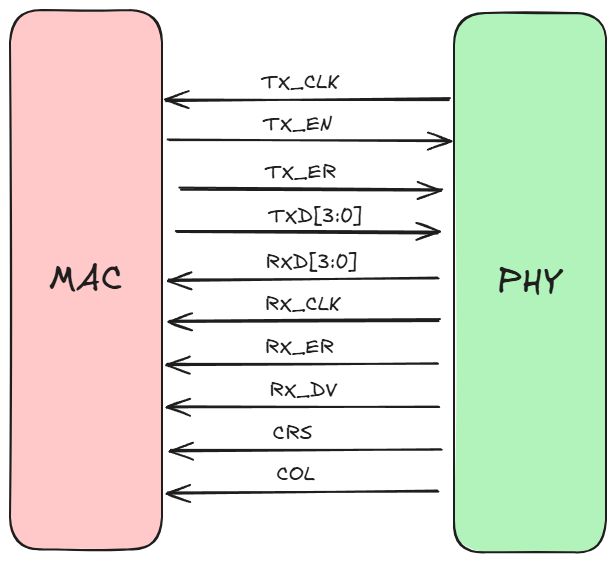
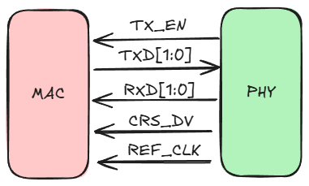
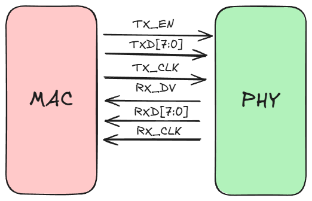
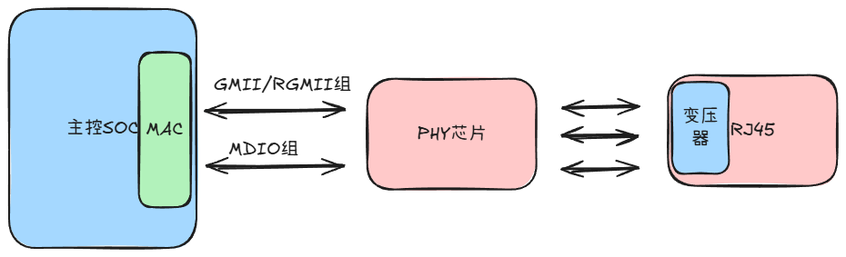
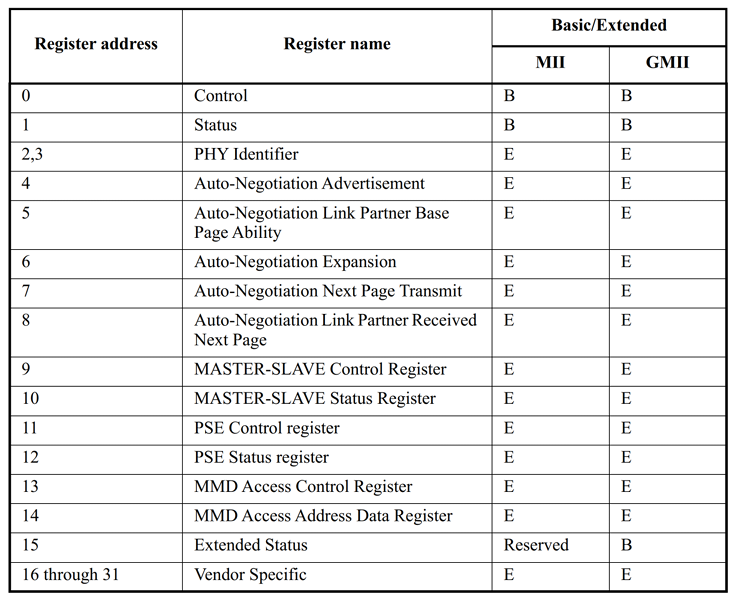

# Linux 网络驱动
## 嵌入式网络简介
### 嵌入式网络硬件接口
嵌入式网络硬件分为`MAC`和`PHY`，通过数据手册可以查询SoC是否支持网络，如果支持一般是说这款SoC内置`MAC`，但是光有`MAC`还不能直接驱动网络，还需要有`PHY`芯片。所以就有了一下两个常见的嵌入式网络硬件方案：SOC内部没有网络`MAC`外设和SOC内部集成网络`MAC`外设，内部集成网络`MAC`的优点如下：
1. 内部`MAC`外设会有专用的加速模块，譬如专用的`DMA`，加速网速数据的处理
2. 网速快，可以支持10/100/1000M网速
3. 外界`PHY`芯片可选择性多，成本低

内部的MAC外设会通过相应的接口来连接外部PHY芯片，有下面两类接口：
1. `MII/RMII`百兆以太网接口：支持$10Mbit/s$和$100Mbit/s$数据传输模式
2. `GMII/RGMII`千兆以太网接口：支持$10Mbit/s$，$100Mbit/s$和$1000Mbit/s$数据传输模式

这些使用与传输网络数据的，还有一个控制接口介于`PHY`和`MAC`间为`MDIO`，一根数据线`MIDO`和一根时钟线`MDC`
### MII/RMII、GMII/RGMII接口
**1. `MII`接口**
`Media Independent Interface`，是IEEE-802.3定义的标准以太网接口，用于连接以太网MAC和PHC芯片  
MII接口一个由16根信号线
- `TX_CLK`：发送时钟，如果网速为 $100M$ 的话时钟频率为 $25MHz$，$10M$ 网速的话时钟频率为 $2.5MHz$，此时钟由 `PHY` 产生并发送给 `MAC`
- `TX_EN`：发送使能信号
- `TX_ER`：发送错误信号，高电平有效，有效期间传输的数据无效，$10Mpbs$ 网速下不起作用
- `TXD[3:0]`：发送数据信号线
- `RXD[3:0]`：接收数据信号线
- `RX_CLK`：接收时钟，，如果网速为$100M$的话时钟频率为$25MHz$，$10M$ 网速的话时钟频率为$2.5MHz$，`RX_CLK`也是由`PHY`产生的
- `RX_ER`：接收错误信号，高电平有效，有效期间传输的数据无效，$10Mpbs$ 网速下不起作用
- `RX_DV`：接收数据有效
- `CRS`：载波侦听信号
- `COL`：冲突检测信号

由于`MII`的接口的信号先，所以现在`MII`接口使用越来越少
**2. `RMII`接口**
`Reduced Media Independent Interface`，`MII`接口的精简版

- `TX_EN`：发送使能信号
- `TXD[1:0]`：发送数据信号线
- `RXD[1:0]`：接收数据信号线
- `CRS_DV`：相当于MII接口中的`RX_DV`和`CRS`这两个信号的混合
- `REF_CLK`：参考时钟，由外部时钟源提供，频率为$50MHz$

**3. `GMII`接口**
`Gigabit Media Independant Interface`，千兆`MII`接口，`GMII`接口采用8位数据接口，工作时钟$125MHz$，因此传输速率可达$1000Mbps$；同时兼容MII所规定的$10/100Mbps$工作方式

- `TX_CLK`：发送时钟，如果网速为 $100M$ 的话时钟频率为 $25MHz$，$10M$ 网速的话时钟频率为 $2.5MHz$，此时钟由 `PHY` 产生并发送给 `MAC`
- `TX_EN`：发送使能信号
- `TX_ER`：发送错误信号，高电平有效，有效期间传输的数据无效，$10Mpbs$ 网速下不起作用
- `TXD[3:0]`：发送数据信号线
- `RXD[3:0]`：接收数据信号线
- `RX_CLK`：接收时钟，，如果网速为$100M$的话时钟频率为$25MHz$，$10M$ 网速的话时钟频率为$2.5MHz$，`RX_CLK`也是由`PHY`产生的
- `RX_ER`：接收错误信号，高电平有效，有效期间传输的数据无效，$10Mpbs$ 网速下不起作用
- `RX_DV`：接收数据有效
- `CRS`：载波侦听信号
- `COL`：冲突检测信号

与`MII`接口相比，`GMII`的数据宽度由4位变为8位
**4. `RGMII`接口**
`Reduced Gigabit Media Independant Interface`，精简版GMII接口

### MDIO接口
`Management Data Input/Ouput`，管理数据输入输出接口，一根`MDIO`数据线，一根`MDC`时钟线。驱动程序可以通过`MDIO`和`MDC`这两根线访问`PHY`芯片的任意一个寄存器，`MDIO`接口支持多达32个`PHY`，即32个地址。`MAC`和外部`PHY`芯片进行连接的时候主要是`MII/RMII`百兆网或`GMII/RGMII`千兆网和`MDIO`接口，另外可能还需要复位、中断等其他引脚
### RJ45接口
`RJ45`座要与`PHY`芯片连接在一起，但是中间需要一个网络变压器，网络变压器用于隔离以及滤波等，现在很多`RJ45`座子内部已经集成了网络变压器，内置网络变压器的`RJ45`座和不内置的引脚一样，但是一般不内置的`RJ45`座会短一点，下图为一个完整的嵌入式网络接口

## PHY芯片
### PHY基础知识
`PHY`是`IEEE 802.3`规定的一个标准模块。`PHY`芯片寄存器地址空间为5位，地址0~31共32个寄存器，IEEE定义了0~15这16个寄存器的功能，16~31这16个寄存器由厂商自行实现。也就是说不管你用的哪个厂家的`PHY`芯片，其中0~15这16个寄存器是一模一样的。仅靠这16个寄存器是完全可以驱动起PHY芯片的，至少能保证基本的网络数据通信，因此Linux内核有通用PHY驱动

## Linux内核网络驱动框架
### `net_device`结构体
### `net_device_ops`结构体
### `sk_buff`结构体
### 网络NAPI处理机制
## RK3566网络驱动简介
### RK3566网络外设设备树
### RK3566网络驱动源码解析
## 网络驱动实验
### Linux内核PHY子系统与MDIO总线简析