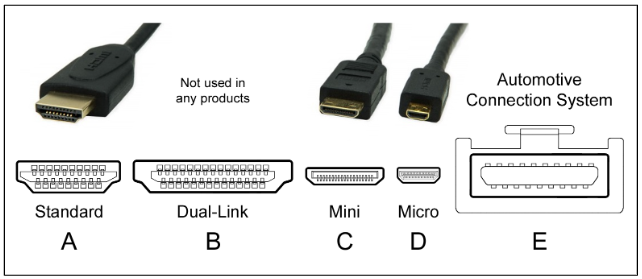
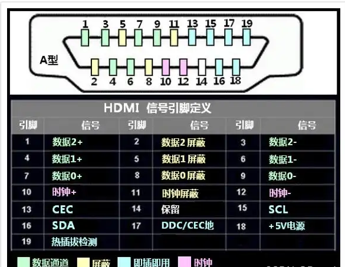
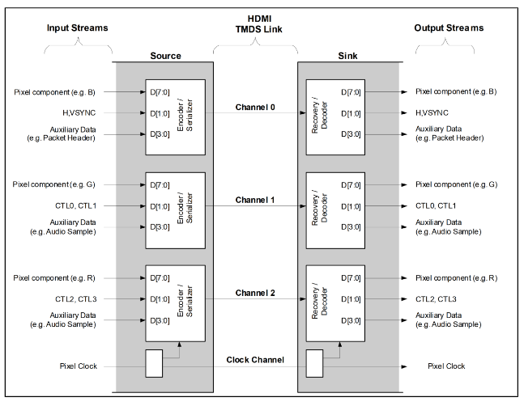
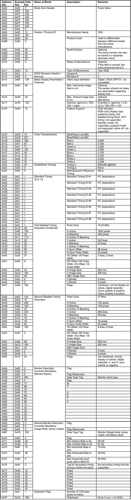

# HDMI 屏幕驱动
## HDMI 介绍
HDMI（高清显示器接口）是一种高速、低功耗、多功能的数字视频接口，可用于连接各种高清显示器，通过一条线同时发送音视频数据，这里了解一些HDMI相关术语
- **HDCP**：high-bandwidth digital content protection，是一种高级数字内容保护，用于保护视频内容的完整性和安全性
- **EDID**：Extended Display Identification Data，扩展显示标识数据，是一种显示器的配置信息，包含了显示器的特性、分辨率、色彩深度、刷新率等信息
- **DDC**： digital display controller，数字显示控制器，是一种专用接口，用于控制显示器的各种特性，如亮度、对比度、色彩饱和度、色域等
- **CEC**：Consumer Electronics Control，消费电子控制，是一种控制显示器的协议，用于控制显示器的各种特性，如亮度、对比度、色彩饱和度、色域等
- **TMDS**：Transmission Media Dependent Signaling，传输媒体依赖信号，是一种高速、低功耗的数字信号，用于传输视频、音频、同步信息等
- **HEAC**：HDMI Ethernet and Audio Return Channel，HDMI以太网和音频返回通道，是一种高速、低功耗的数字信号，用于传输音频、视频等信息
- **Source**：HDMI信号输出设备
- **Sink**：HDMI信号输入设备

### HDMI 接口介绍

框图的左侧是`Source`，右侧是`Sink`，中间是HDMI接口。`Source`和`Sink`之间通过`TMDS`来传输信号，一共有三个信号线：
- `TMDS0`：用于传输视频信号
- `TMDS1`：用于传输音频信号
- `TMDS2`：用于传输同步信号

另外还有几个信号线来传输其他的控制信息：
- `DDC`：用于控制显示器的特性
- `CEC`：用于控制显示器的特性
- `HPD`：高电平有效信号，用于检测`Source`和`Sink`之间的连接状态
- `HEAC`：用于传输音频、视频等信息

HDMI一共有五种接口，最常用的是Type A接口

上面的数据线可以分为一下几类：
- **TMDS 数据 0/1/2** 一共三个数据线，用于传输视频、音频、同步信号
- **TMDS 时钟** 一对时钟线，用于同步传输信号
- **CEC** HDMI 控制接口，用于控制显示器的特性
- **DDC** HDMI 显示接口，用于控制显示器的特性，本质是个I2C总线
- **HPD** 高电平有效信号，用于检测`Source`和`Sink`之间的连接状态，热插拔
### TMDS 传输原理
`TMDS` 使用时钟信号和数据信号来传输视频、音频、同步信号。信号`0`和`1`分别有两个引脚的电压差来决定，即当`TMDS`的差分线+为高电平时，`TMDS`的差分线-为电平，表示1，当`TMDS`的差分线-为高电平时，`TMDS`的差分线+为电平，表示0。接收端通过判断压差来确定1还是0，采用差分传输的好处就是抗干扰能力强，适合于高速传输。
    
`TMDS` 由3个数据通道和1个时钟通道组成，`TMDS` 的时钟通道以所传输的视频信号像素时钟的固定比例运行。每个 `TMDS` 时钟周期，每个 `TMDS` 数据通道都会传输 `10bit` 数据。数据从左侧传递到右侧，左侧的每个通道有`8bit`的原始数据，通过编码后得到`10bit`数据通过`TMDS`传输，接收端接收到的`10bit`数据再进行解码，得到`8bit`原始数据。
- **D[7:0]** 8位数据，用于传输视频信号
- **D[1:0]** 通道0的是`HSYNC`和`VSYNC`，通道1和通道2的是`CTL0~CTL3`
- **D[3:0]** 额外的数据
- **通道0** 传输图像的蓝色分量，`HSYNC`和`VSYNC`信号
- **通道1** 传输图像的绿色分量，`CTL0`和`CTK1`信号
- **通道2** 传输图像的红色分量，`CTL2`和`CTL3`信号
- **时钟** 时钟信号，用于同步传输信号，`TMDS` 时钟频率为`25MHz`

### HDMI 传输阶段
- 视频数据传输阶段，会将`8bit`的视频数据编码成`10bit`的信号，并通过`TMDS`传输。
- 音频和额外数据传输阶段，会将`4bit`数据编码`10bit`的信号，并通过`TMDS`传输。
- 控制信号数据传输阶段，会将`2bit`的控制信号编码`10bit`的信号，并通过`TMDS`传输。
### HDMI 时钟与带宽 
1. 像素时钟
    以RK3568为例，支持1920*1080p@120Hz和4090*2304@60Hz，这两个分辨率对应的像素时钟为
    $1920*1080p@120Hz：120Hz*1920*1080=248.832MHz$
    $4096*2304@60Hz：60Hz*4096*2304=566.2MHz$
2. 理论带宽
    假设像素格式为RGB888，也就是一像素24bit，对应的理论带宽应该是在像素时钟的基础上乘以24bit，即
    $248.832MHz*24bit=6.0Gbps$
    $566.2MHz*24bit=13.6Gbps$
3. `TMDS` 时钟
    在HDMI2.0的协议将TMDS的时钟加到600MHz，一个TMDS单个通道传输`10bit`的数据，所以单通道的带宽是`6Gpbs`，一共有3个通道，所以总带宽是`18Gbps`。，但是TMDS会在传输的时候将原始的`8bit`有效数据编码为`10bit`数据，所以实际的带宽会比理论值小。有效带宽需要理论带宽乘以0.8
### EDID 详解 
EDID 是一种显示器的配置信息，包含了显示器的特性、分辨率、色彩深度、刷新率等信息。EDID 由128字节的二进制数据组成，每字节表示一个16进制数。

