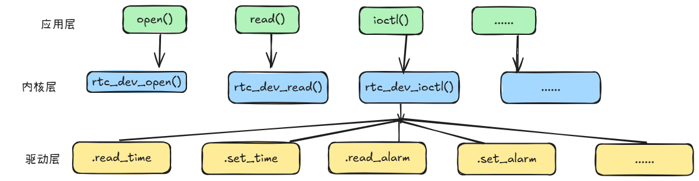

# Linux RTC 驱动
RTC 全称为 Real-Time Clock，即实时时钟。它是一款集中精密的时钟芯片，可用于记录和保持系统时间。Linux 系统中，RTC 驱动程序负责管理 RTC 芯片，并提供对 RTC 寄存器的访问接口。RTC设备驱动是一个标准的字符设备驱动，应用程序通过`open()`、`read()`、`write()`等标准接口与驱动进行交互。Linux 内核中，RTC 驱动程序位于`drivers/char/rtc.c`文件中。
## Linux 内核RTC驱动
Linux 内核将RTC设备抽象为`rtc_device`，所以RTC设备驱动就是申请并初始化`rtc_device`注册到Linux内核里面
```c
struct rtc_device {
	struct device dev;
	struct module *owner;

	int id;

	const struct rtc_class_ops *ops;
	struct mutex ops_lock;

	struct cdev char_dev;
	unsigned long flags;

	unsigned long irq_data;
	spinlock_t irq_lock;
	wait_queue_head_t irq_queue;
	struct fasync_struct *async_queue;

	int irq_freq;
	int max_user_freq;

	struct timerqueue_head timerqueue;
	struct rtc_timer aie_timer;
	struct rtc_timer uie_rtctimer;
	struct hrtimer pie_timer; /* sub second exp, so needs hrtimer */
	int pie_enabled;
	struct work_struct irqwork;
	/* Some hardware can't support UIE mode */
	int uie_unsupported;

	/* Number of nsec it takes to set the RTC clock. This influences when
	 * the set ops are called. An offset:
	 *   - of 0.5 s will call RTC set for wall clock time 10.0 s at 9.5 s
	 *   - of 1.5 s will call RTC set for wall clock time 10.0 s at 8.5 s
	 *   - of -0.5 s will call RTC set for wall clock time 10.0 s at 10.5 s
	 */
	long set_offset_nsec;

	bool registered;

	/* Old ABI support */
	bool nvram_old_abi;
	struct bin_attribute *nvram;

	time64_t range_min;
	timeu64_t range_max;
	time64_t start_secs;
	time64_t offset_secs;
	bool set_start_time;

#ifdef CONFIG_RTC_INTF_DEV_UIE_EMUL
	struct work_struct uie_task;
	struct timer_list uie_timer;
	/* Those fields are protected by rtc->irq_lock */
	unsigned int oldsecs;
	unsigned int uie_irq_active:1;
	unsigned int stop_uie_polling:1;
	unsigned int uie_task_active:1;
	unsigned int uie_timer_active:1;
#endif

	ANDROID_KABI_RESERVE(1);
};
```
这里需要重点关注`const struct rtc_class_ops *ops`这个变量，它指向一个`rtc_class_ops`结构体，这个结构体中包含了一些回调函数指针，这些回调函数指针会在`rtc_device`的操作过程中被调用。
```c
/*
 * For these RTC methods the device parameter is the physical device
 * on whatever bus holds the hardware (I2C, Platform, SPI, etc), which
 * was passed to rtc_device_register().  Its driver_data normally holds
 * device state, including the rtc_device pointer for the RTC.
 *
 * Most of these methods are called with rtc_device.ops_lock held,
 * through the rtc_*(struct rtc_device *, ...) calls.
 *
 * The (current) exceptions are mostly filesystem hooks:
 *   - the proc() hook for procfs
 */
struct rtc_class_ops {
	int (*ioctl)(struct device *, unsigned int, unsigned long);
	int (*read_time)(struct device *, struct rtc_time *);
	int (*set_time)(struct device *, struct rtc_time *);
	int (*read_alarm)(struct device *, struct rtc_wkalrm *);
	int (*set_alarm)(struct device *, struct rtc_wkalrm *);
	int (*proc)(struct device *, struct seq_file *);
	int (*alarm_irq_enable)(struct device *, unsigned int enabled);
	int (*read_offset)(struct device *, long *offset);
	int (*set_offset)(struct device *, long offset);

	ANDROID_KABI_RESERVE(1);
};
```
这个操作集合是最底层的RTC设备操作函数，但不是直接提供给应用层的接口。应用层通过`ioctl()`、`read_time()`、`set_time()`等函数来操作RTC设备。在`drivers/rtc/dev.c`中有提供了所有RTC设备公用的操作函数。
```c
static const struct file_operations rtc_dev_fops = {
	.owner		= THIS_MODULE,
	.llseek		= no_llseek,
	.read		= rtc_dev_read,
	.poll		= rtc_dev_poll,
	.unlocked_ioctl	= rtc_dev_ioctl,
#ifdef CONFIG_COMPAT
	.compat_ioctl	= rtc_dev_compat_ioctl,
#endif
	.open		= rtc_dev_open,
	.release	= rtc_dev_release,
	.fasync		= rtc_dev_fasync,
};

```
应用层调用读写等操作函数进入内核层，内核层调用这些函数进入驱动层，驱动层调用`rtc_class_ops`中的回调函数，驱动层的这些回调函数最终会调用到`rtc_device`中的操作函数。

当准备好`rtc_class_ops`后，可以使用`rtc_device_register()`函数注册`rtc_device`，并将`rtc_class_ops`的指针赋值给`ops`成员。
```c
extern struct rtc_device *devm_rtc_device_register(struct device *dev,
					const char *name,
					const struct rtc_class_ops *ops,
					struct module *owner);
```
- `dev`：设备对象
- `name`：设备名称
- `ops`：`rtc_class_ops`结构体指针
- `owner`：模块指针

注册完成后，就可以通过标准的设备文件接口来操作`rtc_device`。
当卸载模块时，可以使用`rtc_device_unregister()`函数注销`rtc_device`。
```c
static void rtc_device_unregister(struct rtc_device *rtc);
```
- `rtc`：`rtc_device`指针
## 实验
这里学习模仿PCF8563芯片的RTC设备驱动，编写一个简单的驱动程序，实现对PCF8563 RTC芯片的读写操作等功能
### 设备树修改
```dts
&i2c5 {
	status = "okay";
	pinctrl-names = "default";
	pinctrl-0 = <&i2c5m2_xfer>;

	pcf8563: pcf8563@51 {
		compatible = "nxp,pcf8563";
		reg = <0x51>;
		#clock-cells = <0>;
	};
};
```
### 驱动程序编写
```c

#include <linux/clk-provider.h>
#include <linux/i2c.h>
#include <linux/bcd.h>
#include <linux/rtc.h>
#include <linux/slab.h>
#include <linux/module.h>
#include <linux/of.h>
#include <linux/err.h>

#define PCF8563_REG_ST1		0x00        /* control_status_1 */
#define PCF8563_REG_ST2		0x01        /* control_status_2 */
#define PCF8563_BIT_AIE		BIT(1)      /* alarm interrupt enable */
#define PCF8563_BIT_AF		BIT(3)      /* alarm flag */
#define PCF8563_BITS_ST2_N	(7 << 5)

#define PCF8563_REG_SC		0x02 /* vl_seconds */
#define PCF8563_REG_MN		0x03 /* vl_minutes */
#define PCF8563_REG_HR		0x04 /* vl_hours */
#define PCF8563_REG_DM		0x05 /* vl_day_of_month */
#define PCF8563_REG_DW		0x06 /* vl_day_of_week */
#define PCF8563_REG_MO		0x07 /* vl_month */
#define PCF8563_REG_YR		0x08 /* vl_year */

#define PCF8563_REG_AMN		0x09 /* alarm_minutes */

#define PCF8563_REG_CLKO		0x0D /* clock_out */
#define PCF8563_REG_CLKO_FE		0x80 /* clock out enabled */
#define PCF8563_REG_CLKO_F_MASK		0x03 /* frequenc mask */
#define PCF8563_REG_CLKO_F_32768HZ	0x00
#define PCF8563_REG_CLKO_F_1024HZ	0x01
#define PCF8563_REG_CLKO_F_32HZ		0x02
#define PCF8563_REG_CLKO_F_1HZ		0x03

#define PCF8563_REG_TMRC	0x0E /* timer_control */
#define PCF8563_TMRC_ENABLE	BIT(7)
#define PCF8563_TMRC_4096	0
#define PCF8563_TMRC_64		1
#define PCF8563_TMRC_1		2
#define PCF8563_TMRC_1_60	3
#define PCF8563_TMRC_MASK	3

#define PCF8563_REG_TMR		0x0F /* timer */

#define PCF8563_SC_LV		0x80 /* low_voltage */
#define PCF8563_MO_C		0x80 /* century */

// 外设结构体定义
struct pcf8563
{
    strcut rtc_device * rtc;
    struct i2c_client* client;
#ifdef CONFIG_COMMON_CLK
    struct clk_hw clk_hw;
#endif
};

//  起始位 7位地址 应答位 数据位 应答位 停止位
static int pcf8563_read_block_data(struct i2c_client* client, unsigned char reg, int len, unsigned char* buf)
{
    struct i2c_msg msgs[] = {
        {
            .addr = client->addr,
            .len = 1,
            .buf = &reg,
        },
        {
            .addr = client->addr,
            .flags = I2C_M_RD,
            .len = len,
            .buf = buf,
        },
    };
    if ((i2c_transfer(clinet->adapter, msgs, 2)) != 2)
    {
        dev_err(&client->dev, "%s: i2c transfer error\n", __func__);
        return -EIO;
    }
    return 0;
}

static int pcf8563_write_block_data(struct i2c_client* client, unsigned char reg, int len, unsigned char* buf)
{
    int i, err;
    for (i = 0; i < length; i++)
    {
        unsigned char data[2] = { reg + i, buf[i] };

        err = i2c_master_send(client, data, sizeof(data));
        if (err != sizeof(data))
        {
            dev_err(&client->dev, "%s: i2c master send error addr = %02x, data = %02x\n", __func__, client->addr, data[0], data[i]);
            return -EIO;
        }
    }
    return 0;
}

static int pcf8563_set_alarm_mode(struct i2c_client* client, bool on)
{
    unsigned char buf;
    int err;

    err = pcf8563_read_block_data(client, PCF8563_REG_ST2, 1, &buf);
    if (err < 0)
    {
        return err;
    }
    if (on)
    {
        buf |= PCF8563_BIT_AIE
    }
    else
    {
        buf &= ~PCF8563_BIT_AIE;
    }

    buf &= ~(PCF8563_BIT_AF | PCF8563_BITS_ST2_N);

    err = pcf8563_write_block_data(client, PCF8563_REG_ST2, 1, &buf);
    if (err < 0)
    {
        dev_err(&client->dev, "%s: set alarm mode failed\n", __func__);
        return -EIO;
    }
    return 0;
}

static int pcf8563_get_alarm_mode(struct i2c_client* client, unsigned char* en, unsigned char* pen)
{
    unsigned char buf;
    int err;

    err = pcf8563_read_block_data(client, PCF8563_REG_ST2, 1, &buf);
    if (err < 0)
    {
        return err;
    }
    // 双取反操作符，确保返回值标准化为布尔值
    *en = !!(buf & PCF8563_BIT_AIE);
    *pen = !!(buf & PCF8563_BIT_AF);
    return 0;
}

static irqreturn_t pcf8563_irq(int irq, void* dev_id)
{
    struct pcf8563* pcf8563 = i2c_get_clientdata(dev_id);
    int err;
    char pending;
    err = pcf8563_read_block_data(pcf8563->client, PCF8563_REG_ST2, 1, &pending);
    if (err)
    {
        return IRQ_NONE;
    }
    if (pending)
    {
        rtc_update_irq(pcf8563->rtc, 1, RTC_AF | RTC_IRQF);
        pcf8563_set_alarm_mode(pcf8563->client, 1);
        return IRQ_HANDLED;
    }
    return IRQ_NONE;
}

static int pcf8563_rtc_read_time(struct device* dev, struct rtc_time* tm)
{
	struct i2c_client *client = to_i2c_client(dev);
	struct pcf8563 *pcf8563 = i2c_get_clientdata(client);
	unsigned char buf[9];
	int err;

	err = pcf8563_read_block_data(client, PCF8563_REG_ST1, 9, buf);
	if (err)
		return err;

	if (buf[PCF8563_REG_SC] & PCF8563_SC_LV) {
		dev_err(&client->dev,
			"low voltage detected, date/time is not reliable.\n");
		return -EINVAL;
	}

	dev_dbg(&client->dev,
		"%s: raw data is st1=%02x, st2=%02x, sec=%02x, min=%02x, hr=%02x, "
		"mday=%02x, wday=%02x, mon=%02x, year=%02x\n",
		__func__,
		buf[0], buf[1], buf[2], buf[3],
		buf[4], buf[5], buf[6], buf[7],
		buf[8]);


	tm->tm_sec = bcd2bin(buf[PCF8563_REG_SC] & 0x7F);
	tm->tm_min = bcd2bin(buf[PCF8563_REG_MN] & 0x7F);
	tm->tm_hour = bcd2bin(buf[PCF8563_REG_HR] & 0x3F); /* rtc hr 0-23 */
	tm->tm_mday = bcd2bin(buf[PCF8563_REG_DM] & 0x3F);
	tm->tm_wday = buf[PCF8563_REG_DW] & 0x07;
	tm->tm_mon = bcd2bin(buf[PCF8563_REG_MO] & 0x1F) - 1; /* rtc mn 1-12 */
	tm->tm_year = bcd2bin(buf[PCF8563_REG_YR]) + 100;
	/* detect the polarity heuristically. see note above. */
	pcf8563->c_polarity = (buf[PCF8563_REG_MO] & PCF8563_MO_C) ?
		(tm->tm_year >= 100) : (tm->tm_year < 100);

	dev_dbg(&client->dev, "%s: tm is secs=%d, mins=%d, hours=%d, "
		"mday=%d, mon=%d, year=%d, wday=%d\n",
		__func__,
		tm->tm_sec, tm->tm_min, tm->tm_hour,
		tm->tm_mday, tm->tm_mon, tm->tm_year, tm->tm_wday);

	return 0;
}

static int pcf8563_rtc_set_time(struct device *dev, struct rtc_time *tm)
{
	struct i2c_client *client = to_i2c_client(dev);
	struct pcf8563 *pcf8563 = i2c_get_clientdata(client);
	unsigned char buf[9];

	dev_dbg(&client->dev, "%s: secs=%d, mins=%d, hours=%d, "
		"mday=%d, mon=%d, year=%d, wday=%d\n",
		__func__,
		tm->tm_sec, tm->tm_min, tm->tm_hour,
		tm->tm_mday, tm->tm_mon, tm->tm_year, tm->tm_wday);

	/* hours, minutes and seconds */
	buf[PCF8563_REG_SC] = bin2bcd(tm->tm_sec);
	buf[PCF8563_REG_MN] = bin2bcd(tm->tm_min);
	buf[PCF8563_REG_HR] = bin2bcd(tm->tm_hour);

	buf[PCF8563_REG_DM] = bin2bcd(tm->tm_mday);

	/* month, 1 - 12 */
	buf[PCF8563_REG_MO] = bin2bcd(tm->tm_mon + 1);

	/* year and century */
	buf[PCF8563_REG_YR] = bin2bcd(tm->tm_year - 100);
	if (pcf8563->c_polarity ? (tm->tm_year >= 100) : (tm->tm_year < 100))
		buf[PCF8563_REG_MO] |= PCF8563_MO_C;

	buf[PCF8563_REG_DW] = tm->tm_wday & 0x07;

	return pcf8563_write_block_data(client, PCF8563_REG_SC,
				9 - PCF8563_REG_SC, buf + PCF8563_REG_SC);
}

static int pcf8563_rtc_ioctl(struct device *dev, unsigned int cmd, unsigned long arg)
{
	struct i2c_client *client = to_i2c_client(dev);
	int ret;

	switch (cmd) {
	case RTC_VL_READ:
		ret = i2c_smbus_read_byte_data(client, PCF8563_REG_SC);
		if (ret < 0)
			return ret;

		return put_user(ret & PCF8563_SC_LV ? RTC_VL_DATA_INVALID : 0,
				(unsigned int __user *)arg);
	default:
		return -ENOIOCTLCMD;
	}
}

static int pcf8563_rtc_read_alarm(struct device *dev, struct rtc_wkalrm *tm)
{
	struct i2c_client *client = to_i2c_client(dev);
	unsigned char buf[4];
	int err;

	err = pcf8563_read_block_data(client, PCF8563_REG_AMN, 4, buf);
	if (err)
		return err;

	dev_dbg(&client->dev,
		"%s: raw data is min=%02x, hr=%02x, mday=%02x, wday=%02x\n",
		__func__, buf[0], buf[1], buf[2], buf[3]);

	tm->time.tm_sec = 0;
	tm->time.tm_min = bcd2bin(buf[0] & 0x7F);
	tm->time.tm_hour = bcd2bin(buf[1] & 0x3F);
	tm->time.tm_mday = bcd2bin(buf[2] & 0x3F);
	tm->time.tm_wday = bcd2bin(buf[3] & 0x7);

	err = pcf8563_get_alarm_mode(client, &tm->enabled, &tm->pending);
	if (err < 0)
		return err;

	dev_dbg(&client->dev, "%s: tm is mins=%d, hours=%d, mday=%d, wday=%d,"
		" enabled=%d, pending=%d\n", __func__, tm->time.tm_min,
		tm->time.tm_hour, tm->time.tm_mday, tm->time.tm_wday,
		tm->enabled, tm->pending);

	return 0;
}

static int pcf8563_rtc_set_alarm(struct device *dev, struct rtc_wkalrm *tm)
{
	struct i2c_client *client = to_i2c_client(dev);
	unsigned char buf[4];
	int err;

	/* The alarm has no seconds, round up to nearest minute */
	if (tm->time.tm_sec) {
		time64_t alarm_time = rtc_tm_to_time64(&tm->time);

		alarm_time += 60 - tm->time.tm_sec;
		rtc_time64_to_tm(alarm_time, &tm->time);
	}

	dev_dbg(dev, "%s, min=%d hour=%d wday=%d mday=%d "
		"enabled=%d pending=%d\n", __func__,
		tm->time.tm_min, tm->time.tm_hour, tm->time.tm_wday,
		tm->time.tm_mday, tm->enabled, tm->pending);

	buf[0] = bin2bcd(tm->time.tm_min);
	buf[1] = bin2bcd(tm->time.tm_hour);
	buf[2] = bin2bcd(tm->time.tm_mday);
	buf[3] = tm->time.tm_wday & 0x07;

	err = pcf8563_write_block_data(client, PCF8563_REG_AMN, 4, buf);
	if (err)
		return err;

	return pcf8563_set_alarm_mode(client, !!tm->enabled);
}

static int pcf8563_irq_enable(struct device *dev, unsigned int enabled)
{
	dev_dbg(dev, "%s: en=%d\n", __func__, enabled);
	return pcf8563_set_alarm_mode(to_i2c_client(dev), !!enabled);
}

#ifdef CONFIG_COMMON_CLK

//  获取pcf8563结构体中的时钟硬件
#define clkout_hw_to_pcf8563(hw) container_of(_hw, struct pcf8563, clkout_hw)

static const int clkout_rates[] = {
    32768, 1024, 32, 1,
};

// 时钟频率计算函数
static unsigned long pcf8563_clkout_recalc_rate(struct clk_hw* hw, unsigned long parent_rate)
{
    struct pcf8563* pcf8563 = clkout_hw_to_pcf8563(hw);
    struct i2c_client* client = pcf8563->client;
    unsigned char buf;
    int ret = pcf8563_read_block_data(client, PCF8563_REG_CLKO, 1, &buf);
    if (ret < 0)
    {
        return 0;
    }
    buf &= PCF8563_REG_CLKO_F_MASK;
    return clkout_rates[buf];
}

// 时钟频率舍入函数
// ARRAY_SIZE宏用于获取数组的元素个数
static long pcf8563_clkout_round_rate(struct clk_hw* hw, unsigned long rate, unsigned long* parent_rate)
{
    int i;
    for (i = 0; i < ARRAY_SIZE(clkout_rates); i++)
    {
        if (rate <= clkout_rates[i])
        {
            return clkout_rates[i];
        }
    }
    return clkout_rates[ARRAY_SIZE(clkout_rates) - 1];
}

static int pcf8563_clkout_set_rate(struct clk_hw* hw, unsigned long rate, unsigned long parent_rate)
{
    struct pcf8563* pcf8563 = clkout_hw_to_pcf8563(hw);
    struct i2c_client* client = pcf8563->client;
    unsigned char buf;
    int ret = pcf8563_read_block_data(client, PCF8563_REG_CLKO, 1, &buf);
    int i;

    if (ret < 0)
    {
        return ret;
    }

    for (i = 0; i < ARRAY_SIZE(clkout_rates); i++)
    {
        if (clkout_rates[i] == rate)
        {
            // 清位
            buf &= ~PCF8563_REG_CLKO_F_MASK;
            // 置位
            buf |= i;
            // 写入寄存器
            ret = pcf8563_write_block_data(client, PCF8563_REG_CLKO, 1, &buf);
            return ret;
        }
    }
    return -EINVAL;
}

static int pcf8563_clkout_control(struct clk_hw* hw, bool enable)
{
    struct pcf8563* pcf8563 = clkout_hw_to_pcf8563(hw);
    struct i2c_client* client = pcf8563->client;
    unsigned char buf;
    int ret = pcf8563_read_block_data(client, PCF8563_REG_CLKO, 1, &buf);
    if (ret < 0)
    {
        return ret;
    }
    if (enable)
    {
        // 使能置位
        buf |= PCF8563_REG_CLKO_FE;
    }
    else
    {
        // 失能清位
        buf &= ~PCF8563_REG_CLKO_FE;
    }
    ret = pcf8563_write_block_data(client, PCF8563_REG_CLKO, 1, &buf);
    return ret;
}

static int pcf8563_clkout_prepare(struct clk_hw* hw)
{
    return pcf8563_clkout_control(hw, true);
}

static void pcf8563_clkout_unprepare(struct clk_hw* hw)
{
    pcf8563_clkout_control(hw, false);
}

static int pcf8563_clkout_is_prepared(struct clk_hw* hw)
{
    struct pcf8563* pcf8563 = clkout_hw_to_pcf8563(hw);
    struct i2c_client* client = pcf8563->client;
    unsigned char buf;
    // ret 为时钟输出使能位的结果
    int ret = pcf8563_read_block_data(client, PCF8563_REG_CLKO, 1, &buf);
    if (ret < 0)
    {
        return ret;
    }
    return (buf & PCF8563_REG_CLKO_FE) != 0;
}


static const struct clk_ops pcf8563_clkout_ops = {
    .prepare = pcf8563_clkout_prepare,
    .unprepare = pcf8563_clkout_unprepare,
    .is_prepared = pcf8563_clkout_is_prepared,
    .recalc_rate = pcf8563_clkout_recalc_rate,
    .set_rate = pcf8563_clkout_set_rate,
    .round_rate = pcf8563_clkout_round_rate,
};


static struct clk* pcf8653_clkout_register_clk(struct pcf8563* pcf8563)
{
    struct i2c_client = pcf8563->client;
    struct device_node* node = client->dev.of_node;
    struct clk* clk;
    struct clk_init_data init;
    int ret;
    unsigned char buf;

    buf = 0;
    ret = pcf8563_write_block_data(client, PCF8563_REG_CLKO, 1, &buf);
    if (ret < 0)
    {
        return ERR_PTR(ret);
    }
    init.name = "pcf8563_clkout";
    init.ops = &pcf8563_clkout_ops;
    init.flags = 0;
    init.parent_names = NULL;
    init.num_parents = 0;
    pcf8563->clk_hw.init = &init;

    of_property_read_string(node, "clock-output-names", &init.name);

    clk = devm_clk_register(&client->dev, &pcf8563->clkout_hw);

    if (!(IS_ERR(clk)))
    {
        of_clk_add_provider(node, of_clk_src_simple_get, clk);
    }

    return clk;
}
#endif

static const struct rtc_class_ops pcf8563_rtc_ops = {
    .ioctl = pcf8563_rtc_ioctl,
    .read_time = pcf8563_rtc_read_time,
    .set_time = pcf8563_rtc_set_time,
    .read_alarm = pcf8563_rtc_read_alarm,
    .set_alarm = pcf8563_rtc_set_alarm,
    .alarm_irq_enable = pcf8563_rtc_alarm_irq_enable,
};

static int pcf8563_probe(struct i2c_client* client, const struct i2c_device_id* id)
{
    struct pcf8563* pcf8563;
    int err;
    unsigned char buf;
    // dev_dbg是Linux内核提供的调试输出函数，用来输出调试信息
    dev_dbg(&clinet->dev, "%s\n", __func__);
    // 检查是否支持I2C功能
    if (!i2c_check_functionality(client->adapter, I2C_FUNC_I2C))
    {
        return -ENODEV;
    }
    // 分配内存空间
    pcf8563 = devm_kzalloc(&client->dev, sizeof(struct pcf8563), GFP_KERNEL);
    if (!pcf8563)
    {
        return -ENOMEM;
    }
    // 将私有数据关联到I2C客户端
    i2c_set_clientdata(client, pcf8563);
    pcf8563->client = client;
    // 声明设备具有唤醒能力
    device_set_wakeup_capable(&client->dev, true);
    // 设置定时器控制器，每1/60秒递减一次计数器
    buf = PCF8563_TMRC_1_60;
    err = pcf8563_write_block_data(client, PCF8563_REG_TMRC, 1, &buf);
    if (err < 0)
    {
        dev_err(&client->dev, "%s: write TMRC failed\n", __func__);
        return err;
    }
    // 对控制状态寄存器2进行初始化，清位，关中断，关定时
    buf = 0;
    err = pcf8563_write_block_data(client, PCF8563_REG_ST2, 1, &buf);
    if (err < 0)
    {
        dev_err(&client->dev, "%s: write ST2 failed\n", __func__);
        return err;
    }
    // 分配内存空间
    pcf8563->rtc = devm_rtc_allocate_device(&client->dev);
    if (IS_ERR(pcf8563->rtc))
    {
        return PTR_ERR(pcf8563->rtc);
    }
    pcf8563->rtc->ops = &pcf8563_rtc_ops;

    // 禁用闹钟中断
    pcf8563->rtc->uie_unsupported = true;
    // 设置RTC支持的最小时间范围
    pcf8563->rtc->range_min = RTC_TIMESTAMP_BEGIN_2000;
    // 设置RTC支持的最大时间范围
    pcf8563->rtc->range_max = RTC_TIMESTAMP_END_2099;
    // RTC初始化时设置开始时间
    pcf8563->rtc->set_start_time = true;

    // 申请中断
    if (client->irq > 0)
    {
        err = devm_request_threaded_irq(&client->dev, client->irq, NULL, pcf8563_irq,
            IRQF_SHARED | IRQF_ONESHOT | IRQF_TRIGGER_LOW, pcf8563_driver.driver.name,
            client);
        if (err)
        {
            dev_err(&& client->dev, "unable to request irt %d\n", client->irq);
            return err;
        }
    }
    // 注册RTC设备
    err = rtc_register_device(pcf8563->rtc);
    if (err)
    {
        dev_err(&client->dev, "unable to register rtc device\n");
        return err;
    }

    // 注册时钟输出
#ifdef CONFIG_COMMON_CLK
    pcf8563_clkout_register(pcf8563);
#endif
    return 0;
}

static const struct i2c_device_id pcf8563_id[] = {
    { "pcf8563", 0 },
    { }
};
MODULE_DEVICE_TABLE(i2c, pcf8563_id);

#ifdef CONFIG_OF
static const struct of_device_id pcf8563_of_match[] = {
    {.compatible = "nxp,pcf8563" },
    { /* sentinel */ }
};
MODULE_DEVICE_TABLE(of, pcf8563_of_match);
#endif

static struct i2c_driver pcf8563_driver = {
    .driver = {
       .name = "pcf8563",
       .of_match_table = of_match_ptr(pcf8563_of_match),
    },
    .probe = pcf8563_probe,
    .id_table = pcf8563_id,
};
// 注册驱动程序
module_i2c_driver(pcf8563_driver);

MODULE_AUTHOR("xxx");
MODULE_DESCRIPTION("PCF8563 RTC driver");
MODULE_LICENSE("GPL");
```
