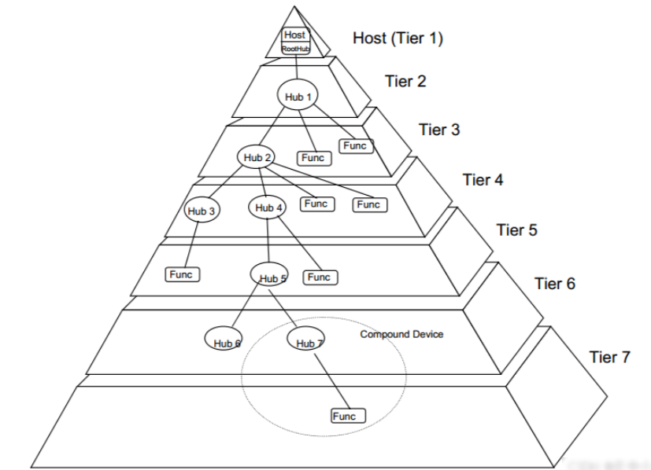

# `USB` 驱动
## `USB` 接口介绍
`Universal Serial Bus (`USB`)` 通用串行总线，按照版本划分为`USB1.x`、`USB2.0`、`USB3.0`、`USB4.0`等系列标准。
### `USB` 电气特性
`USB`是一种支持热插拔的总线接口，使用差分线`DM/DP`进行数据传输。`USB`支持两种供电模式：自供电和总线供电，总线供电就是由`USB`接口为外部电源供电。
#### `Mini USB` 电气属性
- `Mini USB`接口定义了四条线：`D+`、`D-`、`GND`、`ID`，其中`D+`和`D-`为数据线，`GND`为地线，`ID`为`USB`接口的唯一标识符。
#### `Type-C USB` 电气属性
-
### `USB` 拓扑结构
`USB`是主从结构的，也就是分为主机和从机，在一个`USB`系统中，仅有一个USB主机，但是可以有多个从机，最多有127个从机。一个`USB`主控制器支持128个地址，地址0是默认地址，不会分配给任何设备，所以一个`USB`主控制器最多可以支持127个从机，的拓扑结构如下图所示：

- `Root Hub`：`USB`主控制器，连接着所有`USB`设备，负责管理和分配地址。
- `Hub`: `USB`集线器，可以连接多个`USB`设备，实现多设备同时工作。
- `Func`: `USB`功能设备，可以是`USB`外设、打印机、摄像头等。
### `USB OTG`
`USB OTG`（`On-The-Go`）是`USB`的一种电气特性，允许主机和从机之间无缝切换，不需要拔掉线。`USB OTG`的实现方式是通过`USB`接口的`DP`和`DM`信号，通过改变这两个信号的状态来实现切换。`USB OTG`的好处是可以实现无缝切换，节省线材，提高了`USB`的使用效率。
- `Mini USB`通过ID线实现`OTG`功能，`ID`线的状态决定了当前连接的设备是主设备还是从设备。

### `Rockchip USB`接口简介
Rockchip内部集成了三个跟`USB`相关的控制器
- `OTG`控制器
    OTG控制器有两种模式
    - 正常模式
    - 低功耗模式
- `PHY`控制器
    `Port Physical Layer` 端口物理层，一个对OSI模型物理层的共同简称
- `USBH`控制器
    这是一个主机控制器，由`EHCI`和`XHCI`两种协议实现，`EHCI`协议是`USB2.0`的主控制器，`XHCI`协议是`USB3.0`的主控制器。该控制器只能做主机模式