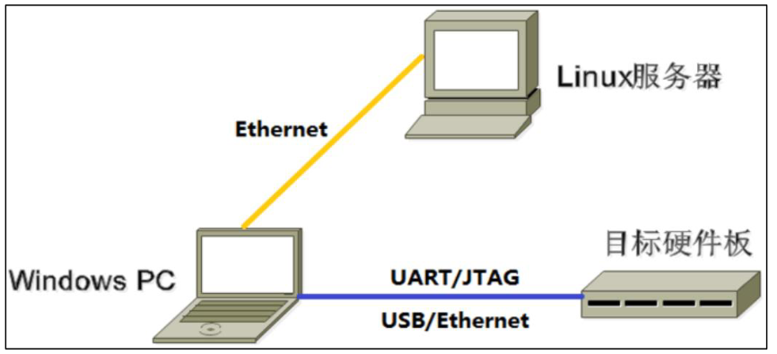
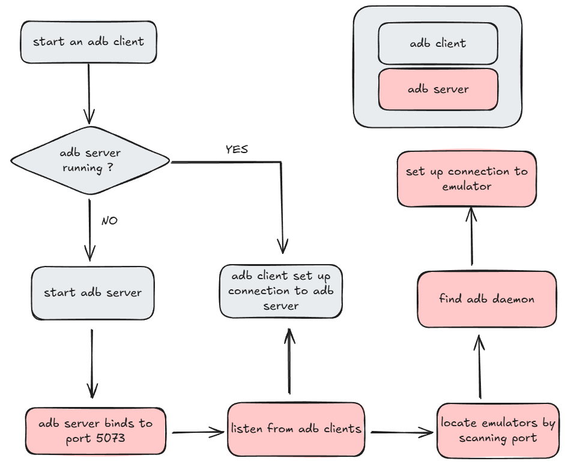

# Linux 系统开发
## 开发环境搭建
一个典型的嵌入式开发环境通常包括Linux 服务器、Windows PC 和目标硬件板

1. Linux 服务器建立交叉编译环境，为软件开发提供代码更新下载、代码交叉编译服务
2. Windows PC 安装远程终端软件，远程登入Linux 服务器进行交叉编译以及代码开发调试
3. Windows PC 通过串口和 USB 与目标硬件板连接，可将编译后生成的镜像文件烧写到目标硬件板，并调试系统或应用程序
### Windows PC上需要安装的东西
* ubuntu 系统搭建，如有公司服务器则跳过
* ubuntu 与 Windows PC文件互传共享
    - ssh
    - nfs
    - ftp
* CH340 串口驱动
* MobaXterm 
* Rockchip USB 驱动
* 镜像烧录工具
* ADB 工具
## 镜像烧录工具使用
Rockchip 平台提供了多种镜像烧写方式
1. Windows下通过RKDevTool（瑞芯微开发工具）工具烧写
2. 通过SD卡方式烧写
3. 通过FactoryTool工具批量烧写（量产烧写工具、支持USB一拖多烧写）
4. Ubuntu系统下通过Linux_Upgrade_Tool工具烧写
### Rockchip 烧写模式
Rockchip 平台烧写模式
|模式|是否支持烧录|描述|
|----|-----------|----|
|**Maskrom**|支持|Flash 在未烧录镜时，芯片会引导进入Maskrom 模式，进行初次镜像烧写，若开发调试过程中无法正常进入Loader 模式，Maskrom 也可以进行烧写|
|**Loader**|支持|Loader 模式下可以进行镜像烧写、更新升级，可以通过烧写工具单独烧写某一个分区镜像文件，方便调试|
|**Recovery**|不支持|系统引导recovery 启动，主要作用是升级、回复出厂设置类操作|
|**Normal Boot**|不支持|系统正常启动后进入的模式，通过引导rootfs启动，加载rootfs，大多是开发都是在这个模式下进行调试的|
### Windows 下RKDevTool工具
1. 单独烧录各个分立镜像
    Linux SDK编译完成后会生成多个镜像文件，其中包括一个分区表parameter.txt;                    
2. 烧录完整update.img固件
3. 擦除操作

使用明细请翻阅《开发工具使用文档_v1.0.pdf》
### Ubuntu 下Linux_Upgrade_Tool工具
## ADB 工具
Android 调试桥，通用的命令行工具，它可以让开发者通过网络或者USB 与 Android 设备通信，开发者可以通过adb 在电脑上对Android 模拟器或者真实的Android 设备进行一系列操作，比如安装、卸载和调试应用（apk），拷贝推送文件（在电脑与Android设备之间拷贝文件），查看设备信息，抓取log等操作。它的主要功能包括：
- 运行设备的shell
- 管理模拟器或设备的端口映射
- 计算机与设备之间的文件上传、下载
- 将本地apk 软件推送到模拟器或者Android 设备
### ADB 工具安装
具体安装步骤查阅 《【正点原子】adb工具使用说明V1.0.pdf》
### ADB 工具使用
这里介绍ADB 的工作原理和常用命令
### ADB 工作原理
Android Debug Bridge 是一种客户端-服务器程序，包括了adb client、adb server 和 adbd 三个部分：
- 客户端
    运行在PC上，用户通过执行adb命令来调用客户端
- 服务器
    运行在PC上，作为客户端的服务端，也作为守护进程的客户端，用于管理客户端和守护进程之间的通信
- 守护进程
    运行在设备上，当Android 系统或者Linux 系统启动时，由init 进程启动adbd，如果adbd进程被终止，则会由init 重启

大概工作原理如下：

1. 在命令行终端执行adb命令时，此时就启动了一个adb client
2. 该客户端会先检查是否有adb server 进程正在运行，
    - 如果没有，它会启动adb server进程
3. adb server启动后，它会与本地TCP端口5037进行绑定，
4. 并监听adb client发出的命令（所有adb client均通过端口5037 与adb server 进行通信）,adb server 会与所有正在运行的设备建立连接。
5. 首先，它通过扫描5555到5585之间（该范围供前16 个模拟器使用）的奇数号端口来查找本地模拟器
6. adb server 一旦发现 adbd 守护进程，便会与该模拟器建立连接
### ADB 常用命令
- 查看帮助信息  
    ```bash
    adb help
    ```
    adb 命令支持多种参数搭配来实现不同的操作
- 查看当前连接的设备
    ```bash
    adb devices
    ``` 
    当我们执行adb命令时，会先启动一个客户端，客户端会检查是否由服务器进程正在进行，如果没有就会输出一下信息
    ```bash
    *deamon not running; starting now tcp:5037
    *deamon started successfully
    ```
    `adb devices`命令用于查询当前连接的设备，并将其显示在`List of devices attached`下方；当前我这里并未连接任何设备，所以显示为空
- 运行Shell
    ```bash
    adb shell
    ```
    执行`adb shell`可以打开运行设备端的shell，执行`exit`可以退出，如果连接多台设备，可以使用`-s`选项去指定设备
    ```bash
    adb device 
    adb -s <deviceid> shell
    ```
- 文件传输
    ```bash
    adb push local remote
    ```
    通过`adb push`可以将本地文件拷贝至设备，local表示本地文件，remote表示远端设备的路径
    ```bash
    adb pull remote local
    ```
    通过`adb push`可以将远端设备的文件拷贝至本地，local表示本地路径，remote表示远端设备的文件
- 应用相关
    ```bash
    adb install path_to_apk
    ```
    执行该命令可以在Android设备上安装软件
- 其他命令
    更多用法可以查看https://developer.android.google.cn/tools/adb?hl=en

 
 
