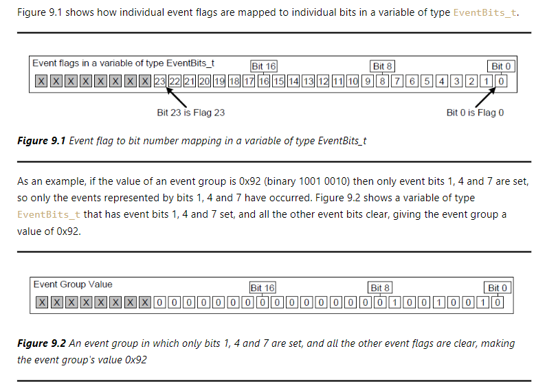
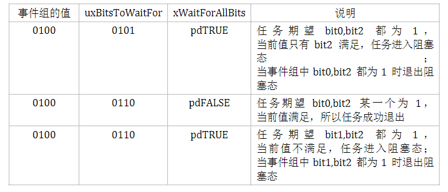

# 事件组
## 简言概述
事件组可以简单地认为是一个整数，每一位对应一个事件，位为1表示对应的事件发生，位为0表示对应的事件未发生。可以由一个任务、多个任务和中断读写该事件组，可以等待其中的某个位或者多个位   
   
## 事件组特性
### 事件组，事件标志和事件位
- 事件标志是一个布尔值，真表示这事件发生，假表示这事件未发生，表示事件的状态
- 事件组由多个事件标志组成
- 事件位表示事件标志的状态，使用`EventBits_t`类型来表示，其实就是一个16位或者32位的整形

如图就是一个事件组事件标志事件位的例子
### 关于`EventBits_t`类型
事件位的个数取决于`configTICK_TYPE_WIDTH_IN_BITS`这个宏，如果该宏的值是`TICK_TYPE_WIDTH_16_BITS`，那么低八位表示事件位，如果该宏的值是`TICK_TYPE_WIDTH_32_BITS`，那么低24位表示事件位，如果该宏的值是`TICK_TYPE_WIDTH_64_BITS`，那么低56位表示事件位
### 一个使用的事件组例子
Free RTOS和TCP/IP栈提供了一个实用的例子，说明如何简化同步，并最大限度的优化资源使用   
一个TCP套接字必须对应很多不同的任务，包括接收事件，绑定事件，读取事件和关闭事件，套接字在任何给定事件的事件取决于事件的状态，例如，如果一个套接字创建了，但是没有绑定地址，他期望去接受一个绑定事件，但是不能接收一个读取事件，因为他没有地址，`FreeRTOS_Socket_t`用来表示套接字的状态，它包含了一个事件组
## 事件组API函数
### 创建事件组
事件组可以静态创建也可以动态创建，静态创建可以使用`xEventGroupCreateStatic()`函数，动态创建可以使用`xEventGroupCreate()`函数
```c
EventGroupHandle_t xEventGroupCreate(void);
EventGroupHandle_t xEventGroupCreateStatic(EventGroupHandle_t xEventGroupBuffer,
                                          StaticEventGroup_t *pxEventGroupBuffer);
```
- `xEventGroupBuffer` 指向一个空的事件组内存空间
- `pxEventGroupBuffer` 指向一个静态事件组内存空间
- 返回值：
    - 如果创建成功，则返回一个有效的事件组句柄
    - 如果创建失败，则返回`NULL`
### 事件组设置位
使用`xEventGroupSetBits()`和`xEventGroupSetBitsFromISR()`函数可以设置事件组的某一位，通常表示某个事件已经发生
```c
EventBits_t xEventGroupSetBits(EventGroupHandle_t xEventGroup, EventBits_t uBitsToSet);
EventBits_t xEventGroupSetBitsFromISR(EventGroupHandle_t xEventGroup, 
                                        EventBits_t uBitsToSet, 
                                        BaseType_t *pxHigherPriorityTaskWoken);
```
- `xEventGroup` 事件组句柄
- `uBitsToSet` 要设置的事件位
- `pxHigherPriorityTaskWoken` 用于通知调用者是否有更高优先级的任务被唤醒，如果有，则该参数为`pdTRUE`，否则为`pdFALSE`
- 返回值：
    - 如果设置成功，则返回设置后的事件位
    - 如果设置失败，则返回`0`

这里需要注意，在中断服务程序中，不能直接使用`xEventGroupSetBitsFromISR()`函数，因为该函数可能会给多个任务唤醒，这就会带来很大的不确定行，所以这个函数是给Free RTOS后台任务发送队列数据，由后台任务来设置事件组
### 事件组等待位
使用`xEventGroupWaitBits()`和`xEventGroupWaitBitsFromISR()`函数允许任务在阻塞的状态下等待一个或者多个事件位发生
```c
EventBits_t xEventGroupWaitBits(EventGroupHandle_t xEventGroup, 
                                EventBits_t uBitsToWaitFor, 
                                BaseType_t xClearOnExit, 
                                BaseType_t xWaitForAllBits, 
                                TickType_t xTicksToWait);
EventBits_t xEventGroupWaitBitsFromISR(EventGroupHandle_t xEventGroup, 
                                        EventBits_t uBitsToWaitFor, 
                                        BaseType_t xClearOnExit, 
                                        BaseType_t xWaitForAllBits, 
                                        BaseType_t *pxHigherPriorityTaskWoken, 
                                        TickType_t xTicksToWait);
```
- `xEventGroup` 事件组句柄
- `uBitsToWaitFor` 等待的事件位
- `xClearOnExit` 如果设置为`pdTRUE`，则在任务退出时清除事件位
- `xWaitForAllBits` 如果设置为`pdTRUE`，则等待所有事件位都发生
- `pxHigherPriorityTaskWoken` 用于通知调用者是否有更高优先级的任务被唤醒，如果有，则该参数为`pdTRUE`，否则为`pdFALSE`
- `xTicksToWait` 等待的超时时间，如果为`portMAX_DELAY`，则表示永远等待
- 返回值：
    - 如果等待成功，则返回等待的事件位
    - 如果等待超时，则返回`0`

如上就是一个等待事件组位的例子
### 事件组获取静态缓冲区
`xEventGroupGetStaticBuffer()`函数可以获取静态事件组的缓冲区，他与创建事件组的缓冲区一样
```c
BaseType_t xEventGroupGetStaticBuffer(EventGroupHandle_t xEventGroup, 
                                        StaticEventGroup_t **ppxEventGroupBuffer);
```
- `xEventGroup` 事件组句柄
- `ppxEventGroupBuffer` 指向静态事件组缓冲区的指针
- 返回值：
    - 如果获取成功，则返回`pdPASS`
    - 如果获取失败，则返回`pdFAIL`
### 事件组使用示例代码
```c
#define mainINTERRUPT_NUMBER        3
#define mainFIRST_TASK_BIT          (1UL << 0UL)
#define mainSECOND_TASK_BIT         (1UL << 1UL)
#define mainISR_BIT                 (1UL << 2UL)

xEventGroupHandle_t xEventGroup;

static void vEventBitSettingTask(void *pvParameters)
{
    const TickType_t xDelay200ms = pdmsToTicks(200), xDontBlock = 0;
    for(;;)
    {
        vTaskDelay(xDelay200ms);
        vPrintString("Bit setting task -\t about to set bit 0.\r\n");
        xEventGroupSetBits(xEventGroup, mainFIRST_TASK_BIT);

        vTaskDelay(xDelay200ms);
        vPrintString( "Bit setting task -\t about to set bit 1.\r\n" );
        vEventGroupSetBits(xEventGroup, mainSECOND_TASK_BIT);
    }
}

static uint32_t ulEventBitSettingISR(void)
{
    static const char *pcString = "Bit setting ISR -\t about to set bit 2.\r\n";
    BaseType_t  xHigherPriorityTaskWoken = pdFALSE;
    xTimerPendFunctionCallFromISR(vPrintStringFromDaemonTask, (void*)pcString, 0, &xHigherPriorityTaskWoken);
    xEventGroupSetBitsFromISR(xEventGroup, mainISR_BIT, &xHigherPriorityTaskWoken);
    portYIELD_FROM_ISR(xHigherPriorityTaskWoken);
}

static void vEventBitReadingTask(void *pvParameters)
{
    EventBits_t xEventGroupValue;
    const EventBits_t xBitsToWaitFor = mainFIRST_TASK_BIT | mainSECOND_TASK_BIT | mainISR_BIT;
    for(;;)
    {
        xEventGroupValue = xEventGroupWaitBits(xEventGroup, xBitsToWaitFor, pdFALSE, pdTRUE, portMAX_DELAY);

        if((xEventGroupValue & mainFIRST_TASK_BIT) != 0)
        {
            vPrintString( "Bit reading task -\t Event bit 0 was set\r\n" );
        }
        if((xEventGroupValue & mainSECOND_TASK_BIT)!= 0)
        {
            vPrintString( "Bit reading task -\t Event bit 1 was set\r\n" );
        }
        if((xEventGroupValue & mainISR_BIT)      != 0)
        {
            vPrintString( "Bit reading task -\t Event bit 2 was set\r\n" );
        }
    }
}

int main(void)
{
    xEventGroup = xEventGroupCreate();
    xTaskCreate(vEventBitSettingTask, "Bit Setter", 1000, NULL, 1, NULL);
    xTaskCreate(vEventBitReadingTask, "Bit Waiter", 1000, NULL, 2, NULL);
    xTaskCreate(vInterruptGenerator, "Int Gen", 1000, NULL, 3, NULL);
    vPortSetInterruptHandler(mainINTERRUPT_NUMBER, ulEventBitSettingISR);
    for(;;);
    return 0;
}
```
## 使用事件组同步任务
有时，应用的设置需要多个任务同步，只有等到所有任务都完成了，才可以进行下一步，使用`xEventGroupSync()`可以同步多个任务
```c
EventBits_t xEventGroupSync( EventGroupHandle_t xEventGroup, 
                            const EventBits_t uxBitsToSet, 
                            const EventBits_t uxBitsToWaitFor, 
                            TickType_t xTicksToWait );
```
- `xEventGroup` 事件组句柄
- `uxBitsToSet` 要设置的事件位
- `uxBitsToWaitFor` 等待的事件位
- `xTicksToWait` 等待的超时时间，如果为`portMAX_DELAY`，则表示永远等待
- 返回值：
    - 如果同步成功，则返回设置后的事件位
    - 如果同步超时，则返回`0`
### 事件组任务同步示例代码
```c
#define mainINTERRUPT_NUMBER        3
#define mainFIRST_TASK_BIT          (1UL << 0UL)
#define mainSECOND_TASK_BIT         (1UL << 1UL)
#define mainTHIRD_TASK_BIT          (1UL << 2UL)

static void vSyncingTask(void *pvParameters)
{
    const TickType_t xMaxDelay = pdMS_TO_TICKS(4000UL);
    const TickType_t xMinDelay = pdMS_TO_TICKS(200UL);
    TickType_t xDelayTime;
    EventBits_t uxThisTasksSyncBit = (EventBits_t)pvParameters;
    const EventBits_t uxAllSyncBits = mainFIRST_TASK_BIT | mainSECOND_TASK_BIT | mainTHIRD_TASK_BIT;

    for(;;)
    {
        xDelayTime = (rand() % xMaxDelay) + xMinDelay;
        vPrintTwoStrings(pcTaskGetTaskName(NULL), "reached sync point\r\n");
        xEventGroupSync(xEventGroup, uxThisTasksSyncBit, uxAllSyncBits, xDelayTime);
        vPrintTwoStrings( pcTaskGetTaskName( NULL ), "exited sync point" );
    }
}

int main(void)
{
    xEventGroup = xEventGroupCreate();
    xTaskCreate(vSyncingTask, "Task1", 1000, mainFIRST_TASK_BIT, 1, NULL);
    xTaskCreate(vSyncingTask, "Task2", 1000, mainSECOND_TASK_BIT, 2, NULL);
    xTaskCreate(vSyncingTask, "Task3", 1000, mainTHIRD_TASK_BIT, 3, NULL);
    vTaskStartScheduler();
    for(;;);
    return 0;
}
```