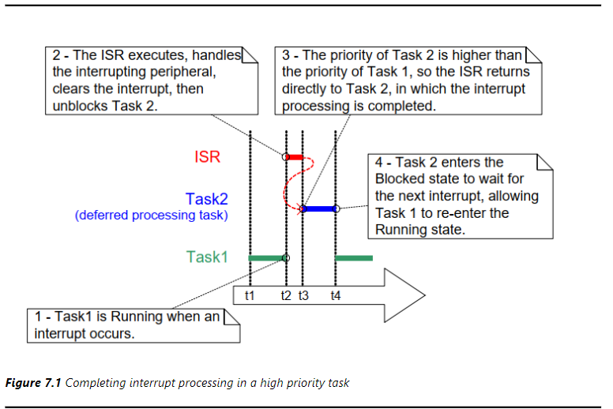
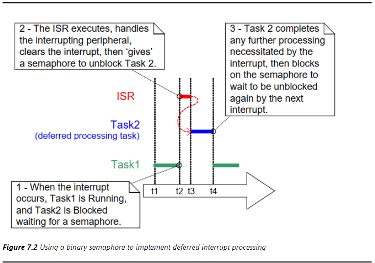
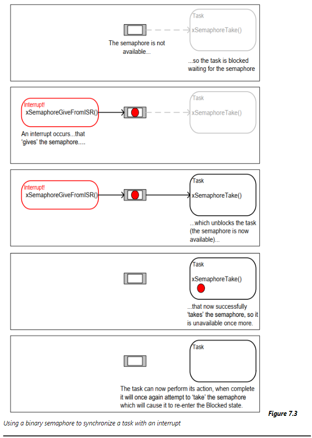
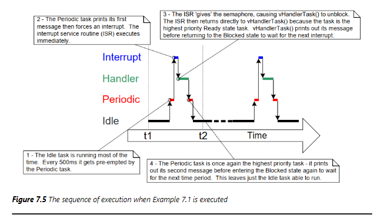
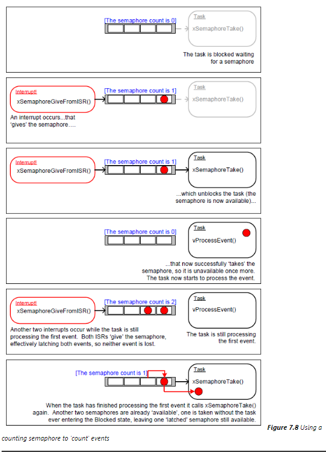
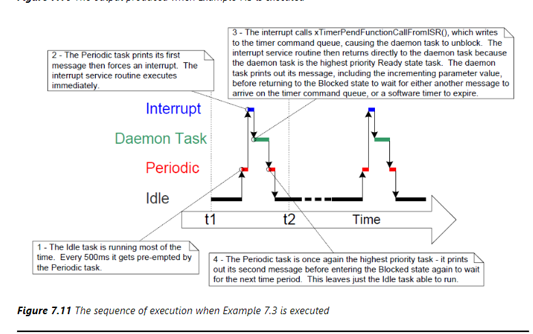
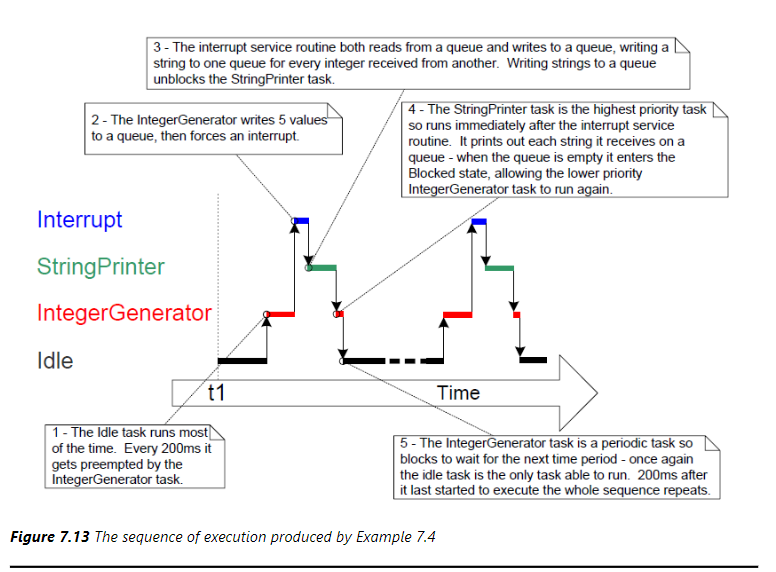

# 中断管理
在RTOS中，需要应对很多事件，事件大多时候是通过硬件中断产生的，当中断触发时候，CPU跳到固定地址去执行代码，保存现场，分辨中断、调用处理函数，恢复现场，中断处理是在内核调用的，所以这个时候用户任务是无法执行的，即中断处理必须快，否则实时性无法保证，系统会显得很卡顿，怎么管理和实现中断是什么重要的
## 两套API函数
在任务函数中和在中断处理中分别使用两套不一样的API
### 为什么需要两套API函数
有很多API函数会导致任务进入阻塞态，但是中断处理不是任务，不能进入阻塞态，所以在中断处理中不能调用这些API函数，只能使用中断安全的函数，这些函数一般都带有`FromISR`后缀，比如`vTaskDelayFromISR`、`xQueueReceiveFromISR`等等，这些函数的作用是从中断处理函数中调用，并且不会导致任务切换，所以在中断处理函数中调用这些函数不会导致任务切换，所以在中断处理函数中使用这些函数可以保证实时性。    
**两套函数的好处**
- 使用两套函数不需要增加额外的代码判断分支，使得函数更加冗长，繁杂
- 在任务中调用需要指定超时事件，表示如果不成功就阻塞一会
- 在中断处理中调用，无论成不成功都会返回

### 两套API函数列表
|任务中|中断处理中|
|----|----|
|`xQueueSendToBack `|`xQueueSendToBackFromISR `|
|`xQueueSendToFront `|`xQueueSendToFrontFromISR `|
|`xQueueReceive `|`xQueueReceiveFromISR `|
|`xQueuePeek `|`xQueuePeekFromISR `|
|`xQueueOverwrite `|`xQueueOverwriteFromISR `|
|`xSemaphoreGive `|`xSemaphoreGiveFromISR `|
|`xSemaphoreTake `|`xSemaphoreTakeFromISR `|
|`xEventGroupSetBits `|`xEventGroupSetBitsFromISR `|
|`xEventGroupGetBits `|`xEventGroupGetBitsFromISR `|
|`xTaskNotifyGive `|`xTaskNotifyGiveFromISR `|
|`xTaskNotify `|`xTaskNotifyFromISR `|
|`xTimerStart `|`xTimerStartFromISR `|
|`xTimerStop `|`xTimerStopFromISR `|
|`xTimerReset `|`xTimerResetFromISR `|
|`xTimerChangePeriod `|`xTimerChangePeriodFromISR `|

### `xHigherPriorityTaskWoken`参数
在中断处理中，是否有更高优先级的任务被唤醒了，如果为真，那么就意味着后面要进行任务切换，在中断处理中，`*FromISR`函数可能会被多次调用，为了效率，一般在中断处理的最后通过判断`xHigherPriorityTaskWoken`是否为真来决定是否进行任务切换。这样做会有一下的好处：
- 避免不必要的上下文切换
- 控制执行顺序
- 可移植性
- 更加效率
- 可以在守护任务执行
### 怎么切换任务
在任务中，切换上下文使用`taskYIELD()`函数，在中断中可以使用一下这两个函数
```c
portEND_SWITCHING_ISR( xHigherPriorityTaskWoken );
portYIELD_FROM_ISR( xHigherPriorityTaskWoken );
```
这两个函数的作用是切换任务，区别在于`portEND_SWITCHING_ISR`不会切换到下一个任务，而是让出CPU，让其他任务有机会执行，`portYIELD_FROM_ISR`会切换到下一个任务，如果没有其他任务就让出CPU，让自己有机会执行。一般在中断处理的最后调用这两个函数，来决定是否切换任务。
```c
void xxx_ISR(void)
{
    int i;
    BaseType_t xHigherPriorityTaskWoken = pdFALSE;
    for(i=0;i<1000000;i++)
    {
            xQueueSendToBackFromISR(queue, &i, &xHigherPriorityTaskWoken);
    }
    portYIELD_FROM_ISR( xHigherPriorityTaskWoken );
}
```
## 中断的延迟处理
一个中断服务向量必须记录中断原因，然后清除中断，以它处理可以以一个任务的形式体现，这样就可以使中断快速退出，这里引出一个中断延时处理的概念，处理流程如下     

- 在t1时刻，任务1运行，任务2阻塞
- 在t2时刻，任务1被中断，进入中断处理函数，中断处理一些操作之后，唤醒任务2
- 在t3时刻，任务2运行，任务1阻塞。任务2完成的是中断的处理，称之为中断延迟处理任务
- 在t4时刻，任务2处理完中断后等待下一次中断发生，任务1冲i性能运行

## 二值信号量同步
在中断中使用二值信号量进行同步，比其他同步方式更加有效

#### 示例代码
```c
#define mainINTERRUPT_NUMBER 3
static void vPeriodicTask(void *pvParameters)
{
    const TickType_t xDelay500ms = pdMS_TO_TICKS(500);
    for(;;) 
    {
        vTaskDelay(xDelay500ms);
        vPrintString("PeriodicTask: About to generate an interrupt event\r\n");
        vPortGenerateSimulatedInterrupt(mainINTERRUPT_NUMBER);
        vPrintString("PeriodicTask: Interrupt event generated\r\n");
    }

}

static void vHandlerTask(void *pvParameters) 
{
    for(;;) 
    {
        if(xSemaphoreTake(xBinarySemaphore, portMAX_DELAY) == pdPASS)
        {
            // handle the task event
        }
        vPrintString("HandlerTask: Processing event\r\n");
    }
}

static uint32_t ulExampleInterruptHandler(void) 
{
    BaseType_t xHigherPriorityTaskWoken = pdFALSE;

    xSemaphoreGiveFromISR(xBinarySemaphore, &xHigherPriorityTaskWoken);
    portYIELD_FROM_ISR(xHigherPriorityTaskWoken);
}

int main(void) 
{
    xBinarySemaphore = xSemaphoreCreateBinary();

    if(xBinarySemaphore != NULL) 
    {
        xTaskCreate(vHandlerTask, "HandlerTask", 1000, NULL, 3, NULL);
        xTaskCreate(vPeriodicTask, "Periodic", 1000, NULL, 1, NULL);
        vPortSetInterruptHandler(mainINTERRUPT_NUMBER, ulExampleInterruptHandler);
        vTaskStartScheduler();
    }
    for(;;);
}
```

   
这里我认为结果应该是先打印`PeriodicTask: About to generate an interrupt event`,然后打印`HandlerTask: Processing event\r\n`，最后打印`HandlerTask: Processing event\r\n`，但是不知道为什么，文档的结果反了
## 计数信号量
计数信号量主要用于计算事件和资源管理   
     
这个例子的代码主要是在中断中多次释放了信号量   
## 将延迟工作推到守护任务中去
不同的中断由不同的时间限制，所以将延迟工作推到守护任务中去，这样就可以避免每一个中断都需要建立一个专门的延时任务去处理，节省资源，可以调用`xTimerPendFunctionCallFromIST()`函数
```c
BaseType_t xTimerPendFunctionCallFromISR(PendedFunction_t xFunctionToCall, void *pvParameter1, uint32_t ulParameter2, BaseType_t xYield)
```
- `xFunctionToCall`：延迟调用的函数
- `pvParameter1`：函数参数1
- `ulParameter2`：函数参数2
- `xYield`：是否切换到其他任务
- 返回值：`pdPASS`表示成功，`pdFAIL`表示失败

#### 示例代码
这里的示例与上面两个示例相近
```c
static uint32_t ulExampleInterruptHandler(void) 
{ 
    static uint32_t ulParameterValue = 0;
    BaseType_t xHigherPriorityTaskWoken = pdFALSE;

    xTimerPendFunctionCallFromISR(vDeferredHandlingFunction, NULL, ulParameterValue++, &xHigherPriorityTaskWoken);
    portYIELD_FROM_ISR(xHigherPriorityTaskWoken);
}

static void vDeferredHandlingFunction(void *pvParameter) 
{
    vPrintString("HandlerTask: Processing event\r\n");
}

int main(void)
{
    const UBaseType_t ulPeriodicTaskPriority = configTIMER_TASK_PRIORITY - 1;
    xTaskCreate(vPeriodicTask, "Periodic", 1000, NULL, ulPeriodicTaskPriority, NULL);
    vPortSetInterruptHandler(mainINTERRUPT_NUMBER, ulExampleInterruptHandler);
    vTaskStartScheduler();
    for(;;);
}
```

## 在中断服务中使用队列
二值信号量和计数信号量用于事件同步，队列可以用于事件同步同时也可以传递数据，`xQueueSendFromISR()`函数可以用于在中断服务中发送数据到队列，`xQueueReceiveFromISR()`函数可以用于在中断服务中接收数据队列。
#### 示例代码
创建一个周期任务，每200ms发送5个数字，发送后产生一个软件中断，创建一个接收任务，接收并打印
```c
static void vIntergerGenerator(void* pvParameters)
{
    TickType_t xLastExecutionTime = xTaskGetTickCount();
    uint32_t ulValueToSend = 0;
    int i 
    for(;;)
    {
        xQueueSendToBack(xIntegerQueue, &ulValueToSend, 0);
        ulValueToSend++;
    }
    vPrintString("Generator task: About to generate an interrupt\r\n");
    vPortGenerateSimulatedInterrupt(mainINTERRUPT_NUMBER);
    vPrintString("Generator task: Interrupt generated\r\n");
}
static uint32_t ulExampleInterruptHandler(void) 
{
    BaseType_t xHigherPriorityTaskWoken = pdFALSE;
    uint32_t ulReceivedNumber;

    static const char *pcStrings[] = {
        "String 0\r\n", 
        "String 1\r\n", 
        "String 2\r\n", 
        "String 3\r\n"
    };

    while(xQueueReceiveFromISR(xIntegerQueue, &ulReceivedNumber, &xHigherPriorityTaskWoken) != errQUEUE_EMPTY)
    {
        ulReceivedNumber &= 0x03;
        xQueueSendToBackFromISR(xStringQueue, &pcStrings[ulReceivedNumber], &xHigherPriorityTaskWoken);
    }
    portYIELD_FROM_ISR(xHigherPriorityTaskWoken);
}

static void vStringPrinter(void* pvParameters)
{
    char *pcString;
    for(;;)
    {
        xQueueReceive(xStringQueue, &pcString, portMAX_DELAY);
        vPrintString(pcString);
    }
}

int main(void)
{
    xIntegerQueue = xQueueCreate(5, sizeof(uint32_t));
    xStringQueue = xQueueCreate(5, sizeof(char*));

    xTaskCreate(vIntergerGenerator, "IntGen", 1000, NULL, 1, NULL);
    xTaskCreate(vStringPrinter, "StrPrn", 1000, NULL, 2, NULL);
    vPortSetInterruptHandler(mainINTERRUPT_NUMBER, ulExampleInterruptHandler);
    vTaskStartScheduler();
    for(;;);

}
```
