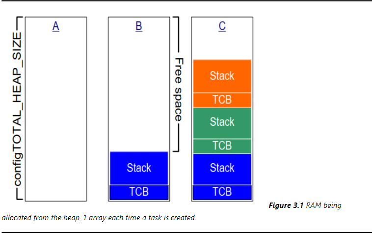
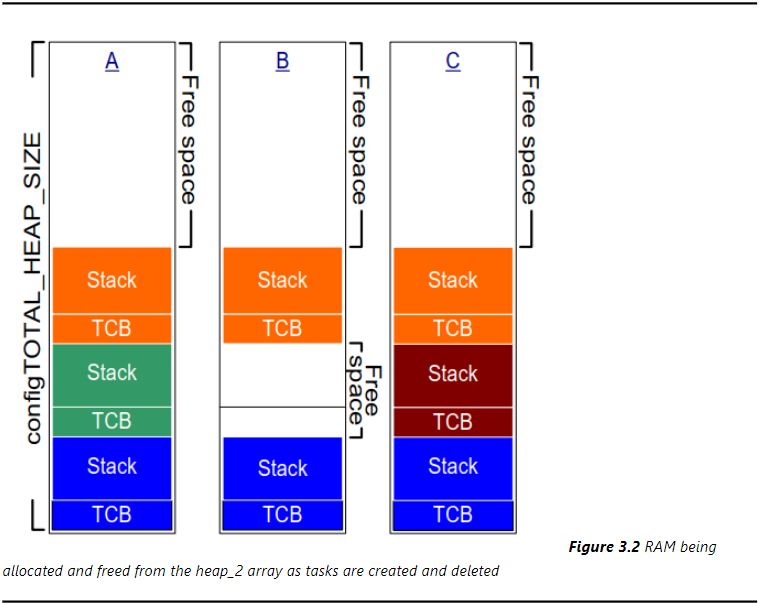
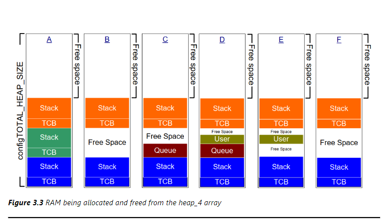

# 内存管理
## 杂谈
在C库中的内存内存管理函数不适用于资源紧缺的嵌入式系统容易出现内存碎片的问题。因此，嵌入式系统需要自己实现内存管理机制。这里再次强调一下堆栈的概念
- 堆，`heap`,就是一块空闲的空间，需要提供管理函数
    - `malloc`，从堆中划出一块空间给程序使用
    - `free`，归还一块空间给堆
- 栈，`stack`，是一块内存区域，用来保存函数调用的上下文信息，需要提供管理函数
    - `alloca`，在栈上分配一块空间给程序使用
    - `free`，不用管栈上的空间，因为栈在函数调用结束后会自动释放
## FreeRTOS的内存管理机制
在FreeRTOS中，提供了五个文件对应五种内存管理的方法
|文件|优点|缺点| 
|---|---|---|
|`heap_1.c`|分配简单，时间确定|只分配、不回收|
|`heap_2.c`|动态分配、最佳分配|碎片、时间不定|
|`heap_3.c`|调用标准库函数|速度慢、时间不定|
|`heap_4.c`|相邻空间内存可合并|可解决碎片问题、时间不定|
|`heap_5.c`|在4的基础上支持分隔的内存块|解决碎片问题、时间不定|
### heap_1
他只是实现了`pvPortMalloc`，没有实现`vPortFree`。因此，分配空间时，只分配，不回收。流程如下

1. 创建任务之前整个内存都是空闲的
2. 创建一个任务之后，蓝色区域被分配出去
3. 创建3个任务之后的数组使用情况
### heap_2
heap_2已经被heap_4取代，之所以保留着是为了兼容以前的代码，与heap_1不同的是，它支持`vPortFree`函数，可以回收空间，采用最佳匹配算法来分配内存，但是不会合并相邻的内存，以至于出现严重的碎片问题。流程如下

1. 创建了3个任务
2. 删除一个任务，空闲的内存有3部分：顶层的、被删除任务的TCB空间、和被删除任务的栈空间
3. 创建一个新的任务，分配的内存是最佳匹配算法分配的，不会出现碎片问题
### heap_3
heap_3使用了标准库函数`malloc`和`free`，但是速度慢，而且时间不定，但是实现了线程安全
### heap_4
heap_4和heap_1、heap_2一样，也是用大数组来分配内存，但是它支持合并相邻的内存，使用首次适应算法来分配内存，可以解决碎片问题，但是时间不定。流程如下

1. 创建了3个任务
2. 删除一个任务，空闲的内存有2部分：顶层的、被删除任务的TCB空间和被删除任务的栈空间合成的空间
3. 分配了一个队列，从第一块空闲内存开始分配
4. 分配了一个用户数据，从队列空间之后的空闲内存块分配
5. 释放队列空间，用户数据前后都有空闲内存块
6. 释放用户数据，合成一个大的空闲块
### heap_5
和heap_4采用一样的算法，但不像heap_4局限于管理一块大数组，而是支持分隔的内存块，在嵌入式系统中，内存的地址可能不连续，就会使用heap_5，但是在分配内存之前，必须使用`vPortDefineHeapRegions()`来指定这些信息，这样一来，就不能动态分配内存了
## 堆相关的实体函数和原型
- 申请和释放内存函数
    ```c
    void *pvPortMalloc( size_t xWantedSize );
    void vPortFree( void *pv );
    ```
- 获取空闲内存函数
    ```c
    size_t xPortGetFreeHeapSize( void );
    size_t xPortGetMinimumEverFreeHeapSize( void );
    ```
- 申请失败钩子函数
    ```c
    void vPortAllocationErrorHook( void );
    ```
## CMSIS-RTOS V2封装
- 申请和释放内存函数
    ```c
    void osMemoryPoolAlloc( osMemoryPoolId_t id, void **block );
    void osMemoryPoolFree( osMemoryPoolId_t id, void *block );
    ```
- 获取空闲内存函数
    ```c
    uint32_t osMemoryPoolGetCapacity( osMemoryPoolId_t id );
    uint32_t osMemoryPoolGetBlockSize( osMemoryPoolId_t id );
    uint32_t osMemoryPoolGetCount( osMemoryPoolId_t id );
    uint32_t osMemoryPoolGetSpace( osMemoryPoolId_t id );
    ```
