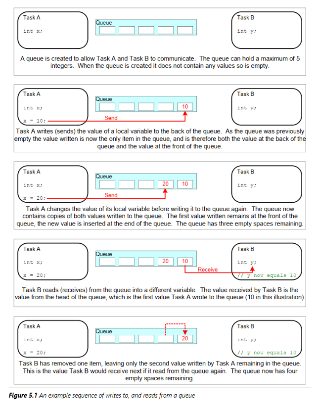
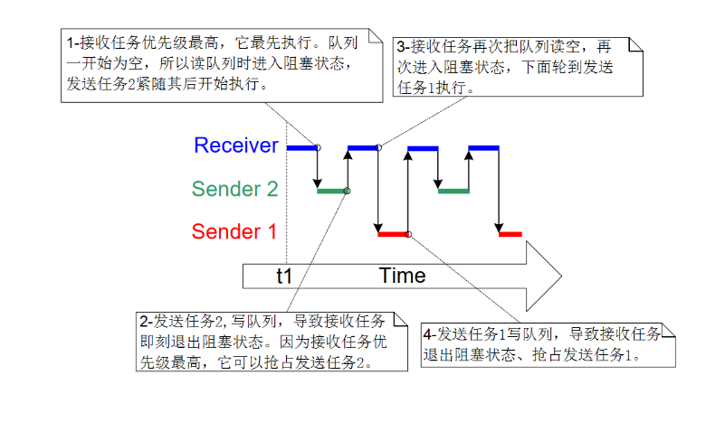
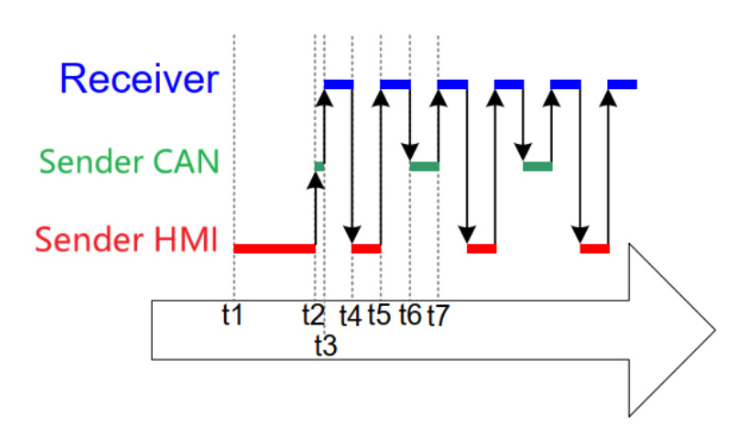

# 队列管理
队列可以用于任务到任务，任务到中断，中断到任务直接传输消息
## 队列特性
### 常规操作
              
队列操作采用先进先出，写数据放到队尾，读数据从队首开始，对于不同对象，队列的队首队尾时相对的
### 传输数据
在RTOS中，队列传输数据采用拷贝的方式
- 局部变量的值可以传入队列，当函数结束局部变量被回收，不会影响队列中的数据
- 不用再分配空间，队列中有空间
- 局部变量可以使用队列里面的值
- 接收任务不需要知道这数据来源，发送任务也不需要知道数据去向
### 队列的阻塞访问
只要知道队列的句柄，谁都可以对队列进行读写等操作，如果读写队列不成功，那么任务就会阻塞，直到阻塞超时，如果读写成功，任务就会进入就绪态，对于多任务操作队列，都是优先级高的任务先操作队列，如果优先级相同，那么等待时间久的任务操作队列
## 队列函数
### 创建队列
队列的创建有两种方式：
- 静态创建：在编译时就已经确定队列的大小，分配空间，创建队列
```c
QueueHandle_t xQueueCreateStatic( uint32_t uxQueueLength, uint32_t uxItemSize, uint8_t *pucQueueStorageArea, StaticQueue_t *pxStaticQueue )
```
= uxQueueLength：队列的长度
- uxItemSize：队列中每个元素的大小
- pucQueueStorageArea：队列的存储空间
- pxStaticQueue：静态队列的结构体

返回值：队列的句柄，NULL为失败

- 动态创建：在运行时创建队列，分配空间，创建队列
```c
QueueHandle_t xQueueCreate( uint32_t uxQueueLength, uint32_t uxItemSize )
```
- uxQueueLength：队列的长度
- uxItemSize：队列中每个元素的大小

返回值：队列的句柄，NULL为失败
#### 样例代码
```c
#define QUEUE_LENGTH 10
#define ITEM_SIZE sizeof(uint32_t)

uint8_t ucQueueStorage[QUEUE_LENGTH * ITEM_SIZE];

void vTask1(void *pvParameters)
{
    QueueHandle_t xQueue;
    xQueue = xQueueCreateStatic(QUEUE_LENGTH, ITEM_SIZE, ucQueueStorage, &xStaticQueue);
}
```
### 复位队列
队列在被使用的时候可以使用`xQueueReset()`函数复位，复位后队列为空，队列的句柄仍然有效，可以继续使用
```c
BaseType_t xQueueReset( QueueHandle_t xQueue );
```
- xQueue：队列的句柄

返回值：pdPASS为成功，pdFAIL为失败
### 删除队列
只能删除使用动态方法创建的队列
```c
void vQueueDelete( QueueHandle_t xQueue );
```
### 写入队列
数据写入可以写到队列头部也可以写到队列尾部
```c
/**
 * 往队列尾部写入数据，如果队列满，阻塞时间为xTicksToWait
 */
BaseType_t xQueueSend( QueueHandle_t xQueue, const void *pvItemToQueue, TickType_t xTicksToWait );
/**
 * 往队列头部写入数据，如果队列满，阻塞时间为xTicksToWait
 */
BaseType_t xQueueSendToBack( QueueHandle_t xQueue, const void *pvItemToQueue, TickType_t xTicksToWait );
/**
 * 往队列头部写入数据，如果队列满，阻塞时间为xTicksToWait
 */
BaseType_t xQueueSendToFront( QueueHandle_t xQueue, const void *pvItemToQueue, TickType_t xTicksToWait );
/**
 * 往队列尾部写入数据，此函数可以在中断函数中使用，不可阻塞
 */
BaseType_t xQueueSendToBackFromISR( QueueHandle_t xQueue, const void *pvItemToQueue, BaseType_t *pxHigherPriorityTaskWoken );
/**
 * 往队列头部写入数据，此函数可以在中断函数中使用，不可阻塞
 */
BaseType_t xQueueSendToFrontFromISR( QueueHandle_t xQueue, const void *pvItemToQueue, BaseType_t *pxHigherPriorityTaskWoken );
```
- xQueue：队列的句柄
- pvItemToQueue：要写入的数据
- xTicksToWait：等待时间，如果队列满，等待时间内没有空余位置，则返回失败

返回值：pdPASS为成功，pdFAIL为失败

### 读取队列
读取队列的数据后，队列中该数据会被移除
```c
/**
 * 从队列头部读取数据，如果队列为空，阻塞时间为xTicksToWait
 */
BaseType_t xQueueReceive( QueueHandle_t xQueue, void *pvBuffer, TickType_t xTicksToWait );
/**
 * 从队列尾部读取数据，此函数可以在中断函数中使用，不可阻塞
 */
BaseType_t xQueueReceiveFromISR( QueueHandle_t xQueue, void *pvBuffer, BaseType_t *pxHigherPriorityTaskWoken );
```
- xQueue：队列的句柄
- pvBuffer：读取到的数据
- xTicksToWait：等待时间，如果队列为空，等待时间内没有数据，则返回失败

返回值：pdPASS为成功，pdFAIL为失败


### 队列状态查询
查询队列有多少个数据、有多少空余空间
```c
/**
 * 查询队列中有多少个数据
 */
UBaseType_t uxQueueMessagesWaiting( QueueHandle_t xQueue );
/**
 * 查询队列中有多少空余空间
 */
UBaseType_t uxQueueSpacesAvailable( QueueHandle_t xQueue );
```
- xQueue：队列的句柄

返回值：队列中有多少个数据、有多少空余空间
### 队列覆盖
当队列长度为1的时候，可以使用`xQueueOverwrite()`或者`xQueueOverwriteFromISR()`函数，覆盖队列中的数据，这个函数只能用于在队列长度为1的情况下，如果队列是满的，就会覆盖队列里的数据
```c
BaseType_t xQueueOverwrite( QueueHandle_t xQueue, const void *pvItemToQueue );
BaseType_t xQueueOverwriteFromISR( QueueHandle_t xQueue, const void *pvItemToQueue, BaseType_t *pxHigherPriorityTaskWoken );
```
- xQueue：队列的句柄
- pvItemToQueue：要写入的数据
- pxHigherPriorityTaskWoken：如果队列满，且有任务在等待，则该参数为pdTRUE，表示有任务需要运行，该任务需要重新调度

返回值：pdPASS为成功，pdFAIL为失败
### 队列偷窥
如果想让队列中的数据共享给其他任务，可以使用`xQueuePeek()`或`xQueuePeekFromISR()`函数，这个函数可以查看队列中的数据，但是不能修改数据，如果队列为空，那么函数会阻塞，一旦有数据，函数就会返回数据
```c
BaseType_t xQueuePeek( QueueHandle_t xQueue, void *pvBuffer, TickType_t xTicksToWait );
BaseType_t xQueuePeekFromISR( QueueHandle_t xQueue, void *pvBuffer, BaseType_t *pxHigherPriorityTaskWoken );
```
- xQueue：队列的句柄
- pvBuffer：读取到的数据
- xTicksToWait：等待时间，如果队列为空，等待时间内没有数据，则返回失败

返回值：pdPASS为成功，pdFAIL为失败
## 队列基本使用  
这里的示例回创建一个队列，然后创建2个发送任务和一个接受任务，发送任务的优先级为1，接受任务的优先级为2，发送任务分别发送数据队列中，接受任务接收数据队列中并打印。
```c
QueueHandle_t xQueue;

static void vSenderTask(void *pvParameters)
{
    int32_t lValueToSend;
    BaseType_t xStatus;
    lValueToSend = (int32_t)pvParameters;
    for(;;)
    {
        xStatus = xQueueSendToBack(xQueue, &lValueToSend, 0);
        if(xStatus != pdPASS)
        {
            printf("Sender %d queue full\r\n", (int)pvParameters);
        }
    }
}

static void vReceiverTask(void *pvParameters)
{
    uint32_t lReceivedValue;
    BaseType_t xStatus;
    const TickType_t xTicksToWait  = pdMS_TO_TICKS(100UL);
    for(;;)
    {
        if(xQueueReceive(xQueue, &lReceivedValue, xTicksToWait) == pdPASS)
        {
            printf("Receiver received %d\r\n", ulReceivedValue);
        }
        else
        {
            printf("Receiver queue empty\r\n");
        }
    }
}
int main()
{
    prvSetupHardware();
    xQueue = xQueueCreate(10, sizeof(uint32_t));
    if(xQueue != NULL)
    {
        xTaskCreate(vSenderTask, "Sender1", 1024, (void*)100, 1, NULL);
        xTaskCreate(vSenderTask, "Sender2", 1024, (void*)100, 1, NULL);
        xTaskCreate(vReceiverTask, "Receiver", 1024, NULL, 2, NULL);
        vTaskStartScheduler();
    }
    else
    {
    }
    return 0;
}
```
    
## 分辨队列数据源
当有多个发送任务通过一个队列发送数据，接收任务需要知道数据来源，可以说使用数据内嵌标识符，构造一个结构体，在里面加入标识字段
```c
typedef struct
{
    ID_t DataID;
    int32_t lDataValue;
} Data_t;
```
不同的发送任务，构造好结构体，写入队列，接受任务读出数据就可以根据标识字段判断数据来源，下面示例会创建一个队列，2个发送任务，1个接受任务，发送任务发送不同的数据，接收任务接收数据并打印
#### 样例代码
```c
typedef enum
{
    eMotorSpeed,
    eSpeedSetPoint,
}ID_t;

typedef struct
{
    ID_t DataID;
    int32_t lDataValue;
} Data_t;

static const Data_t xStructsToSend[] =
{
    {eMotorSpeed, 100},
    {eSpeedSetPoint, 150},
};

QueueHandle_t xQueue;

static void vSenderTask(void *pvParameters)
{
    BaseType_t xStatus;
    const TickType_t xTicksToWait  = pdMS_TO_TICKS(100UL);
    for(;;)
    {
        xStatus = xQueueSendToBack(xQueue, (void*)&xStructsToSend[pvParameters], xTicksToWait);
        if(xStatus != pdPASS)
        {
            printf("Sender %d queue full\r\n", (int)pvParameters);
        }
    }
}

static void vReceiverTask(void *pvParameters)
{
    Data_t xReceivedData;
    Basetype_t xStatus;
    const TickType_t xTicksToWait  = pdMS_TO_TICKS(100UL);
    for(;;)
    {
        if(xQueueReceive(xQueue, (void*) &xReceivedData, xTicksToWait) == pdPASS)
        {
            switch(xReceivedData.DataID)
            {
                case eMotorSpeed :
                    printf("Motor speed is %d\r\n", xReceivedData.lDataValue);
                    break;
                case eSpeedSetPoint :
                    printf("Speed set point is %d\r\n", xReceivedData.lDataValue);
                    break;
                default:
                    break;
            }
        }
        else
        {
            printf("Receiver queue empty\r\n");
        }
    }
}

int main(void)
{
    prvSetupHardware();
    xQueue = xQueueCreate(5, sizeof(Data_t))
    if(xQueue != NULL)
    {
        xTaskCreate(vSenderTask, "CAN Task", 1024, (void*)&(xStructsToSend[0]), 2, NULL);
        xTaskCreate(vSenderTask, "HMI Task", 1024, (void*)&(xStructsToSend[1]), 2, NULL);
        xTaskCreate(vReceiverTask, "Display Task", 1024, NULL, 1, NULL);
        vTaskStartScheduler();
    }
    else
    {
    }
    return 0;
}
```
     
该图为程序运行情况图，先是读取队列任务运行，队列没有数据阻塞，接着HMI任务发送数据到队列，一次行把队列写满然后阻塞，轮到CAN任务发送数据到队列，但是数据已经满了所以阻塞，回到接受任务开始读取数据，然后打印，所以运行开始会打印5次HMI的数据
## 传输大数据块
FreeRTOS的队列使用拷贝传输，这种方法使用于小数据块，但是遇到大数据块这样的方式太慢，这时候可以传输这个巨大结构体的指针，使用地址去访问数据，这样使用时需要注意
- 这块内存是共享内存，所以需要注意同步访问
- 这块内存一定是全局变量，或者是动态分配的内存‘
#### 样例代码
```c
static char pcBuffer[1024];

QueueHandle_t xQueue;

static void vSenderTask(void *pvParameters)
{
    BaseType_t xStatus;
    static int cnt = 0;
    char* buffer;
    for(;;)
    {
        sprintf(pcBuffer, "Data %d\r\n", cnt++);
        buffer = pcBuffer;
        xStatus = xQueueSendtoBack(xQueue, &buffer, 0);
        if(xStatus != pdPASS)
        {
            printf("Sender queue full\r\n");
        }
    }
}

static void vReceiverTask(void *pvParameters)
{
    BaseType_t xStatus;
    char* buffer;
    const TickType_t xTicksToWait  = pdMS_TO_TICKS(100UL);
    for(;;)
    {
        if(xQueueReceive(xQueue, &buffer, xTicksToWait) == pdPASS)
        {
            printf("%s", buffer);
        }
        else
        {
            printf("Receiver queue empty\r\n");
        }
    }
}

int main(void)
{
    prvSetupHardware();
    xQueue = xQueueCreate(1, sizeof(char*));
    if(xQueue != NULL)
    {
        xTaskCreate(vSenderTask, "Sender", 1024, (void*)pcBuffer, 1, NULL);
        xTaskCreate(vReceiverTask, "Receiver", 1024, NULL, 1, NULL);
        vTaskStartScheduler();
    }
    else
    {
    }
    return 0;
}
```
## 邮箱
在FreeRTOS中邮箱是一个长度为1的队列，写邮箱的使用使用`xQueueOverWrite()`或者`xQueueOverwriteFromISR()`函数直接覆盖数据，读邮箱的使用使用`xQueuePeek()`或`xQueuePeekFromISR()`函数读取而不移除数据，邮箱的特性是无论邮箱中是否有没有数据，总能写入成功，下面样例创建一个邮箱，一个发送任务和接收任务
#### 样例代码
```c
QueueHandle_t xQueue;

static void vSenderTask(void *pvParameters)
{
    BaseType_t xStatus;
    for(;;)
    {
        xStatus = xQueueOverwrite(xQueue, (void*)pvParameters);
        if(xStatus != pdPASS)
        {
            printf("Sender queue full\r\n");
        }
    }
}

static void vReceiverTask(void *pvParameters)
{
    BaseType_t xStatus;
    const TickType_t xTicksToWait  = pdMS_TO_TICKS(100UL);
    for(;;)
    {
        if(xQueuePeek(xQueue, (void*)pvParameters, xTicksToWait) == pdPASS)
        {
            printf("Receiver received %d\r\n", (int)pvParameters);
        }
        else
        {
            printf("Receiver queue empty\r\n");
        }
    }
}

int main(void)
{
    prvSetupHardware();
    xQueue = xQueueCreate(1, sizeof(uint32_t));
    if(xQueue != NULL)
    {
        xTaskCreate(vSenderTask, "Sender", 1024, (void*)100, 2, NULL);
        xTaskCreate(vReceiverTask, "Receiver", 1024, NULL, 1, NULL);
        vTaskStartScheduler();
    }
    else
    {
    } 
    return 0;
}

## 零拷贝队列
## DMA和队列
 