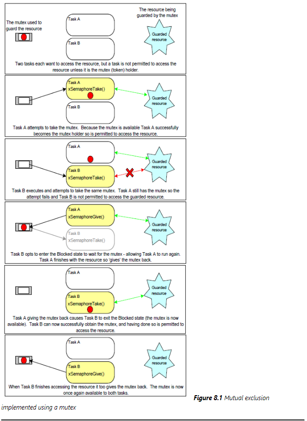
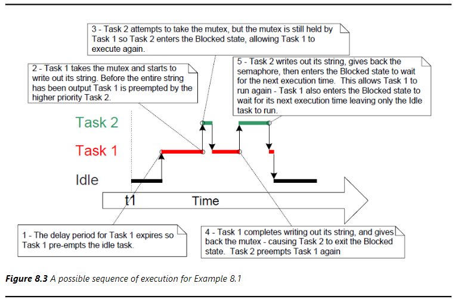
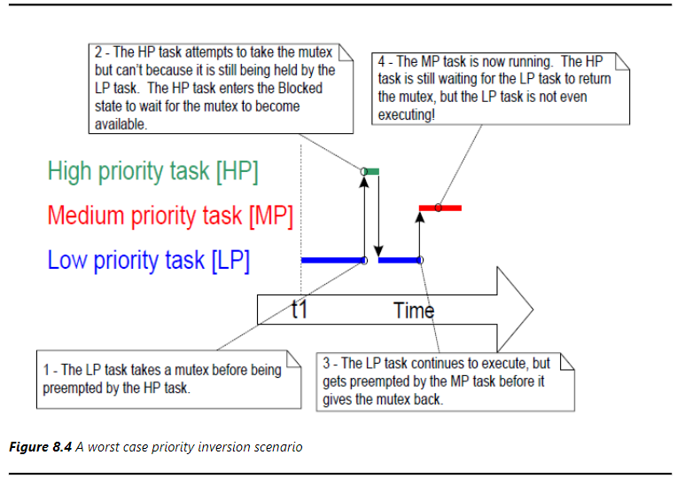
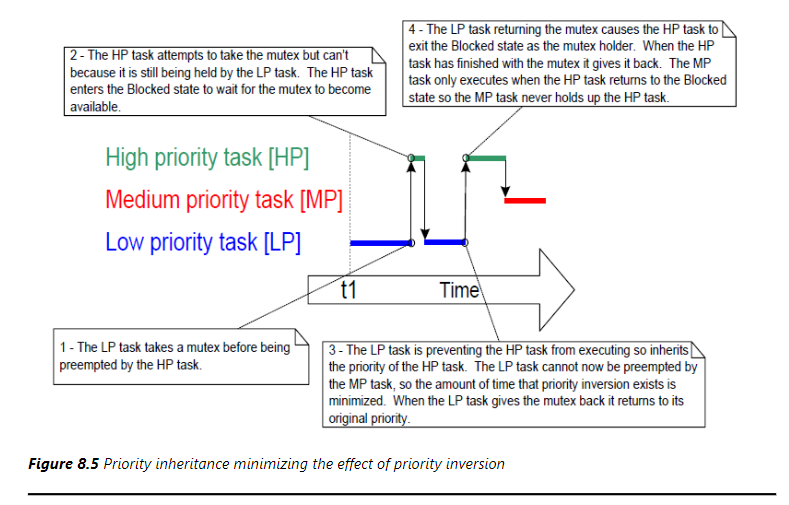
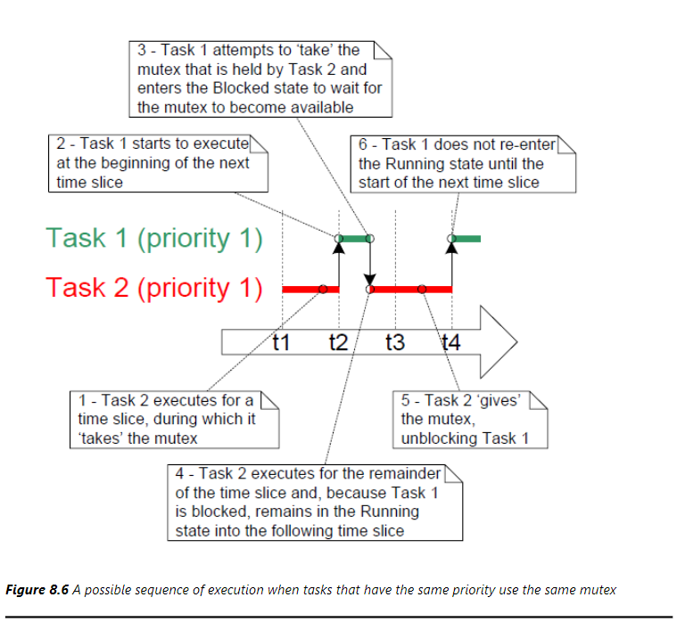

# 资源管理
## 简言
在多任务系统中，如果一个任务开始访问某个资源，但在完成访问之前就被从运行状态切换出去，就有可能出现错误。如果该任务使资源处于不一致的状态，那么其他任何任务或中断对该资源的访问都可能导致数据损坏或其他类似问题
- 外设访问
- 读写修改操作
- 非原子访问的变量
- 函数重入
## 临界区和挂起调度器
- 临界区
    基本的临界区代码段由下面两个原型组成，在临界区的代码不允许被调度不允许被抢占，直到临界区代码执行完毕，才允许调度器调度其他任务，每次临界区的代码执行时间应该尽可能短，并且应该成对的出现并且不能在中断中调用
    ```c
    taskENTER_CRITICAL();
    //critical section
    taskEXIT_CRITICAL();
    ```
- 挂起调度器
    挂起调度器是指当一个任务在临界区中执行时，其他任务都不能执行，直到该任务执行完临界区代码，才允许调度器调度其他任务。可以使用下面两个函数实现挂起调度器
    ```c
    vTaskSuspendAll(xTaskHandle);
    xTaskResumeAll(xTaskHandle);
    ```
## 互斥量
互斥量是一种特殊的二值信号量，互斥量与其他的同步机制不同，它是用来保护共享资源的一种机制。互斥量的作用是确保同一时刻只有一个任务或进程访问共享资源

### 互斥量函数
- 创建
```c
SemaphoreHandle_t xSemaphoreCreateMutex(void);
SemaphoreHandle_t xSemaphoreCreateMutexStatic(StaticSemaphore_t *pxStaticSemaphore);
```
- 其他函数
```c
void vSemaphoreDelete(SemaphoreHandle_t xSemaphore);
void vSemaphoreGive(SemaphoreHandle_t xSemaphore);
void vSemaphoreTake(SemaphoreHandle_t xSemaphore, TickType_t xBlockTime);
```
#### 示例代码
```c
static void prvNewPrintString(char *pcStringToPrint)
{
    xSemaphoreTake(xMutex, portMAX_DELAY);
    {
        printf("%s", pcStringToPrint);
        fflush(stdout);
    }
    xSemaphoreGive(xMutex);
}

static void prvPrintTask(void *pvParameters)
{
    char *pcStringToPrint = (char *)pvParameters;
    const TickType_t xMaxBlockTimeTicks = 0x20;
    for(;;)
    {
        prvNewPrintString(pcStringToPrint);
        vTaskDelay((rand()%xMaxBlockTimeTicks));
    }
}

int main(void)
{
    xMutex = xSemaphoreCreateMutex();

    if(xMutex != NULL)
    {
        xTaskCreate(prvPrintTask, "Print1", 1000, "Task 1 ***************************************\r\n", 1, NULL);
        xTaskCreate(prvPrintTask, "Print2", 1000, "Task 2 **********\r\n", 2, NULL);
        vTaskStartScheduler();
    }
    for(;;);
}
```

### 优先级反转
上图其实就是一个典型的优先级反转的案例，高优先级的任务二必须区等待低优先级的任务1放弃互斥量的控制，才能获得控制权，这就造成了优先级反转       
   
当低优先级的任务获取到互斥量之后，高优先级任务发生抢占但是发现互斥量已经被低优先级任务持有，没有资源就会发生阻塞，等到低优先级任务释放互斥量完成任务后，中等优先级的任务抢占执行，高优先级任务只能最后执行
### 优先级继承
在RTOS中互斥量和二值信号量非常相似但是，互斥量具有优先级继承的机制，优先级继承是一种最小化影响优先级反转的方案

### 死锁
死锁是互斥量错误使用存在的另一种隐患，死锁通常发生于两个任务应为无法从另一方获取资源导致任务阻塞
### 递归互斥量
对于一个任务也有可能自己造成死锁，这通常发生在一个任务多次尝试去调用获取相同互斥量，导致自己进入阻塞态等待资源，采用递归互斥量可以是任务再拥有互斥量的情况下再次去获取互斥量，但是递归获取了多少互斥量相应的也该释放多少互斥量，使用`xSemaphoreCreateRecursiveMutex`创建信号量，使用`xSemaphoreTakeRecursive`获取信号量，使用`xSemaphoreGiveRecursive`释放信号量
#### 示例代码
```c
SemaphoreHandle_t xRecursiveMutex;

void vTaskFunction(void * pvParameters)
{
    const TickType_t xMaxBlock20ms = pdMS_TO_TICKS(20);
    xRecursiveMutex = xSemaphoreCreateRecursiveMutex();
    configASSERT(xRecursiveMutex);
    for(;;)
    {
        if(xSemaphoreTakeRecursive(xRecursiveMutex, xMaxBlock20ms) == pdTRUE)
        {
            xSemaphoreGiveRecursive(xRecursiveMutex);
            xSemaphoreGiveRecursive(xRecursiveMutex);
        }
    }
}
```
### 互斥和任务
如果两个不同优先级的任务使用相同的互斥量，再RTOS的调度规则中，得确保高优先级的任务先运行。如果任务具有相同的优先级，那么任务调度的顺序是不确定的。如下图，
  
- 任务2先执行并占有互斥量
- 时间片到任务1尝试去获取互斥量，但是任务2已经占有了互斥量，任务1被阻塞
- 任务2跑完任务1应该执行剩下的时间片
- 任务2释放互斥量，任务1获得互斥量，继续执行
- 时间片到任务1开始执行

这里就有个问题，任务1并没有再任务2释放互斥量的时候立刻执行，而是等待下一个时间片才去获取互斥量，这就造成了任务1的执行时间延迟，如果在十分紧凑或者多任务的情况下，这将十分浪费在上下文切换上，所以在释放了互斥量之后可以主动切换任务
#### 示例代码
```c
void vFunction(void* pvParameter)
{
    extern SemaphoreHandle_t xMutex;
    char cTextBuffer[128];
    TickType_t xTimerAtWhichMutexWasTaken;
    for(;;)
    {
        vGenerateTextInALocalBuffer(cTextBuffer);
        xSemaphoreTake(xMutex, portMAX_DELAY);
        xTimerAtWhichMutexWasTaken = xTaskGetTickCount();
        vCopyTextToFrameBuffer(cTextBuffer);
        xSemaphoreGive(xMutex);
        if (xTaskGetTickCount() != xTimerAtWhichMutexWasTaken)
        {
            taskYIELD();
        }
    }
}
```
## 看门人任务
看门人任务提供了一种干净实现互斥而且没有优先级反转和死锁的方法，主要用于集中管理对共享资源的访问，只有看门人任务能够直接访问资源，其他任务访问资源只能间接调用看门人任务的服务，下面的代码就是一个看门人任务，两个普通任务和一个钩子函数，队列是公共资源，由看门人任务控制队列资源
#### 示例代码
```c
static char *pcStringsToPrint[] = 
{
    "Task 1 ****************************************************\r\n", 
    "Task 2 ----------------------------------------------------\r\n", 
    "Message printed from the tick hook interrupt ##############\r\n"
}

static void prvStdioGateKeeperTask(void *pvParameters)
{
    char *pcMessageToPrint;
    for(;;)
    {
        xQueueReceive(xPrintQueue, &pcMessageToPrint, portMAX_DELAY);
        printf("%s", pcMessageToPrint);
        fflush(stdout);
    }
}
static void prvPrintTask(void *pvParameters)
{
    int iIndexToString = (int)pvParameters;
    const TickType_t xMaxBlockTimerTicks = 0x20;
    for(;;)
    {
        xQueueSendToBack(xPrintQueue, &pcStringsToPrint[iIndexToString], portMAX_DELAY);
        vTaskDelay((rand()%xMaxBlockTimerTicks));
    }
}

void vAppicationTickHook(void)
{
    static int iCount = 0;
    iCount++;

    if(iCount >= 200)
    {
        xQueueSendToFrontFromISR(xPrintQueue, &(pcStringsToPrint[2]), NULL);
        iCount = 0;
    }
}

int main(void)
{
    xPrintQueue = xQueueCreate(5, sizeof(char*));
    if(xPrintQueue != NULL)
    {
        xTaskCreate(prvPrintTask, "Print1", 1000, (void*)0, 1, NULL);
        xTaskCreate(prvPrintTask, "Print2", 1000, (void*)1, 2, NULL);
        xTaskCreate(prvStdioGateKeeperTask, "GateKeeper", 1000, NULL, 0, NULL);
        vTaskStartScheduler();
    }
    for(;;) ;
}
```