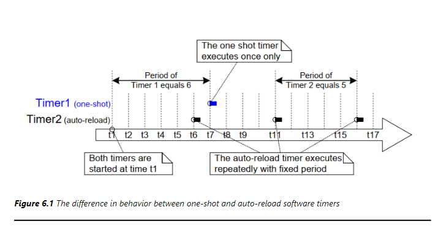
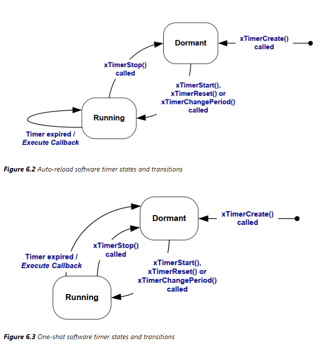
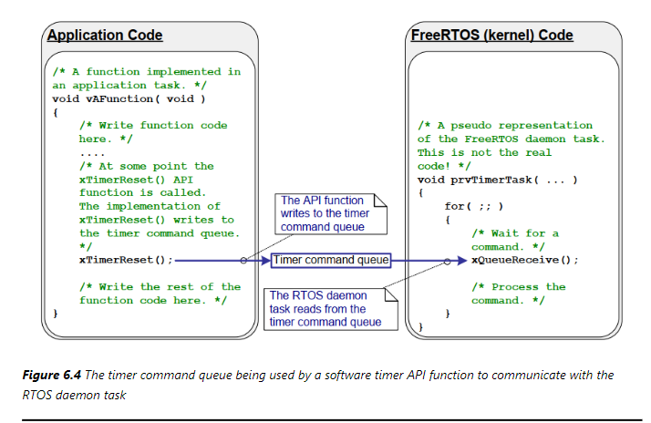
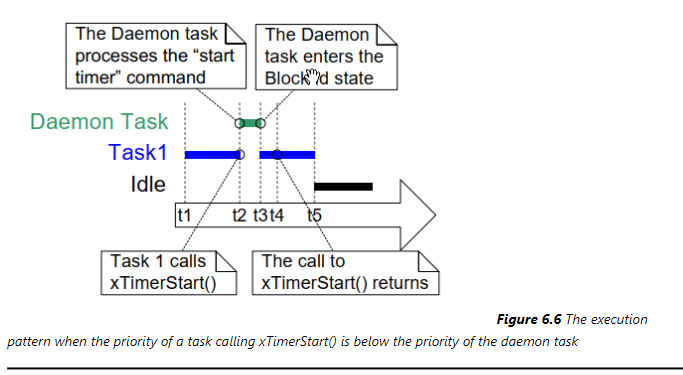
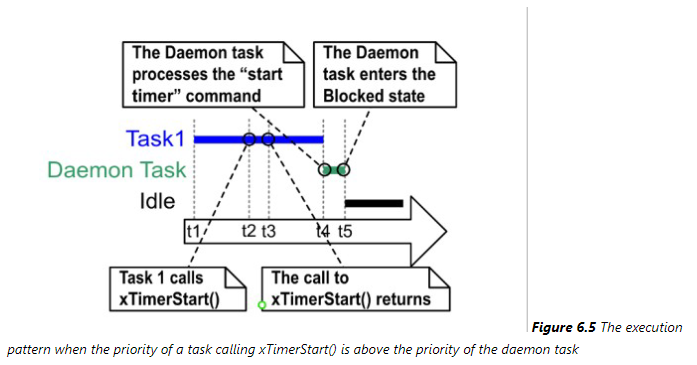

# 软件定时器
简单理解软件定时器就是闹钟，RTOS里的定时器都是基于系统滴答中断
## 软件定时器的特性
软件定时器有以下的特性
### 定时器周期
指定时间，启动定时器和运行回调函数，两者的间隔被称之为定时器的周期
### 一次性定时器和周期性定时器
- 一次行定时器，这类定时器只会执行一次回调函数，可以手动再次调用但是不会自行启动
- 自动重装载定时器，这类定时器启动后，时间到了之后会自行启动，是的回调函数可以被周期性调用


### 软件定时器的状态
- 运行，定时器正在运行，回调函数会被调用
- 休眠，定时器停止运行，回调函数不会被调用


## 软件定时器的上下文
### 守护任务
软件定时器是基于`TICK`来运行了，但是在RTOS中，`TICK`的频率是不确定的，所以软件定时器的精度也不确定，这就可能导致定时器的抖动。为了解决这个问题，RTOS中引入了守护任务，守护任务的主要作用是确保系统的稳定运行，它会定时检查系统的运行状态，如果发现系统出现异常，则会进行一些处理，比如重启系统。在启动调度器时，会自动创建RTOS守护任务，用户编写的任务函数使用定时器时是通过定时器命令队列`timer command queue`来和守护任务进行交互的，如下图   
  
这里会涉及到两个变量
- `configTIMER_TASK_PRIORITY` 定时器任务的优先级
- `configTIMER_QUEUE_LENGTH` 定时器命令队列的长度
### 守护任务的调度
守护任务的调度和普通任务差不多，守护任务的工作有两类，一类是处理定时器命令队列，一类是执行定时器回调函数，能否及时处理定时器命令、能否及时处理定时器的回调函数，严重依赖于守护任务的调度
- 当守护任务的优先级较高时
    
    - t1时刻，Task1处于运行态，守护进程处于阻塞态
    - t2时刻，Task1调用`xTimerStart()`启动定时器，将定时器命令放入定时器命令队列，使守护任务进入就绪态，守护任务的优先级高于Task1，因此Task1进入阻塞态
    - t3时刻，守护任务处理完队列命令，再次进入阻塞态，此时Task1是优先级最高的就绪态任务，执行
    - t4时刻，Task1之前被守护任务抢占，对`xTimerStart()`的调用被忽略，Task1进入运行态，守护进程处于阻塞态
    - t5时刻，Task1由于某些原因阻塞，空闲任务执行
- 当守护任务的优先级较低时 
    
    - t1时刻，Task1处于运行态，守护进程处于阻塞态
    - t2时刻，Task1调用`xTimerStart()`启动定时器，将定时器命令放入定时器命令队列，使守护任务进入就绪态，但是由于优先级较低无法立即执行
    - t3时刻，Task1执行完`xTimerStart()`
    - t4时刻，守护进程从就绪态进入运行态，执行定时器命令队列中的命令，此时Task1处于阻塞态，守护进程处于运行态
    - t5时刻，守护任务处理完点列中所有命令，再次进入阻塞态，此时空闲任务是优先级最高的就绪态任务，执行

    **某个时刻超时了，超时时间要从调用`xTimerStart()`被调用时刻算起**
### 回调函数 
定时器的回调函数是在守护任务中被调用的，守护任务不是专为某个定时器服务的，所以定时器回调函数不能影响其他定时器回调函数
- 回调函数应该尽快执行，不能阻塞，不能调用阻塞相关的函数
- 可以调用`xQueueReceive()`函数，但是超时时间要设置为0，否则会导致死锁

定时器回到函数原型如下
```c
void vTimerCallback(TimerHandle_t xTimer);
```
- `xTimer` 定时器句柄，通过这个句柄可以获取定时器的一些信息，比如周期、ID等

## 软件定时器的函数
### 创建
可以静态创建或者动态创建
```c
TimerHandle_t xTimerCreate(const char * const pcTimerName,
                            TickType_t xTimerPeriodInTicks,
                            UBaseType_t uxAutoReload,
                            void * const pvTimerID,
                            TimerCallbackFunction_t pxCallbackFunction);        
TimerHandle_t xTimerCreateStatic(const char * const pcTimerName,
                                 TickType_t xTimerPeriodInTicks,
                                 UBaseType_t uxAutoReload,
                                 void * const pvTimerID,
                                 StaticTimer_t * const pxTimerBuffer,
                                 TimerCallbackFunction_t pxCallbackFunction);       
```
- `pcTimerName` 定时器名称，可以为空
- `xTimerPeriodInTicks` 定时器周期，单位是滴答数，可以是任意整数
- `uxAutoReload` 定时器类型，可以是`pdFALSE`表示一次性定时器，`pdTRUE`表示周期性定时器
- `pvTimerID` 定时器ID，可以为空    
- `pxCallbackFunction` 定时器回调函数
- `pxTimerBuffer` 静态定时器缓冲区

返回值
- 成功，返回定时器句柄
- 失败，返回`NULL`
### 删除
动态创建的定时器不需要时，可以删除
```c
void vTimerDelete(TimerHandle_t xTimer, TickType_t xBlockTime);
```
- `xTimer` 定时器句柄
- `xBlockTime` 阻塞时间，单位是滴答数，可以是任意整数，如果设置为0，则不会阻塞
### 启动/停止
#### 启动定时器
```c
BaseType_t xTimerStart(TimerHandle_t xTimer, TickType_t xBlockTime);
BaseType_t xTimerStartFromISR(TimerHandle_t xTimer, BaseType_t *pxHigherPriorityTaskWoken);
```
- `xTimer` 定时器句柄
- `xBlockTime` 阻塞时间，单位是滴答数，可以是任意整数，如果设置为0，则不会阻塞
- `pxHigherPriorityTaskWoken` 用于通知调用者是否有更高优先级的任务被唤醒，如果被唤醒，则该变量会被设置为`pdTRUE`，否则为`pdFALSE`

返回值
- 成功，返回`pdPASS`
- 失败，返回`errQUEUE_FULL`
#### 停止定时器
```c
BaseType_t xTimerStop(TimerHandle_t xTimer, TickType_t xBlockTime);
BaseType_t xTimerStopFromISR(TimerHandle_t xTimer, BaseType_t *pxHigherPriorityTaskWoken);
```
- `xTimer` 定时器句柄
- `xBlockTime` 阻塞时间，单位是滴答数，可以是任意整数，如果设置为0，则不会阻塞
- `pxHigherPriorityTaskWoken` 用于通知调用者是否有更高优先级的任务被唤醒，如果被唤醒，则该变量会被设置为`pdTRUE`，否则为`pdFALSE`

返回值
- 成功，返回`pdPASS`
- 失败，返回`errQUEUE_FULL`

### 复位
```c
BaseType_t xTimerReset(TimerHandle_t xTimer, TickType_t xBlockTime);
BaseType_t xTimerResetFromISR(TimerHandle_t xTimer, BaseType_t *pxHigherPriorityTaskWoken);
```
- `xTimer` 定时器句柄
- `xBlockTime` 阻塞时间，单位是滴答数，可以是任意整数，如果设置为0，则不会阻塞
- `pxHigherPriorityTaskWoken` 用于通知调用者是否有更高优先级的任务被唤醒，如果被唤醒，则该变量会被设置为`pdTRUE`，否则为`pdFALSE`

返回值
- 成功，返回`pdPASS`
- 失败，返回`errQUEUE_FULL`


### 修改周期
```c
BaseType_t xTimerChangePeriod(TimerHandle_t xTimer, TickType_t xNewPeriod, TickType_t xBlockTime);
BaseType_t xTimerChangePeriodFromISR(TimerHandle_t xTimer, TickType_t xNewPeriod, BaseType_t *pxHigherPriorityTaskWoken);
```
- `xTimer` 定时器句柄
- `xNewPeriod` 新的周期，单位是滴答数，可以是任意整数
- `xBlockTime` 阻塞时间，单位是滴答数，可以是任意整数，如果设置为0，则不会阻塞
- `pxHigherPriorityTaskWoken` 用于通知调用者是否有更高优先级的任务被唤醒，如果被唤醒，则该变量会被设置为`pdTRUE`，否则为`pdFALSE`

返回值
- 成功，返回`pdPASS`
- 失败，返回`errQUEUE_FULL`


### 定时器ID
```c
void *pvTimerGetTimerID(TimerHandle_t xTimer);
void vTimerSetTimerID(TimerHandle_t xTimer, void *pvNewID);
```
- `xTimer` 定时器句柄
- `pvNewID` 新的定时器ID，可以为空

## 一般使用 
下面示例代码有定时器的一般使用
#### 示例代码
```c
/* 首先需要配置文件中进行配置 */
##define configUSE_TIMERS 1
##define configTIMER_TASK_PRIORITY 31
##define configTIMER_QUEUE_LENGTH 5
##define configTIMER_TASK_STACK_DEPTH 32

/* 主文件    */
static volatile uint8_t flagONEShotTimerRun = 0;
static volatile uint8_t flagAutoReloadTimerRun = 0;

##define ONESHOT_TIMER_PERIOD pdMS_TO_TICKS(10)
##define AUTORELOAD_TIMER_PERIOD pdMS_TO_TICKS(20)

static void prvOneShotTimerCallback(TimerHandle_t xTimer)
{
    static int cnt = 0;
    flagONEShotTimerRun = !flagONEShotTimerRun;
    printf("OneShotTimer Callback %d\r\n", cnt++);  
}

static void prvAutoReloadTimerCallback(TimerHandle_t xTimer)
{
    static int cnt = 0;
    flagAutoReloadTimerRun = !flagAutoReloadTimerRun;
    printf("AutoReloadTimer Callback %d\r\n", cnt++);
}

int main(void)
{
    TimerHandle_t xOneShotTimer, xAutoReloadTimer;
    prvSetupHardware();
    xOneShotTimer = xTimerCreate("OneShotTimer", ONESHOT_TIMER_PERIOD, pdFALSE, NULL, prvOneShotTimerCallback);
    xAutoReloadTimer = xTimerCreate("AutoReloadTimer", AUTORELOAD_TIMER_PERIOD, pdTRUE, NULL, prvAutoReloadTimerCallback);
    if(xOneShotTimer != NULL && xAutoReloadTimer != NULL)
    {
        xTimerStart(xOneShotTimer, 0);
        xTimerStart(xAutoReloadTimer, 0);

        vTaskStartScheduler();
    }
    return 0;
}
```

## 消除抖动 
在机械开关中经常遇到抖动问题，引脚电平在短时间内反复变化，频繁触发中断，这时候可以使用在中断中多次复位软件定时器的方式来消除抖动。
#### 示例代码
```c
static TimerHandle_t xKeyFilteringTimer;

#define KEY_FILTERING_PERIOD pdMS_TO_TICKS(20)

static void prvKeyFilteringCallback(TimerHandle_t xTimer)
{
    statinc int cnt = 0;
    printf("KeyFiltering Callback %d\r\n", cnt++);
}

void prvKeyFilterTask(void *pvParameters)
{
    int cnt = 0;
    const TickType_t xDelay = pdMS_TO_TICKS(20);
    
    for(;;)
    {
        xTimerReset(xKeyFilteringTimer, 0);
        cnt++;
        vTaskDelay(xDelay);
    }
}

int main(void)
{
    prvSetupHardware();
    xKeyFilteringTimer = xTimerCreate("KeyFiltering", 
    KEY_FILTERING_PERIOD, pdFALSE, NULL, prvKeyFilteringCallback);
    xTaskCreate(prvKeyFilterTask, "KeyFilterTask", 1024, NULL, 1, NULL);
    vTaskStartScheduler();
    return 0;
}
