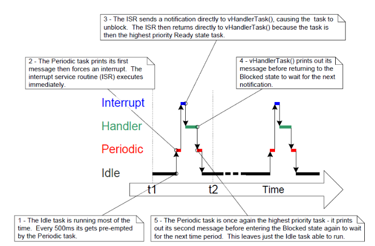
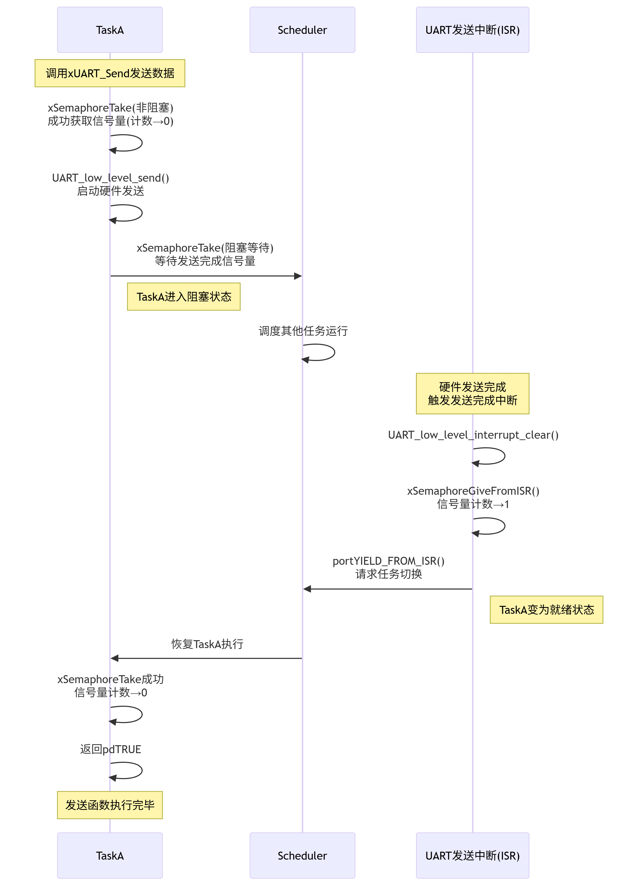
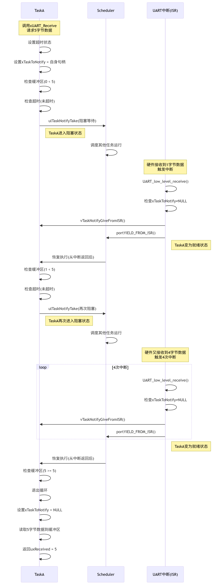
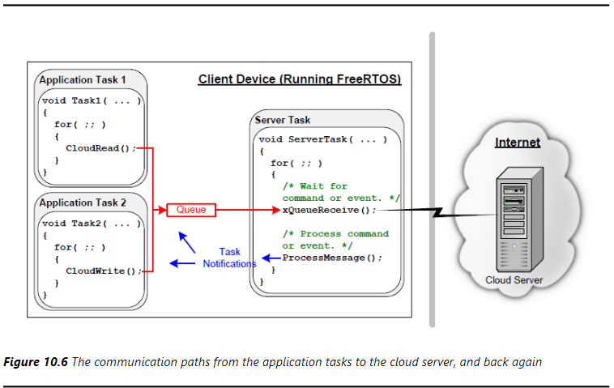

# 任务通知
## 简言概括
任务通知是一种能给指定任务进行任务同步的有效机制，可以直接进行任务通信，但不需要一个额外的单独的通信对象，当使用任务通知的时候，每个任务都会有至少一个通知状态挂起和非挂起，和一个32位的通知值。当任务接收到一个通知，他的通知状态会被设置为非挂起，任务可以阻塞等待在可选的时间，等待他的通知状态变为挂起
## 任务通知优势和限制
- 任务通知优势
    - 使用任务通知向任务发送时间或者数据比使用队列信号量事件组区同步要更快，效率更高
    - 使用任务通知发送事件或者数据明显的使用了更少的内存，不用额外创建结构体
- 任务通知限制
    - 任务通知可以在中断处理中向任务发送事件和数据，但是不能在任务中发向中断
    - 数据独享，不能发送给其他任务
    - 无法缓冲数据
    - 如果发送受阻，发送方无法进入阻塞状态
    - 无法广播数据
## 任务通知使用
### 通知状态和通知值
每个任务都有一个TCB任务控制块结构体，里卖弄有两个成员，一个是`uint8_t`类型的表示通知状态，一个是`uint32_t`类型的表示通知值
```c
typedef struct tskTaskControlBlock       
/* The old naming convention is used to prevent breaking kernel aware debuggers. */
{
    ...
    #if ( configUSE_TASK_NOTIFICATIONS == 1 )
        volatile uint32_t ulNotifiedValue[ configTASK_NOTIFICATION_ARRAY_ENTRIES ];
        volatile uint8_t ucNotifyState[ configTASK_NOTIFICATION_ARRAY_ENTRIES ];
    #endif
    ...
} tskTCB;
```
通知状态有3种取值：
- `taskNOT_WAITING_NOTIFICATION`：任务没有挂起，可以接收通知
- `taskWAITING_NOTIFICATION_BLOCKED`：任务挂起，等待通知，但是被阻塞
- `taskWAITING_NOTIFICATION`：任务挂起，等待通知   

通知值可以有多种类型：
- 计数值
- 位
- 任意数值
### 发送任务通知
使用`xTaskNotifyGive()`函数直接向任务发送通知，并增加接收任务的通知值，使任务的通知状态变为非挂起
```c
BaseType_t xTaskNotifyGive( TaskHandle_t xTaskToNotify )
BaseType_t xTaskNotifyGiveIndexed( TaskHandle_t xTaskToNotify, 
                                UBaseType_t uxIndexToNotify )
BaseType_t xTaskNotifyGiveFromISR( TaskHandle_t xTaskToNotify, 
                                BaseType_t  *pxHigherPriorityTaskWoken )
```
- `xTaskToNotify`：任务句柄，要通知的任务
- `uxIndexToNotify`：通知索引，用于指定通知值数组的哪个元素
- `pxHigherPriorityTaskWoken`：用于从中断中唤醒任务，如果有任务被唤醒，则该参数会被设置为`pdTRUE`，否则为`pdFALSE`
- 返回值
    - 只能是`pdPASS`
### 获取任务通知
使用`xTaskNotifyWait()`函数等待接收任务的通知，并减少接收任务的通知值，使任务的通知状态变为挂起
```c
uint32_t  xTaskNotifyWait( BaseType_t  xClearCountOnExit, 
                            TickType_t xTicksToWait )
```
- `xClearCountOnExit`：是否清除通知值
    - 如果为`pdTRUE`，则通知值清零
    - 如果为`pdFALSE`，则通知值不清零，通知值减1
- `xTicksToWait`：等待时间，如果为`portMAX_DELAY`，则一直等待
- 返回值
    - 函数返回之前，在清零或减1之前的通知值
#### 使用任务通知区替代信号量——方案一
`ulTaskNotifyTake`函数的`xClearOnExit`参数设置为`pdTRUE`，这样替代了二值信号量的功能
```c
const TickType_t xInterrupFrequency = pdMS_TO_TICKS(500UL);

static void vPeriodicTask(void *pvParameters)
{
    const TickType_t xDelay500ms = pdMS_TO_TICKS(500);
    for(;;) 
    {
        vTaskDelay(xDelay500ms);
        vPrintString("PeriodicTask: About to generate an interrupt event\r\n");
        vPortGenerateSimulatedInterrupt(mainINTERRUPT_NUMBER);
        vPrintString("PeriodicTask: Interrupt event generated\r\n");
    }

}

static void vHandlerTask(void *pvParameters)
{
    const TickType_t xMaxExpectedBlockTime = xInterruptFrequency + pdMS_TO_TICKS(10UL);
    uint32_t ulEventsToProcess;

    for (;;)
    {
        ulEventsToProcess = ulTaskNotifyTake(pdTRUE, xMaxExpectedBlockTime);
        if (ulEventsToProcess != 0)
        {
            while(ulEventsToProcess > 0)
            {
                vPrintString( "Handler task - Processing event.\r\n" );
                ulEventsToProcess--;
            }
        }
        else
        {
        }
    }
}

static uint32_t ulExampleInterruptHandler(void)
{
    BaseType_t xHigherPriorityTaskWoken = pdFALSE;
    vTaskNotifyGiveFromISR(xHandlerTaskHandle, &xHigherPriorityTaskWoken);
    portYIELD_FROM_ISR(xHigherPriorityTaskWoken);
}
```
 
#### 使用任务通知区替代信号量——方案二
`ulTaskNotifyTake`函数的`xClearOnExit`参数设置为`pdTRUE`，这样替代了计数信号量的功能
```c
const TickType_t xInterrupFrequency = pdMS_TO_TICKS(500UL);

static void vPeriodicTask(void *pvParameters)
{
    const TickType_t xDelay500ms = pdMS_TO_TICKS(500);
    for(;;) 
    {
        vTaskDelay(xDelay500ms);
        vPrintString("PeriodicTask: About to generate an interrupt event\r\n");
        vPortGenerateSimulatedInterrupt(mainINTERRUPT_NUMBER);
        vPrintString("PeriodicTask: Interrupt event generated\r\n");
    }

}

static void vHandlerTask(void *pvParameters)
{
    const TickType_t xMaxExpectedBlockTime = xInterruptFrequency + pdMS_TO_TICKS(10UL);

    for (;;)
    {
        if (ulTaskNotifyTake(pdFALSE, xMaxExpectedBlockTime) != 0)
        {
            vPrintString( "Handler task - Processing event.\r\n" );
        }
    }
}

static uint32_t ulExampleInterruptHandler(void)
{
    BaseType_t xHigherPriorityTaskWoken = pdFALSE;
    vTaskNotifyGiveFromISR(xHandlerTaskHandle, &xHigherPriorityTaskWoken);
    vTaskNotifyGiveFromISR(xHandlerTaskHandle, &xHigherPriorityTaskWoken);
    vTaskNotifyGiveFromISR(xHandlerTaskHandle, &xHigherPriorityTaskWoken);
    portYIELD_FROM_ISR(xHigherPriorityTaskWoken);
}
```
### 发送任务通知强化版
`xTaskNotify`的函数更加强大，使用不同参数可以实现各类功能比如：
- 让接收任务的通知值加一
- 设置接收任务的通知值的某一位或者某些位，相等于一个更加轻量级高效的事件组
- 把一个新值写入接收任务的通知值，上一次的通知值被读取之后写入才成功，相当于长度为1的队列
- 用一个新值覆盖接受任务的通知值，类似于`xQueueOverwrite`函数，相当于一个轻量级的邮箱
```c
BaseType_t xTaskNotify( TaskHandle_t xTaskToNotify, 
                        uint32_t ulValue, 
                        eNotifyAction eAction );
BaseType_t xTaskNotifyFromISR( TaskHandle_t xTaskToNotify, 
                               uint32_t ulValue, 
                               eNotifyAction eAction, 
                               BaseType_t *pxHigherPriorityTaskWoken );
```
- `xTaskToNotify`：任务句柄，要通知的任务
- `ulValue`：通知值
- `eAction`：通知动作
    - `eIncrement`：让接收任务的通知值加一
    - `eSetBits`：设置接收任务的通知值的某一位或者某些位
    - `eSetValueWithOverwrite`：把一个新值写入接收任务的通知值，上一次的通知值被读取之后写入才成功
    - `eSetValueWithoutOverwrite`：用一个新值覆盖接收任务的通知值
    - `eNoAction`：不执行任何操作
- `pxHigherPriorityTaskWoken`：用于从中断中唤醒任务，如果有任务被唤醒，则该参数会被设置为`pdTRUE`，否则为`pdFALSE`
- 返回值
    - 只能是`pdPASS`
### 接收任务通知强化版
`xTaskNotifyWait`的函数更加强大，使用不同参数可以实现各类功能比如：
- 可以让任务等待，等待通知状态为挂起
- 可以在函数进入退出时候清除通知值
```c
BaseType_t  xTaskNotifyWait( uint32_t ulBitsToClearOnEntry, 
                            uint32_t ulBitsToClearOnExit, 
                            uint32_t *pulNotificationValue, 
                            TickType_t xTicksToWait );  
```
- `ulBitsToClearOnEntry`：在函数进入时候清除的通知值位，比如要清除第零个位就要将值设置为0x01
- `ulBitsToClearOnExit`：在函数退出时候清除的通知值位，比如要清除第零个位就要将值设置为0x01
- `pulNotificationValue`：接收到的通知值指针
- `xTicksToWait`：等待时间，如果为`portMAX_DELAY`，则一直等待
- 返回值
    - `pdTRUE`：接收到通知，通知状态为挂起
    - `pdFALSE`：超时，在`xTicksToWait`事件内没有接收到通知
## 实际应用
许多硬件外围设备的操作（如高精度ADC转换、大量数据UART传输）耗时较长。如果使用轮询方式等待操作完成，会严重浪费CPU资源，尤其在多任务RTOS系统中会阻塞其他任务执行。因此，高效的RTOS感知驱动程序应采用中断驱动方式，并利用二进信号量让发起操作的任务进入“阻塞”状态，等待操作完成后再被唤醒。这样可以释放CPU给其他任务，提高系统整体效率
### 串口使用任务通知
- 使用二值信号量发送
    ```c
    BaseType_t xUART_Send(xUART* pxUARTInstance, uint8_t *pucDataSource, size_t uxLength)
    {
        BaseType_t xReturn = pdFALSE;
        // 非阻塞方式获取信号量，失败说明串口占用
        xSemaphoreTake(pxUARTInstance->xTxSemaphore, 0);
        // 串口开始发送
        UART_low_level_send(pxUARTInstance, pucDataSource, uxLength);
        // 如果发送完成，就能成功获取信号量
        xReturn = xSemaphoreTake(pxUARTInstance->xTxSemaphore, pxUARTInstance->xTxTimeout);
        return xReturn;
    }

    void xUART_TransmitEndISR(xUART* pxUARTInstance)
    {
        BaseType_t xHigherPriorityTaskWoken = pdFALSE;
        // 串口中断完成清除标志位
        UART_low_level_interrupt_clear(pxUARTInstance);
        // 释放信号量标志串口发送完成
        xSemaphoreGiveFromISR(pxUARTInstance->xTxSemaphore, &xHigherPriorityTaskWoken);
        // 切换任务
        portYIELD_FROM_ISR(xHigherPriorityTaskWoken);
    }
    ```
    
- 使用任务通知替代信号量接收串口信息
    ```c
    size_t xUART_Receice(xUART *pxUARTInstance, uint8_t *pucBuffer, size_t uxWantedBytes)
    {
        size_t uxReceived = 0;
        // 获取超时时间
        TickType_t xTicksToWait = pxUARTInstance->xRxTimeout;
        // 记录函数进入的时间 
        vTaskSetTimeOutState(&xTimeOut);
        // 获取通知任务
        pxUARTInstance->xTaskToNotify = xTaskGetCurrentTaskHandle();
        // 进入循环直到接收到想要的字节数或者超时退出
        while(UART_bytes_in_rx_buffer(pxUARTInstance) < uxWantedBytes)
        {
            // 检查是否超时
            if(xTaskCheckForTimeOut(&xTimeOut, &xTicksToWait) != pdFALSE)
            {
                break;
            }
            // 等待通知
            ulTaskNotifyTake(pdFALSE, xTicksToWait);
        }
        pxUARTInstance->xTaskToNotify = NULL;
        uxReceived = UART_read_from_receive_buffer(pxUARTInstance, pucBuffer, uxWantedBytes);
        return uxReceived;
    }

    void xUART_ReceiveISR(xUART* pxUARTInstance)
    {
        BaseType_t xHigherPriorityTaskWoken = pdFALSE;
        // 复制接收的数据和清除中断位
        UART_low_level_receive(pxUARTInstance);
        if(pxUARTInstance->xTaskToNotify != NULL)
        {
            // 在中断中，串口处理完成，通知接收任务
            vTaskNotifyGiveFromISR(pxUARTInstance->xTaskToNotify, &xHigherPriorityTaskWoken);
            portYIELD_FROM_ISR(xHigherPriorityTaskWoken);
        }
    }
    ```
      
    如图就是串口接收的大概流程
### ADC使用任务通知

```c
void vADCTask(void *pvParameters)
{
    uint32_t ulADCValue;
    BaseType_t xResult;
    // ADC触发的频率
    const TickType_t xADCConversionFrequency = pdMS_TO_TICKS(50UL);

    for (;;)
    {
        // 等待下一次ADC转换结果
        // 新的ADC值会覆写已经存在的值
        xResult = xTaskNotifyWait(0, 0, &ulADCValue, xADCConversionFrequency);
        if (xResult == pdTRUE)
        {
            // 处理ADC结果
            ProcessADCResult( ulADCValue );
        }
        else
        {

        }
    }
}

void ADC_ConversionEndISR(void)
{
    uint32_t ulConversionResult;
    BaseType_t xHigherPriorityTaskWoken = pdFALSE;
    // 读取ADC转换结果并清除中断位
    ulConversionResult = ADC_low_level_read(pxADCInstance);
    // 通知ADC任务，发送ADC转换结果
    xResult = xTaskNotifyFromISR(xADCTaskToNotify, 
                                ulConversionResult,  
                                eSetValueWithoutOverwrite, 
                                &xHigherPriorityTaskWoken);
    configASSERT(xResult == pdPASS);
    portYIELD_FROM_ISR(xHigherPriorityTaskWoken);
}
```
### 在应用中使用任务通知
这里假设一个例子去演示任务通知的强大
- 应用程序通过缓慢的互联网连接，向远程服务器发送数据，请求数据，这里将这个服务器统称为云服务
- 从云服务请求数据之后，接受任务必须在阻塞态等待接收数据完成
- 在向云服务发送数据之后，发送任务必须在阻塞态等待一个通知，通知接收任务数据发送完成

如图是一个应用的调度方式

- 处理云服务的多个互联网连接被封装到一个RTOS任务中去，这个任务充当一个代理的作用
- 应用任务通过调用`CloudRead()`读取云服务的数据，它不能直接访问云服务，但是可以通过一个队列发送请求并从服务器接收请求数据作为一个任务通知
- 应用程序通过调用`CloudWrite()`向云服务写入数据，同样他不能直接访问云服务，但是可以通过一个队列向云服务任务请求写操作，并把数据写入的结果作为任务通知

```c
#define SEND_SUCCESSFUL_BIT                 (0x01 << 0)
#define OPERATION_TIMED_OUT_BIT             (0x01 << 1)    
#define NO_INTERNET_CONNECTION_BIT          (0x01 << 2)
#define CANNOT_LOCATE_CLOUD_SERVER_BIT      (0x01 << 3)

#define CLOUD_WRITE_STATUS_BIT_MASK         (SEND_SUCCESSFUL_BIT | 
                                            OPERATION_TIMED_OUT_BIT | 
                                            NO_INTERNET_CONNECTION_BIT | 
                                            CANNOT_LOCATE_CLOUD_SERVER_BIT)
// 云服务操作
typedef enum CloudOperations 
{
    eRead, 
    eWrite
} Operation_t;
// 云服务命令请求
typedef struct CloudCommand
{
    Operation_t eOperation;
    uint32_t ulDateID;
    uint32_t ulDataValue;
    TaskHandle_t xTaskToNotify;
} CloudCommand_t; 

BaseType_t CloudRead(uint32_t ulDataId, uint32_t *pulValue)
{
    CloudCommand_t xRequest;
    BaseType_t xReturn;
    // 配置云服务请求内容
    xRequest.eOperation = eRead;
    xRequest.ulDataID = ulDataID;
    xRequest.xTaskToNotify = xTaskGetCurrentTaskHandle();
    // 清除可能存在的旧通知
    xTaskNotify(xRequest.xTaskToNotify, 0, eSetBits);
    xTaskNotifyWait(0, 0, NULL, 0);
    // 发送云服务请求
    xQueueSend(xServerTaskQueue, &xRequest, portMAX_DELAY);
    // 等待从云服务任务发出的任务通知
    xReturn = xTaskNotifyWait(0, 0, pulValue, portMAX_DELAY);
    return xReturn;
}

BaseType_t CloudWrite(uint32_t ulDataId, uint32_t ulValue)
{
    CloutCommand_t xRequest;
    uint32_t ulNotificationValue;
    // 配置云服务请求内容
    xRequest.eOperation = eWrite;
    xRequest.ulDataID = ulDataID;
    xRequest.ulDataValue = ulDateValue;
    xRequest.xTaskToNotify = xTaskGetCurrentTaskHandle();
    // 清除可能存在的旧通知
    xTaskNotifyWait(0, CLOUD_WRITE_STATUS_BIT_MASK, NULL, 0);
    // 发送云服务请求
    xQueueSend(xServerTaskQueue, &xRequest, portMAX_DELAY);
    // 等待服务器任务的通知
    xTaskNotifyWait(0, CLOUD_WRITE_STATUS_BIT_MASK, &ulNotificationValue, pdMS_TO_TICKS(250));
    // 检查是否发送成功
    return (ulNotificationValue & SEND_SUCCESSFUL_BIT);
}

void ServerTask(void *pvParameters)
{
    CloudCommand_t xCommand;
    uint32_t ulReceivedValue, ulBitWiseStatusCode;   

    for(;;)
    {
        // 接收队列
        xQueueReceive(xServerTaskQueue, &xCommand, portMAX_DELAY);
        // 处理云服务请求
        switch(xCommand.eOperation)
        {
            case eRead:
            ulReceivedValue = GetCloudData(xCommand.ulDataID);
            // 处理完了发送任务通知
            xTaskNotify(xCommand.xTaskToNotify, ulReceivedValue, eSetValueWithoutOverwrite);
            break;
            case eWrite:
            ulBitWiseStatusCode = SetCloudData(xCommand.ulDataID, xCommand.ulDataValue);
            // 处理完了发送任务通知
            xTaskNotify(xCommand.xTaskToNotify, ulBitWiseStatusCode, eSetValueWithoutOverwrite);
            break;
        }
    }
}
```