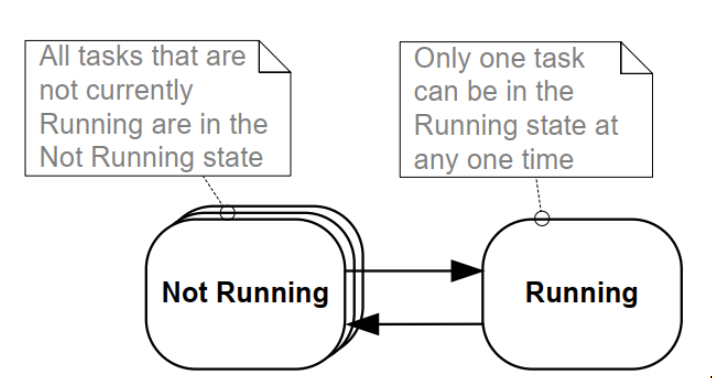
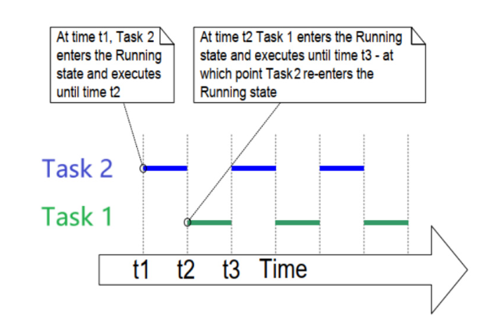
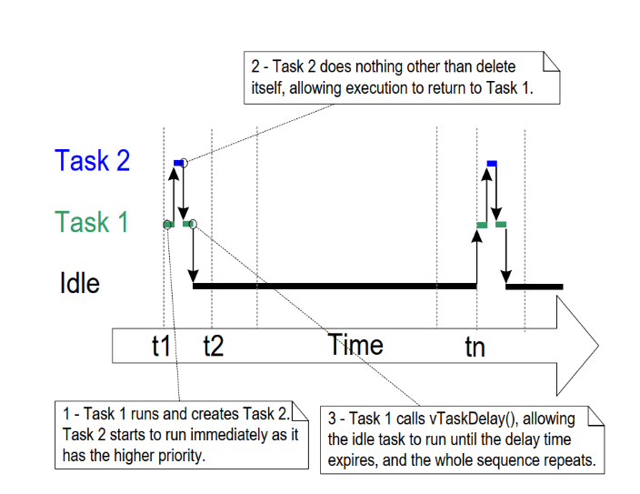
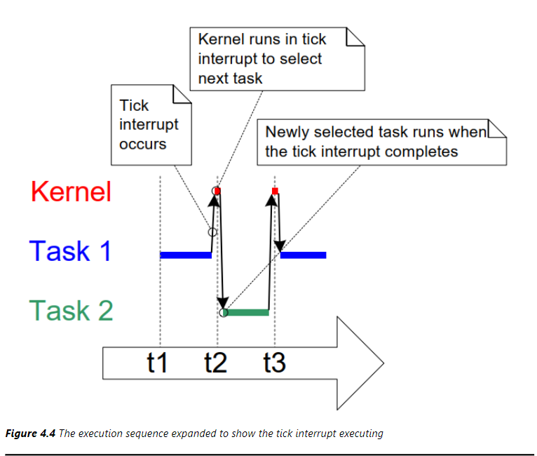
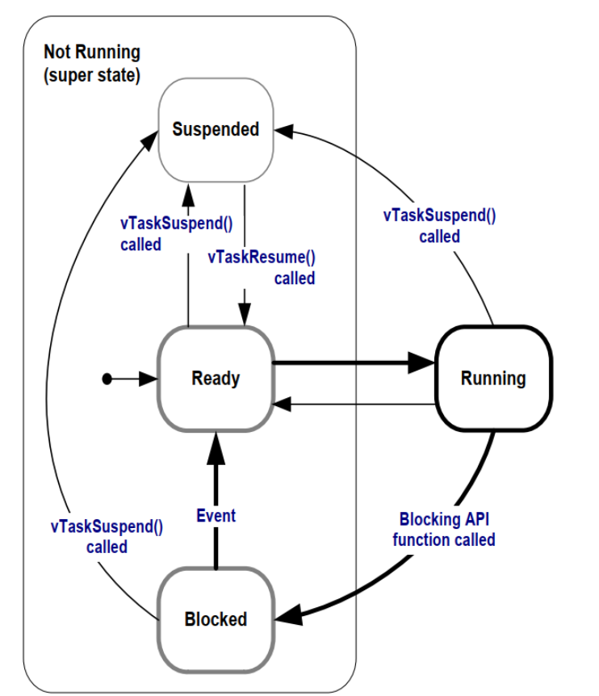

# 任务管理
这里会记录一些任务相关的知识
## 任务
在RTOS中，任务就是一个函数，可以简单理解为一个任务就是要给`while`循环，需要注意一下几点
- 任务函数不能返回
- 函数内部尽量使用局部变量，不同任务的局部变量都有自己的副本
- 多个任务可以执行同一个任务函数
- 每个任务都有自己的栈空间
```c
void vATaskFunction(void *pvParameters);
void vATaskFunction( void * pvParameters )
{ 
    /* 
     * Stack-allocated variables can be declared normally when inside a function. 
     * Each instance of a task created using this example function will have its 
     * own separate instance of lStackVariable allocated on the task's stack. 
     */ 
    long lStackVariable = 0; 
 
    /* 
     * In contrast to stack allocated variables, variables declared with the 
`static` 
     * keyword are allocated to a specific location in memory by the linker. 
     * This means that all tasks calling vATaskFunction will share the same 
     * instance of lStaticVariable. 
     */ 
    static long lStaticVariable = 0; 
 
    for( ;; ) 
    { 
        /* The code to implement the task functionality will go here. */ 
    } 
  
    /* 
     * If the task implementation ever exits the above loop, then the task 
     * must be deleted before reaching the end of its implementing function. 
     * When NULL is passed as a parameter to the vTaskDelete() API function, 
     * this indicates that the task to be deleted is the calling (this) task. 
     */ 
    vTaskDelete( NULL ); 
} 
```

## 顶层任务状态
RTOS中有两种顶层任务状态，分别是运行和不运行

## 任务创建和删除
### 创建任务
```c
BaseType_t xTaskCreate( TaskFunction_t pxTaskCode, const char * const pcName, 
                       uint16_t usStackDepth, void *pvParameters, 
                       UBaseType_t uxPriority, TaskHandle_t *pxCreatedTask )
```
- `pxTaskCode`：任务函数指针
- `pcName`：任务名称
- `usStackDepth`：任务栈深度 
- `pvParameters`：任务参数
- `uxPriority`：任务优先级
- `pxCreatedTask`：任务句柄指针

返回值
- `pdPASS`：成功创建任务
- `pdFAIL`：创建任务失败
    
#### 样例1
在`main.c`中创建两个任务，分别打印`Task1`和`Task2`的运行信息，并在两个任务中使用`for`循环，模拟任务执行时间。
```c
void vTask1(void *pvParameters)
{
    volatile unsigned long ulCount;
    for(;;)
    {
        vPrintLine("Task1 is running");
        for(ulCount = 0; ulCount < 1000000; ulCount++)
        {

        }
    }
}
void vTask2(void *pvParameters)
{
    volatile unsigned long ulCount;
    for(;;)
    {
        vPrintLine("Task2 is running");
        for(ulCount = 0; ulCount < 1000000; ulCount++)
        {
            
        }
    }
}
int main(void)
{
    xTaskCreate(vTask1, "Task1", 1024, NULL, 1, NULL);
    xTaskCreate(vTask2, "Task2", 1024, NULL, 2, NULL);
    vTaskStartScheduler();
    for(;;);
    return 0;
}
```

如图是任务运行的大概情况，现实情况下，两个任务在进行快速的切换，这取决于RTOS的调度算法。
### 使用任务参数
多个任务可以共享同一个任务函数，但它们可以有不同的参数。
- 使用的栈不同
- 创建任务时可以传入不同的参数
#### 样例2
在`main.c`中创建两个任务，使用同一个函数
```c
void vTask1(void *pvParameters)
{
    char* pcTaskName = (char*)pvParameters;
    volatile unsigned long ul;
    for(;;)
    {
        vPrintLine(pcTaskName);
        for(ul = 0; ul < 1000000; ul++)
        {
        }
    }
}
static const char* pcTexTForTask1 = "Task1 is running";
static const char* pcTexTForTask2 = "Task2 is running";
int main(void)
{
    xTaskCreate(vTask1, "Task1", 1024, (void*)pcTexTForTask1, 1, NULL);
    xTaskCreate(vTask2, "Task2", 1024, (void*)pcTexTForTask2, 2, NULL);
    vTaskStartScheduler();
    for(;;);
    return 0;
}
```
### 任务的删除
```c
void vTaskDelete( TaskHandle_t xTaskToDelete )
```
- `xTaskToDelete`：任务句柄，如果为`NULL`，则删除当前任务
#### 样例3
```c
void vTask1(void *pvParameters)
{
    const TickType_t xDelay = 1000 / pdMS_TO_TICKS(1000);
    BaseType_t ret;
    for(;;)
    {
        vPrintLine("Task1 is running");
        ret = xTaskCreate(vTask2, "Task2", 1024, NULL, 2, NULL);
        if(ret != pdPASS)
        {
            vPrintLine("Failed to create Task2");
        }
        vTaskDelay(xDelay);
    }
}
void vTask2(void *pvParameters)
{
    printf("Task2 is running\n");
    vtaskDelete(NULL);
}
int main(void)
{
    prvSetupHardware();
    xTaskCreate(vTask1, "Task1", 1024, NULL, 1, NULL);
    vTaskStartScheduler();
    for(;;);
    return 0;
}
```

任务一会先运行然后创建任务二，任务二运行完后删除自己，进入空闲任务，任务一继续运行，如此往复，如果不使用`vTaskDelay`的话，任务一会一直运行，最后内存耗尽程序崩溃
## 任务优先级和`TICK`
### 任务优先级
优先级的取值范围是`0 ~ configMAX_PRIORITIES - 1`，数值越大优先级越高。使用不同的方法时，`configMAX_PRIORITIES`的值不同。
- 通用方法
    使用C函数实现，对所有架构都是一样的，`configMAX_PRIORITIES`取值没有限制，但是取值越大越浪费内存和时间，`configUSE_PORT_OPTIMISED_TASK_SELECTION`未定义时使用此方法
- 架构相关的优化的方法
    架构相关的汇编指令，可以从一个32位的数里快速找出为1的最高位

这里在学习任务调度之前，了解一下
- RTOS会确保最高优先级的、可运行的任务，马上就能执行
- 对于相同优先级的、可运行的任务，轮流执行

在RTOS中，任务优先级可以通过`uxTaskPriorityGet`和`vTaskPrioritySet`函数来获取和设置。
```c
configMAX_PRIORITIES
BaseType_t xTaskPriorityGet( TaskHandle_t xTask )
void vTaskPrioritySet( TaskHandle_t xTask, UBaseType_t uxNewPriority )
```
- `xTask`：任务句柄
- `uxNewPriority`：新的优先级，范围为`0 ~ configMAX_PRIORITIES - 1`

 
### `Tick` 
对于RTOS来说，时间是一个重要的概念，RTOS使用`Tick`来表示时间，`Tick`是一个计数器，每隔一段时间就会自增一次，单位是`Tick`。中断之间的时间称之为时间片，时间片的长度由`configTICK_RATE_HZ`决定，默认是1000Hz，即1秒钟中有1000个`Tick`。下图为相同优先级的任务切换

- 任务2从t1执行到t2
- t2发生tick中断，进入tick中断处理函数
- tick中断处理完毕切换到任务1
- 任务1从t2执行到t3

有了`tick`的概念，就可以使用`vTaskDelay`函数来实现任务的延时。这里建议使用该函数以`ms`为单位吗，使用`pdMS_TO_TICKS`宏将`ms`转换为`Tick`
```c
vTaskDelay(pdMS_TO_TICKS(1000)); // 1000ms
```
## 任务状态
上面简单的将任务状态分为运行和非运行，对于非运行还可以细分为，阻塞态、就绪态、挂起态
### 阻塞态
阻塞态是指任务因为某种原因不能运行，比如等待某资源、等待外部事件、等待时间片、等待其他任务完成等，在阻塞态的任务，它可以等待两种类型的时间：
- 超时时间：任务在阻塞态时，可以设置一个超时时间，如果超时时间到了，任务会自动从阻塞态转换到就绪态
- 事件：任务在阻塞态时，可以等待某事件发生，比如外部中断、信号量、消息队列等，当事件发生时，任务会自动从阻塞态转换到就绪态
### 就绪态
任务准备好了，但是还未运行

### 挂起态
在RTOS中使用`vTaskSuspend`将任务挂起暂停
```c 
void vTaskSuspend( TaskHandle_t xTaskToSuspend )
```
- `xTaskToSuspend`：任务句柄


要退出挂起态，只能由别的任务或者中断程序调用
```c
void xTaskResume( TaskHandle_t xTaskToResume )
void xTaskResumeFromISR( TaskHandle_t xTaskToResume )
```
- `xTaskToResume`：任务句柄

实际开发中，挂起态用的比较少 
## 延时函数
这里介绍两个延时函数
- `vTaskDelay`：至少等待指定个数的Tick Interrupt 才能变为就绪状态，通俗理解为计时器
- `vTaskDelayUntil`：等待到指定的绝对时刻周期，才能变为就绪态，通俗理解为定时器或者闹钟
## 空闲函数及其钩子函数
空闲函数是指没有任务在运行的情况下，RTOS会调用空闲函数，空闲函数的作用是让RTOS有时间去执行一些任务，比如进行内存管理、垃圾回收等。在使用`vTaskStartScheduler()`函数来创建启动调度器时，这个函数内部会创建空闲任务
- 空闲任务优先级为0，不会阻碍用户任务运行
- 空闲任务永远不会阻塞，要么处于就绪态，要么处于运行态

空闲任务的钩子函数在每次循环都会执行一次，可以这么用：
- 执行一些低优先级的、后台的、需要连续执行的函数
- 测量系统的空闲时间
- 进入低功耗模式

但是钩子函数也限制，不能导致空闲任务进入阻塞态和挂起，打开`configUSE_IDLE_HOOK`宏即可使用空闲任务钩子函数，实现`vApplicationIdleHook`函数即可
 

## 调度算法
简单理解调度算法，就是使用什么方法确定哪个就绪态的任务切换为运行态，在RTOS配置文件中有三个配置项
- `configUSE_PREEMPTION`：是否使用抢占式调度算法，如果定义了该宏，则使用抢占式调度算法，否则使用非抢占式调度算法
- `configUSE_TIME_SLICING`：是否使用时间片轮转调度算法，如果定义了该宏，则使用时间片轮转调度算法，否则使用轮转调度算法
- `configUSE_TICKLESS_IDLE`：是否使用无`Tick`的空闲任务，如果定义了该宏，则使用无`Tick`的空闲任务，否则使用有`Tick`的空闲任务

三个角度同意理解多种调度算法：
- 是否可抢占
    - 可抢占调度
        - 同优先级的任务可以轮流执行的成为时间片轮转调度算法
        - 不能够轮流执行的任务将会一直执行，直到被抢占或者主动放弃资源
    - 不可抢占调度，协作式调度
        - 当前任务执行时，更高优先级的任务就绪了也不能执行，只能等当前任务主动让出资源
        - 其他同优先级的任务只能等待
## CMSIS-RTOS V2封装