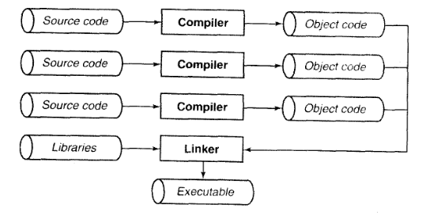

# 基本概念
## 环境
- 翻译环境，在这个环境里，源代码被转换为可执行的机器指令
- 执行环境，它用于实际执行代码
- 独立环境，不存在操作系统的环境
### 翻译
翻译阶段有以下几个步骤
1. 将程序的每个源文件通过编译过程分别转换为**目标代码**，编译也由一下几个阶段组成
    - 预处理器，它会处理源代码中的预处理指令，如#include、#define等
    - 编译器，它会将预处理后的代码转换为汇编语言
    - 汇编器，它会将汇编语言代码转换为机器指令  
2. 各个目标文件由**链接器**捆绑在一起，形成一个可执行的程序 


- 文件名约束
    - 目标文件名以.o结尾
    - 可执行文件名以.exe结尾
- 编译和链接
    1. 编译并连接一个完全包含于一个源文件的C程序
        ```bash
        gcc -c basic_concepts.c -o basic_concepts.o
        gcc basic_concepts.o -o basic_concepts
        ```
    2. 编译并连接多个源文件
        ```bash
        gcc -c main.c -o main.o
        gcc -c basic_concepts.c -o basic_concepts.o
        gcc main.o basic_concepts.o -o basic_program
        ```
###  执行
程序的执行过程也需要经历几个阶段
1. 加载：将可执行文件加载到内存中
2. 链接：将程序中的各个目标文件链接在一起
3. 运行：程序从入口地址开始执行，直到结束或遇到错误
    - 程序在运行时会使用一个**堆栈**，用来存储函数的局部变量和返回地址
    - 程序同时也可以使用**静态**内存，用来存储静态内存中的变量，在执行过程中一直保留他们的值直到程序结束
## 词法规则
一个C程序由声明和函数组成
- 函数定义了需要执行的工作
- 声明描述了函数和函数将要操作的数据类型和数据
###  字符
    注意转义字符
### 注释
    注释不可以嵌套
### 自由形式的代码
### 标识符
标识符就是变量、函数、类型等的名字，由大小写字母、数字和下划线组成并且不能以数字开头，关键字不能用于标识符，下列C语言关键字是被保留的，不能最为标识符使用
```c
auto break case char const continue default do 
double else enum extern float for goto if int 
long register return short signed sizeof static 
struct switch typedef union unsigned void volatile while
```
### 程序的形式 
## 程序风格
在学习时形成良好的代码风格，在工作时代码风格需加入自己的心眼   
1. 空行用于风格不同的逻辑代码段
2. 控制语句的括号时语句的一部分，而不是他们所测试的表达式的一部分，在括号和表达式之间留下一个空格，函数原型也一样
3. 在绝大多数操作符中间隔以空格    
4. 嵌套于其他语句的语句将使用`tab`缩进，而不是空格
5. 绝大部分的注释都是成块出现的，使用`/**/`块注释，而不是`//`单行注释
## 总结
## 警告的总结
1. 字符串常量的字符被错误的解释称三子母词，用好转义字符
2. 编写糟糕的注释可能会意外低终止语句
3. 注释的不适当结束
## 编程提示的总结
良好的程序风格和文档将使程序更容易阅读和维护
## 问题


1. 用注释来“注释掉”一段语句即嵌套注释会导致程序报错
2. 优点：减少了文件的数量和复杂性、简化了编译和构建的过程、函数与变量可以共享
   缺点：可维护性降低、可扩展性降低、增加编译时间、容易命名冲突
3. `printf("\"Blunden\?\?!\?\?\"");` 
4. `\40 = 空格字符 ` 
   `\100 = @`
   `\x40 = @`
5. `int x, y;` 
6. 关键字不能用于标识符
7. 否
8. 不正确，while循环的花括号不相匹配；后者更易于检查正确性
9. `gcc main.c list.c report.c`
10. `gcc main.c list.c report.c -lparse`
11. 完整的流程  
```bash
# 第一次编译
gcc main.c -o main
gcc list.c -o list
gcc table.c -o table
gcc symbol.c -o symbol.o
gcc main.o list.o table.o symbol.o -o program
# 修改list.c，第二次编译
gcc list.c -o list
gcc main.o list.o table.o symbol.o -o program
# 如果修改了list.h，第三次编译
gcc list.c -o list
gcc table.c -o table
gcc main.o list.o table.o symbol.o -o program
# 如果修改了table.h，第四次编译
gcc table.c -o table
gcc main.o list.o table.o symbol.o -o program
```